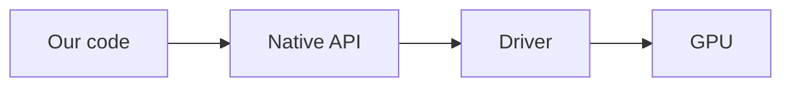
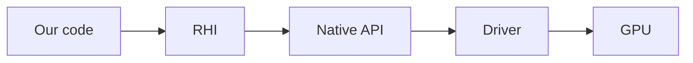
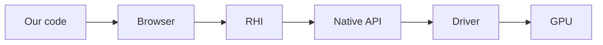
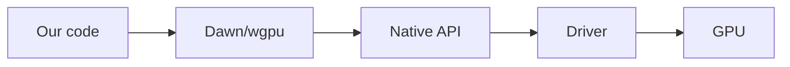

# Почему WebGPU, wgpu и Rust

## Что такое графическое API

Графическое API - это интерфейс, позволяющий управлять видеокартой из кода программ для отрисовки 2D или
3D графики. Графические API нового поколения поддерживают также и произвольные вычисления на видеокартах.

Все графические API можно разделить на следующие виды:

- Нативные - реализованные напрямую в драйвере видеокарты. К таким относятся OpenGL, Vulkan, DirectX и Metal, а также
  проприетарные API игровых консолей, такие как GNM на PlayStation.

- Абстракции и обертки - различные библиотеки, предоставляющие своё графическое API поверх нативных. Такие, как
  [Skia](https://skia.org/), [IGL](https://github.com/facebook/igl),
  [ANGLE](https://chromium.googlesource.com/angle/angle) и другие. Эти библиотеки еще называют `RHI (Render Hardware
  Interface)`, поскольку они предоставляют единый интерфейс поверх разнообразных нижележащих API и физических устройств.

- Отдельно можно выделить API в браузерах, например WebGL. Код фронтенда может работать с ними напрямую, но внутри
  самого браузера все равно используется библиотека-абстракция, совершающая вызовы нативного API текущей платформы.
  Таким образом, браузерные API можно тоже считать абстракциями над нативными.

## Почему WebGPU

На данный момент можно выделить следующие нативные графические API:

- OpenGL - официально признан устаревшим, не развивается, значительно отстает по кроссплатформенным возможностям и
  склонен к ошибкам и непредвиденному поведению.

- Vulkan - пришел на смену OpenGL, потенциально более производительный, более богатый по возможностям. Однако требует
  написания в разы больших объемов кода (примерно 1000 строк для самой примитивной программы уровня Hello World), очень
  легко допустить ошибку, большая часть работы по управлению видеокартой переложена на разработчика.
  Кроме этого, не доступен нативно на устройствах компании Apple, а слой совместимости MoltenVK (призванный решить эту
  проблему) отличается катастрофической нестабильностью и слабо подходит для серьезной разработки. Отсутствуют
  официальные инструменты отладки, необходимо полагаться на решения от сообщества. Есть множество жалоб на
  нестабильность даже на поддерживаемых системах вроде Windows. Последние годы стремительно теряет популярность, однако
  от полного вымирания также очень далек.

- DirectX 12 - разительно отличается от прошлых версий DirectX, первым внедряет новые возможности в мире графики, но по
  сложности и многословности схож с Vulkan. Вдобавок нативно работает только на Windows 10+ и Xbox, через слой
  совместимости Proton возможен запуск на Linux. Есть официальные инструменты отладки от Microsoft. В последние годы
  становится все более популярным.

- Metal - самое простое и удобное из трёх API нового поколения, с самыми продвинутыми инструментами отладки. По объему
  кода сравним с OpenGL, по простоте даже превосходит его. В разы проще и лаконичнее и Vulkan, и DirectX 12, при
  сохранении их возможностей. Однако поддерживается только платформами компании Apple, что означает полное отсутствие
  переносимости решений на нём. Но все это было справедливо лишь для Metal до 4 версии. В Metal 4 его авторы нацелились
  на максимальное сходство с DirectX 12 ради облегчения портирования игр с Windows на macOS, что неизбежно привело к его
  кардинальному усложнению.

Вдобавок, в браузерной среде до недавнего времени был доступен только WebGL, который является еще более урезанной
версией катастрофически устаревшего OpenGL.

В 2021 году Google, Apple, Mozilla и Khronos в составе рабочей группы W3C опубликовали черновик стандарта нового
графического API для браузеров, названного [WebGPU](https://www.w3.org/TR/webgpu). Оно призвано принести возможности
современных нативных графических API (Vulkan, DirectX 12, Metal) в браузерную среду, обеспечив полную
кроссплатформенность и предоставив доступ к современному решению вместо устаревшей модели WebGL/OpenGL.

Довольно скоро появилось две значимые реализации данного стандарта:

- [Dawn](https://dawn.googlesource.com/dawn) - написан на C/C++, используется в Chromium. Содержит компилятор Tint для
  преобразования шейдеров.
- [wgpu](https://wgpu.rs/) - написан на Rust, опционально имеет вариант сборки в библиотеку C для привязки к другим
  языкам программирования, используется в Firefox. Содержит компилятор Naga для преобразования шейдеров.

Данные реализации находятся в свободном доступе и позволяют использовать WebGPU не как API в браузере, а в качестве
нового кроссплатформенного решения для нативных платформ. Это дает возможность разрабатывать игры и другие графические
приложения с современными фичами, но без необходимости писать несколько реализаций под разные API и платформы, а также
делать это так же просто, как на OpenGL или Metal 3, значительно проще Vulkan и DirectX 12.

И Dawn, и wgpu относятся к библиотекам-абстракциям над нативными графическими API. "Под капотом" они превращают свои
вызовы в обращения к платформенному API, то есть Vulkan, DirectX 12 или Metal. Совместимость с OpenGL как нативным API
поддерживается, но с ограниченными возможностями, в качестве резервного варианта.

WebGPU выгодно отличается от других API-абстракций тем, что в первую очередь является новым стандартом в браузерах, а
значит поддерживается крупными корпорациями и будет использоваться разработчиками. Как следствие, Dawn и wgpu будут
продолжать развиваться под их нужды, и можно рассчитывать на своевременное исправление багов.

Дополнительная информация

Vulkan, DirectX 12, Metal и WebGPU относятся к графическим API нового поколения, тогда как OpenGL и WebGL - к старому.

Дополнительная информация

И Dawn, и wgpu позволяют запускать код на Rust/C/C++ в браузере через сборку в WASM, что дает использовать их в том
числе и для 3D графики на фронтенде. Но данный вопрос выходит за рамки руководства.

Таким образом, WebGPU является единственным графическим API, обладающим всеми перечисленными ниже свойствами:

- Адекватный уровень абстракции, позволяющий реализовывать необходимые для разработки игр и графических приложений
  алгоритмы, но не требующий чрезмерного количества действий для простых задач.

- Хорошая производительность.

- Полная кроссплатформенность.

- Доступ к современным возможностям, такие как вычисления на видеокарте.

- Стандартизация и широкая поддержка в индустрии.

Вдобавок, wgpu как реализация еще больше расширяет возможности WebGPU, предоставляя дополнительную функциональность при
работе вне браузера, на нативных платформах. Что, в совокупности с вышеперечисленным, делает его идеальным кандидатом
для использования в качестве основного графического API.

## Почему Rust

Но почему не использовать Dawn, или хотя бы wgpu в режиме совместимости с языком C? Ведь C/C++ - самые популярные языки
в сфере графической разработки и создания игр.

Тому есть несколько причин:

- Так как Dawn написан на C++, существует множество проблем при попытке привязаться к нему из других языков
  программирования. При этом wgpu официально предоставляет wgpu-native, сборку в библиотеку C, что значительно упрощает
  задачу привязки. Поэтому именно к ней привязываются такие языки,
  как [Odin (модуль стандартной библиотеки)](https://pkg.odin-lang.org/vendor/wgpu/)
  и [C# (официальный пакет Silk.NET)](https://github.com/dotnet/Silk.NET/blob/3c0313b2d69bbde12224c759a76bc2e7e064a893/build/nuke/Native/Wgpu.cs#L31).
  А это, в свою очередь, увеличивает количество пользователей, обнаруженных и исправленных багов, и в целом улучшает
  качество кода.

- wgpu написана на Rust, что позволяет использовать дополнительные гарантии безопасности при взаимодействии с ней из
  Rust кода. Например, стандартные проверки времени жизни ссылок гарантируют, что ресурсы видеокарты не будут очищены
  раньше дозволенного.

- При использовании wgpu за пределами браузера, она предоставляет доступ к продвинутым возможностям современных нативных
  API за пределами стандарта WebGPU. Например, пуш константы, трассировка лучей, кеширование пайплайнов, рисование
  линий, привязки массивов объектов в шейдерах, и другие.

- wgpu в виде упакованной библиотеки весит примерно в 15 раз меньше Dawn (на момент написания — 10МБ против 150МБ).

- Dawn гораздо более неудобный в сборке, подключении и обновлении, а также хуже в плане примеров, документации и тестов.

- Отсутствие проблем с кроссплатформенностью, подключением зависимостей и сборкой. Вместо 5 глав настройки проекта,
  типичных для C/C++ руководств, на это уйдет около 5 минут. Код запускается на любой операционной системе без изменений
  или платформ-специфичного кода, а стандартная система сборки автоматически подключает зависимости и собирает проект,
  как в остальных современных языках.

- Сам язык будет гарантировать отсутствие множества ошибок, типичных для программ на C/C++, в особенности касающихся
  управления памятью и многопоточности.

- Язык намного богаче и позволяет решать поставленную задачу с помощью готовых решений и алгоритмов, а не писать с нуля
  велосипеды, изобретенные 50 лет назад в других языках.

- Развитая экосистема языка позволит использовать готовые библиотеки на любой случай. На момент написания, глобальный
  репозиторий библиотек языка Rust, [crates.io](https://crates.io/), содержит на порядок больше пакетов, чем conan
  (репозиторий библиотек на C/C++ от сообщества) и vcpkg (аналогичное решение от Microsoft) вместе взятые.

- wgpu и Rust автоматически управляют памятью и не требуют от разработчика ручной очистки ресурсов видеокарты
  (никаких забытых `delete` и `free()`, без сборщика мусора как в языках вроде Java или Go).

- WebGPU использует язык WGSL для написания шейдеров, который более схож с Rust, чем с любым другим языком
  программирования.

- Множество полезных утилит, созданных для WebGPU и WGSL, поддерживают в первую очередь Rust, а не C/C++. Например,
  [WESL](https://wesl-lang.dev/) и [encase](https://github.com/teoxoy/encase).

Таким образом, Rust позволит нам писать меньше кода, делать это проще и удобнее, с большим количеством проверок и
гарантий корректной работы и безопасности, а также с поддержкой множества платформ, без потерь по производительности.

Кроме того, wgpu стала де-факто решением для графики в экосистеме Rust. Её используют такие проекты, как игровой
движок [Bevy](https://bevyengine.org/), движок рендера векторной графики [Vello](https://github.com/linebender/vello),
а также как бэкенд для рендера GUI библиотек [egui](https://github.com/emilk/egui) и [iced](https://iced.rs/).
Более зрелый игровой движок [Fyrox](https://fyrox.rs/) также планирует реализацию рендера на wgpu вместо устаревшего
OpenGL. Кроме того, можно привести пример MMORPG на wgpu, написанной с нуля без готового игрового движка -
[Veloren](https://www.veloren.net/). И даже новый браузерный движок от Mozilla, [Servo](https://github.com/servo/servo),
отрисовывает веб-страницы через wgpu.

Главная причина

Сам стандарт WebGPU все еще не имеет множества возможностей современных нативных API, доступных на всех актуальных
платформах. А также исключает некоторые оптимизации, из-за необходимости поддержки JavaScript с его ограничениями.

И если Dawn просто следует стандарту 1 к 1, не пытаясь сделать что-то сверх минимума, то wgpu же значительно расширяет
фичи, доступные разработчику.

Если какая-то фича поддерживается всеми тремя современными нативными API, то она все равно не появится в Dawn, однако
будет добавлена в wgpu как native-only расширение, то есть доступное только за пределами браузера.

Конкретные примеры - bindless ресурсы, трассировка лучей, меш шейдеры, пуш константы, поддержка других шейдерных языков
кроме WGSL, сжатые форматы текстур, отрисовка линий вместо треугольников, атомарные операции с текстурами, и многое
другое.

Все перечисленное есть в wgpu, потому что поддерживается Vulkan, Metal и DirectX 12. Но отсутствует в стандарте WebGPU
и в Dawn.

По этой причине я рекомендую wgpu даже для проектов, которые разрабатываются не на Rust.

