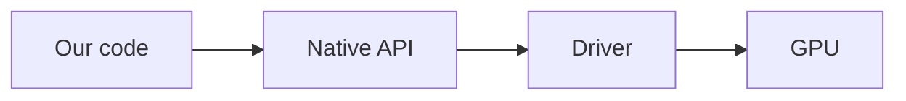
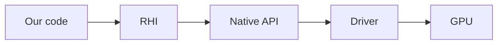
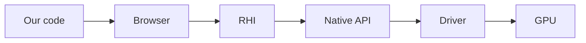
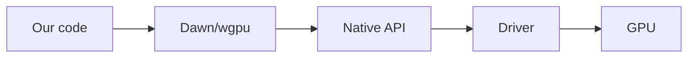

# Почему WebGPU, wgpu и Rust

## Что такое графическое API

Графическое API — интерфейс, позволяющий управлять видеокартой из кода для отрисовки 2D- или 3D-графики. Графические API нового поколения поддерживают также и произвольные вычисления на видеокартах.

Все графические API можно разделить на следующие виды:

- Нативные — реализованные напрямую в драйвере видеокарты. К таким относятся OpenGL, Vulkan, DirectX и Metal, а также
  проприетарные API игровых консолей, такие как GNM на PlayStation.

```mermaid
flowchart LR
    Code["Our code"] --> Native["Native API"] --> Driver --> GPU
```

- Абстракции и обёртки — различные библиотеки, предоставляющие своё графическое API поверх нативных. Такие, как
  [Skia](https://skia.org/), [IGL](https://github.com/facebook/igl),
  [ANGLE](https://chromium.googlesource.com/angle/angle) и другие. Эти библиотеки ещё называют `RHI (Render Hardware
  Interface)`, поскольку они предоставляют единый интерфейс поверх разнообразных нижележащих API и физических устройств.

```mermaid
flowchart LR
    Code["Our code"] --> RHI["RHI"] --> Native["Native API"] --> Driver --> GPU
```

- Отдельно можно выделить API в браузерах, например WebGL. Код фронтенда может работать с ними напрямую, но внутри
  самого браузера всё равно используется библиотека-абстракция, совершающая вызовы нативного API текущей платформы.
  Так что браузерные API тоже можно считать абстракциями над нативными.

```mermaid
flowchart LR
    Code["Our code"] --> Browser --> RHI["RHI"] --> Native["Native API"] --> Driver --> GPU
```

## Почему WebGPU

Сейчас список нативных графических API таков:

- OpenGL — официально признан устаревшим, не развивается, значительно отстаёт по кроссплатформенным возможностям и
  склонен к ошибкам и непредвиденному поведению.

- Vulkan — пришёл на смену OpenGL, потенциально более производительный, более богатый по возможностям. Однако API крупный и многословный, порог входа высокий: примерно 1000 строк для самой примитивной программы уровня Hello World, очень легко допустить ошибку, большая часть работы по управлению видеокартой переложена на разработчика. Кроме этого, недоступен нативно на устройствах компании Apple, а слой совместимости MoltenVK (призванный решить эту проблему) — сторонняя прослойка, переводящая вызовы в Metal, со всеми ограничениями такого перевода. Фирменных инструментов отладки уровня RenderDoc/PIX для Vulkan заметно меньше, отладка тяжелее.

- DirectX 12 — разительно отличается от прошлых версий DirectX, первым внедряет новые возможности в мире графики, но по
  сложности и многословности схож с Vulkan. Вдобавок нативно работает только на Windows 10+ и Xbox, через слой
  совместимости Proton возможен запуск на Linux. Есть официальные инструменты отладки от Microsoft. В последние годы
  становится все более популярным.

- Metal — самое простое и удобное из трёх API нового поколения, с самыми продвинутыми инструментами отладки. По объёму
  кода сравним с OpenGL, по простоте даже превосходит его. В разы проще и лаконичнее и Vulkan, и DirectX 12, при
  сохранении их возможностей. Однако поддерживается только платформами компании Apple, что означает полное отсутствие
  переносимости решений на нём. Но всё это было справедливо лишь для Metal до версии 4. В Metal 4 его авторы нацелились
  на максимальное сходство с DirectX 12 ради облегчения портирования игр с Windows на macOS, что неизбежно привело к его
  кардинальному усложнению.

Вдобавок в браузерной среде до недавнего времени был доступен только WebGL — ещё более урезанная
версия давно не развивавшегося OpenGL.

В 2021 году Google, Apple, Mozilla и Khronos в составе рабочей группы W3C опубликовали черновик стандарта нового
графического API для браузеров, названного [WebGPU](https://www.w3.org/TR/webgpu). Стандарт призван принести возможности
современных нативных графических API (Vulkan, DirectX 12, Metal) в браузерную среду, обеспечив полную
кроссплатформенность и предоставив доступ к современному решению вместо устаревшей модели WebGL/OpenGL.

Довольно скоро появились две значимые реализации этого стандарта:

- [Dawn](https://dawn.googlesource.com/dawn) — написан на C/C++, используется в Chromium. Содержит компилятор Tint для
  преобразования шейдеров.
- [wgpu](https://wgpu.rs/) — написан на Rust, опционально имеет вариант сборки в библиотеку C для привязки к другим
  языкам программирования, используется в Firefox. Содержит компилятор Naga для преобразования шейдеров.

Обе реализации находятся в свободном доступе и позволяют использовать WebGPU не как API в браузере, а в качестве
нового кроссплатформенного решения для нативных платформ. Это даёт возможность разрабатывать игры и другие графические
приложения с современными фичами, но без необходимости писать несколько реализаций под разные API и платформы, а также
делать это так же просто, как на OpenGL или Metal 3, и значительно проще, чем на Vulkan и DirectX 12.

И Dawn, и wgpu относятся к библиотекам-абстракциям над нативными графическими API. «Под капотом» они превращают свои
вызовы в обращения к платформенному API, то есть Vulkan, DirectX 12 или Metal. Совместимость с OpenGL как нативным API
поддерживается, но с ограниченными возможностями, в качестве резервного варианта.

```mermaid
flowchart LR
    Code["Our code"] --> Dawn/wgpu --> Native["Native API "] --> Driver --> GPU
```

WebGPU выгодно отличается от других API-абстракций тем, что в первую очередь — новый стандарт в браузерах, а
значит поддерживается крупными корпорациями и будет использоваться разработчиками. Как следствие, Dawn и wgpu будут
продолжать развиваться под их нужды, и можно рассчитывать на своевременное исправление багов.

Дополнительная информация

Vulkan, DirectX 12, Metal и WebGPU относятся к графическим API нового поколения, тогда как OpenGL и WebGL — к старому.

Дополнительная информация

И Dawn, и wgpu позволяют запускать код на Rust/C/C++ в браузере через сборку в WASM, что даёт возможность использовать
их в том числе и для 3D-графики на фронтенде. Но этот вопрос выходит за рамки руководства.

Таким образом, WebGPU — единственный графический API, обладающий всеми перечисленными ниже свойствами:

- Адекватный уровень абстракции, позволяющий реализовывать необходимые для разработки игр и графических приложений
  алгоритмы, но не требующий чрезмерного количества действий для простых задач.

- Хорошая производительность.

- Полная кроссплатформенность.

- Доступ к современным возможностям, таким как вычисления на видеокарте.

- Стандартизация и широкая поддержка в индустрии.

Вдобавок wgpu как реализация ещё больше расширяет возможности WebGPU, предоставляя дополнительную функциональность при
работе вне браузера, на нативных платформах. В совокупности с вышеперечисленным это делает его идеальным кандидатом
для использования в качестве основного графического API.

## Уровень абстракции: между OpenGL и DirectX 12

WebGPU занимает промежуточное положение между поколениями API. От старого (OpenGL) он наследует разумный объём
обязанностей программиста: простые задачи остаются простыми. От нового (Vulkan, DirectX 12) — явную модель ресурсов
и исполнения.

Что видно явно — и чему учит руководство:

- команды записываются в encoder и отправляются очередью через submit, а не выполняются немедленно (глава
  «CPU, GPU и очередь»);
- состояние конвейера собирается в явный pipeline, ресурсы привязываются готовыми bind groups с их layout'ами;
- форматы, usages и раскладка памяти (выравнивание, offsets) — контракт программиста, а не драйвера.

Что скрыто — и почему этого нет в главах:

- барьеры и переходы состояний ресурсов: wgpu выводит их из usages и порядка команд;
- аллокация видеопамяти, дескрипторные кучи и их индексация;
- fence-синхронизация CPU и GPU: ожидание и map берут на себя реализация и очередь;
- владение поверхностью при изменении размеров окна.

Поэтому курс «низкоуровневый» ровно там, где это контракт программиста, и не тратит главы на работу, которую wgpu
выполняет за вас.

## Почему Rust

Но почему не использовать Dawn или хотя бы wgpu в режиме совместимости с языком C? Ведь C/C++ — самые популярные языки
в сфере графической разработки и создания игр.

Тому есть несколько причин, сгруппированных в три блока: сам язык, экосистема, wgpu и его инструменты.

**Язык.**

- Сам язык гарантирует отсутствие множества ошибок, типичных для программ на C/C++, особенно касающихся
  управления памятью и многопоточности.

- Типовые задачи решаются готовыми инструментами самого языка и стандартной библиотеки: алгебраические
  типы данных, обработка ошибок, итераторы и адаптеры — рукописный код, изобретённый десятилетия назад в других
  языках, писать не приходится.

- Ресурсы освобождаются автоматически, по правилам владения: без ручных `delete` и `free()` и без сборщика
  мусора как в языках вроде Java или Go.

**Экосистема.**

- Отсутствие проблем с кроссплатформенностью, подключением зависимостей и сборкой. Вместо 5 глав настройки проекта,
  типичных для C/C++ руководств, на это уйдёт около 5 минут. Код запускается на любой операционной системе без изменений
  или платформ-специфичного кода, а стандартная система сборки автоматически подключает зависимости и собирает проект,
  как в остальных современных языках.

- Развитая экосистема позволит использовать готовые библиотеки на любой случай. На момент написания глобальный
  репозиторий библиотек языка Rust, [crates.io](https://crates.io/), содержит на порядок больше пакетов, чем conan
  (репозиторий библиотек на C/C++ от сообщества) и vcpkg (аналогичное решение от Microsoft) вместе взятые.

**wgpu и его инструменты.**

- Dawn написан на C++, и привязка к нему из других языков программирования связана с множеством проблем.
  При этом wgpu официально предоставляет wgpu-native, сборку в библиотеку C, что значительно упрощает
  задачу привязки. Поэтому именно к ней привязываются такие языки,
  как [Odin (модуль стандартной библиотеки)](https://pkg.odin-lang.org/vendor/wgpu/)
  и [C# (официальный пакет Silk.NET)](https://github.com/dotnet/Silk.NET/blob/3c0313b2d69bbde12224c759a76bc2e7e064a893/build/nuke/Native/Wgpu.cs#L31).
  А это, в свою очередь, увеличивает количество пользователей, обнаруженных и исправленных багов, и в целом улучшает
  качество кода.

- wgpu написана на Rust, что позволяет использовать дополнительные гарантии безопасности при взаимодействии с ней из
  Rust кода. Например, стандартные проверки времени жизни ссылок гарантируют, что ресурсы видеокарты не будут очищены
  раньше дозволенного.

- При использовании wgpu за пределами браузера она предоставляет доступ к продвинутым возможностям современных нативных
  API за пределами стандарта WebGPU. Например, трассировка лучей, кеширование пайплайнов, рисование
  линий, привязки массивов объектов в шейдерах и другие.

- wgpu в виде упакованной библиотеки весит примерно в 15 раз меньше Dawn (на момент написания — 10 МБ против 150 МБ);
  сам Dawn заметно неудобнее в сборке, подключении и обновлении, а также хуже в плане примеров, документации и тестов.

- WebGPU использует язык WGSL для написания шейдеров, который более схож с Rust, чем с любым другим языком
  программирования. Множество полезных утилит, созданных для WebGPU и WGSL, поддерживают в первую очередь Rust,
  а не C/C++. Например, [WESL](https://wesl-lang.dev/) и [encase](https://github.com/teoxoy/encase).

Таким образом, Rust позволит нам писать меньше кода, делать это проще и удобнее, с большим количеством проверок и
гарантий корректной работы и безопасности, а также с поддержкой множества платформ, без потерь по производительности.

Кроме того, wgpu стала де-факто решением для графики в экосистеме Rust. Её используют игровой
движок [Bevy](https://bevyengine.org/), движок рендера векторной графики [Vello](https://github.com/linebender/vello),
а также GUI-библиотеки [egui](https://github.com/emilk/egui) и [iced](https://iced.rs/) — как бэкенд рендера.
Более зрелый игровой движок [Fyrox](https://fyrox.rs/) также планирует реализацию рендера на wgpu вместо устаревшего
OpenGL. Кроме того, можно привести пример MMORPG на wgpu, написанной с нуля без готового игрового движка —
[Veloren](https://www.veloren.net/). И даже новый браузерный движок от Mozilla, [Servo](https://github.com/servo/servo),
отрисовывает веб-страницы через wgpu.

Главная причина

Стандарт WebGPU сознательно очерчивает переносимое общее ядро возможностей: не всё, что умеют нативные API, входит в
ядро — часть живёт как опциональные фичи (например, сжатые текстуры BC/ETC2 в WebGPU доступны через
`texture-compression-bc` и связанные флаги), часть появляется в стандарте постепенно.

Dawn — эталонная реализация стандарта в Chromium: её приоритет — соответствие спецификации, и расширения в ней — это
в первую очередь experimental-флаги стандарта. wgpu же, помимо ядра стандарта, предоставляет и набор собственных
native-расширений за пределами браузера — например, трассировку лучей, mesh-шейдеры и другие
возможности, поддержанные нативными API.

Практическое следствие: на wgpu можно писать и строго переносимое подмножество (то, что работает и в браузере), и
использовать native-расширения там, где проект работает только нативно — с явным запросом фичи через
`DeviceDescriptor` и честной деградацией, если адаптер её не даёт.

По этой причине я рекомендую wgpu даже для проектов, которые разрабатываются не на Rust.

