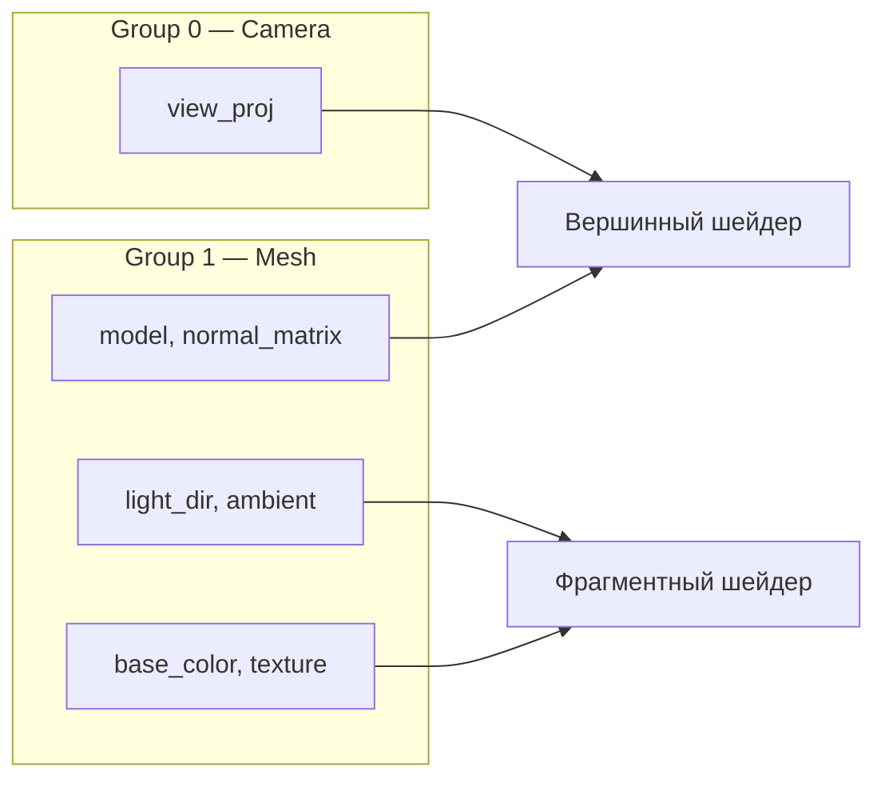

# Несколько мешей

[Полный код главы](https://github.com/Bromles/wgpu-tutorial/tree/master/code/guide/advanced/multiple-meshes)

**Что уже должно быть понятно:**

- нормали, освещение, текстуры
- camera, depth buffer, bind groups
- vertex и index buffers

**Что появится в этой главе:**

- процедурная генерация геометрии: сфера из параметрических уравнений
- несколько мешей, каждый со своими буферами и bind group
- два bind group: общий camera (group 0) + персональный mesh (group 1)
- переключение между мешами в render pass

**Итог:** три сферы с разными текстурами, каждая — отдельный mesh со своим bind group

---

До сих пор все объекты использовали одну и ту же геометрию (куб). В реальных сценах разные объекты
имеют разную форму, текстуры и материалы. Эта глава показывает, как работать с несколькими мешами.

## Процедурная сфера

Сфера генерируется параметрически: два угла (phi, theta) пробегают поверхность:


```rust
fn generate_sphere(stacks: u32, slices: u32, radius: f32) -> (Vec<Vertex>, Vec<u16>) {
    let mut vertices = Vec::new();
    let mut indices = Vec::new();

    for stack in 0..=stacks {
        let phi = PI * stack as f32 / stacks as f32;
        let sin_phi = phi.sin();
        let cos_phi = phi.cos();

        for slice in 0..=slices {
            let theta = 2.0 * PI * slice as f32 / slices as f32;
            let sin_theta = theta.sin();
            let cos_theta = theta.cos();

            let x = cos_theta * sin_phi;
            let y = cos_phi;
            let z = sin_theta * sin_phi;

            vertices.push(Vertex {
                position: [x * radius, y * radius, z * radius],
                normal: [x, y, z],
                uv: [slice as f32 / slices as f32, stack as f32 / stacks as f32],
            });
        }
    }
    // indices: каждый quad сетки → 2 треугольника
    (vertices, indices)
}
```

- `stacks` — горизонтальных срезов (от полюса до полюса)
- `slices` — вертикальных сегментов
- Нормаль совпадает с направлением от центра — это свойство сферы

Индексы связывают соседние вершины в треугольники. Каждая ячейка сетки — два треугольника.

## Структура MeshDraw

Каждый mesh хранит свои буферы и bind group:

```rust
struct MeshDraw {
    vertex_buffer: Buffer,
    index_buffer: Buffer,
    index_count: u32,
    bind_group: wgpu::BindGroup,
    model: Mat4,
    normal_matrix: [[f32; 3]; 3],
    uniform_buffer: Buffer,
    base_color: Vec4,
}
```

Один pipeline используется для всех мешей — формат вершин и состояние рендера одинаковые.
Меняются только данные: геометрия (vertex/index buffers) и параметры (uniform + texture).

## Два bind group: camera и mesh

Данные для рендера делятся на две категории: общие для всей сцены (камера) и индивидуальные для каждого объекта
(модель, текстура). Разделим их на два bind group:



- **Group 0 (camera)** — `view_proj`, устанавливается **один раз** перед циклом отрисовки. Все меши используют одну и
  ту же матрицу проекции
- **Group 1 (mesh)** — `model`, `normal_matrix`, `light_dir`, `ambient`, `base_color` + текстура, устанавливается
  **на каждый меш**. Эти данные уникальны для каждого объекта

### Шейдер

```wgsl
struct CameraUniforms {
    view_proj: mat4x4<f32>,
};

@group(0) @binding(0)
var<uniform> camera: CameraUniforms;

struct MeshUniforms {
    model: mat4x4<f32>,
    normal_matrix: mat3x3<f32>,
    light_dir: vec3<f32>,
    ambient: f32,
    base_color: vec4<f32>,
};

@group(1) @binding(0)
var<uniform> mesh: MeshUniforms;

@group(1) @binding(1)
var diffuse_tex: texture_2d<f32>;

@group(1) @binding(2)
var diffuse_sampler: sampler;
```

Вершинный шейдер читает `camera.view_proj` из group 0 и `mesh.model` из group 1:

```wgsl
let world_pos = mesh.model * vec4<f32>(input.position, 1.0);
output.position = camera.view_proj * world_pos;
```

### Rust: два bind group layout

Pipeline layout содержит оба layout:

```rust
let camera_bgl = ctx.device.create_bind_group_layout(&BindGroupLayoutDescriptor {
    label: Some("Camera BGL"),
    entries: &[BindGroupLayoutEntry {
        binding: 0,
        visibility: ShaderStages::VERTEX,
        ty: BindingType::Buffer {
            ty: BufferBindingType::Uniform,
            has_dynamic_offset: false,
            min_binding_size: Some(CameraUniforms::min_size()),
        },
        count: None,
    }],
});

let mesh_bgl = ctx.device.create_bind_group_layout(&BindGroupLayoutDescriptor {
    label: Some("Mesh BGL"),
    entries: &[
        // binding 0: mesh uniform (model, normal_matrix, light, color)
        // binding 1: diffuse texture
        // binding 2: sampler
    ],
});

let pipeline_layout = ctx.device.create_pipeline_layout(&PipelineLayoutDescriptor {
    bind_group_layouts: &[Some(&camera_bgl), Some(&mesh_bgl)],
    // ...
});
```

Camera bind group создаётся один раз, mesh bind group — для каждого объекта:

```rust
let camera_bind_group = ctx.device.create_bind_group(&BindGroupDescriptor {
    layout: &camera_bgl,
    entries: &[BindGroupEntry {
        binding: 0,
        resource: camera_uniform_buffer.as_entire_binding(),
    }],
});
```

## Создание меша

Функция `create_mesh` создаёт вершинный и индексный буферы, mesh uniform и bind group (group 1):

```rust
let create_mesh = |vertices, indices, tex_view, color, model| {
    let vertex_buffer = ctx.device.create_buffer_init(...);
    let index_buffer = ctx.device.create_buffer_init(...);
    let uniform_buffer = ctx.device.create_buffer(...);
    let bind_group = ctx.device.create_bind_group(...);
    MeshDraw { vertex_buffer, index_buffer, ..., base_color: color }
};
```

Три сферы — три вызова `create_mesh` с разными позициями и текстурами:

```rust
let meshes = vec![
    create_mesh(&sphere.0, &sphere.1, &tex1, white, Mat4::from_translation(Vec3::new(-3.0, 0.0, 0.0))),
    create_mesh(&sphere.0, &sphere.1, &tex2, white, Mat4::from_translation(Vec3::new(0.0, 0.0, 0.0))),
    create_mesh(&sphere.0, &sphere.1, &tex3, white, Mat4::from_translation(Vec3::new(3.0, 0.0, 0.0))),
];
```

Все три используют одну и ту же геометрию (sphere), но могли бы использовать разную — например,
куб + сфера + плоскость.

## Отрисовка

Camera bind group (group 0) устанавливается **один раз** перед циклом — `view_proj` общий для всех мешей.
Mesh bind group (group 1) переключается на каждом объекте:

```rust
rpass.set_pipeline(&self.pipeline);
rpass.set_bind_group(0, &self.camera_bind_group, &[]);
for mesh in &self.meshes {
    rpass.set_vertex_buffer(0, mesh.vertex_buffer.slice(..));
    rpass.set_index_buffer(mesh.index_buffer.slice(..), IndexFormat::Uint16);
    rpass.set_bind_group(1, &mesh.bind_group, &[]);
    rpass.draw_indexed(0..mesh.index_count, 0, 0..1);
}
```

`view_proj` пишется в camera uniform buffer один раз за кадр, а не дублируется в каждый mesh uniform.

## Что получилось

::: warning Типичные ошибки
- Каждый mesh должен иметь свой bind group — общий bind group не работает при разных uniform-данных
- `index_count` в `draw_indexed` должен соответствовать реальному количеству индексов — иначе мусор или crash
- Sphere generation: `(stacks+1) × (slices+1)` вершин, не `stacks × slices` — каждый стек имеет +1 вершину для замыкания
:::

Три сферы с разными текстурами, стоящие в ряд. Камера свободно перемещается.

<!-- TODO: скриншот -->

<div class="tip custom-block" style="padding-top: 8px">
<p class="custom-block-title">Попробуем</p>

- Изменить `base_color` для одной из сфер — tint текстуры цветом
- Добавить куб как четвёртый mesh — разные типы геометрии в одной сцене
- Изменить `stacks` и `slices` — увидеть, как меняется детализация сферы
- Добавить поворот в model-матрицу: `Mat4::from_rotation_y(angle)`

</div>

[Полный код главы](https://github.com/Bromles/wgpu-tutorial/tree/master/code/guide/advanced/multiple-meshes)
