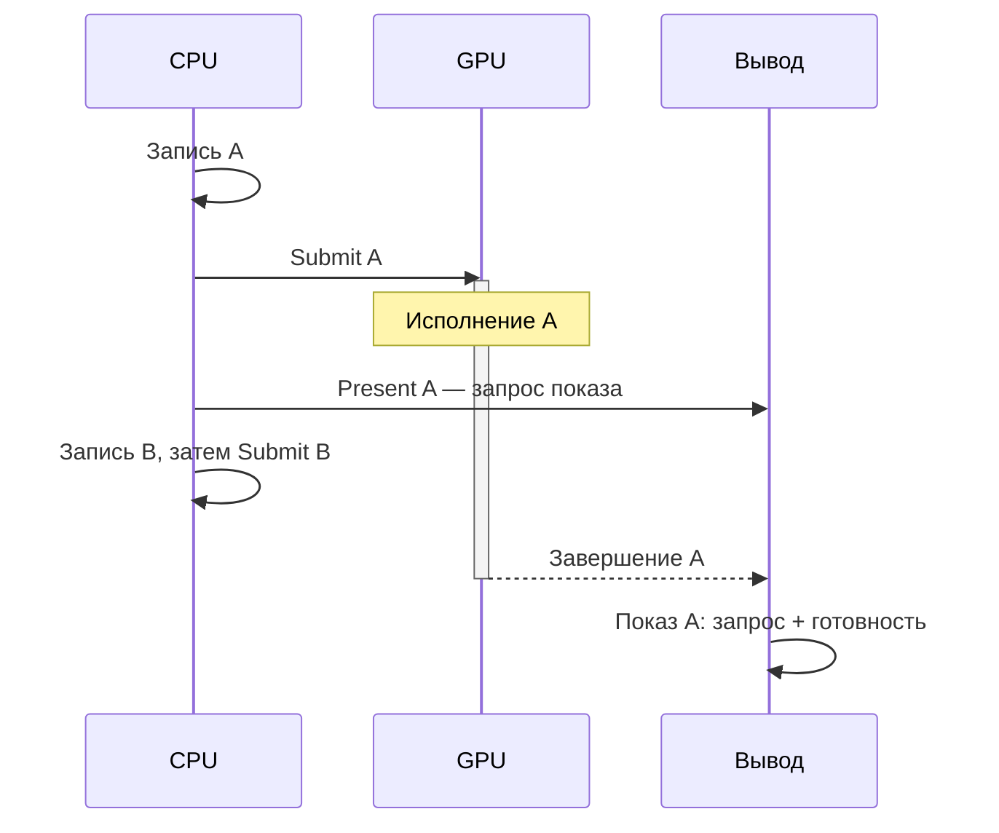

# CPU, GPU и очередь

::: info Только native
Продолжаем маршрут приложений Rust без браузера и WASM.
Здесь нет нового исполняемого проекта, окна или GPU-кадра: результат главы — схема порядка событий.
:::

В главе [«Изображение и числа»](../image-data/) присваивание изменяло байт до следующего чтения этого байта в той же программе.
Почему нельзя так же считать, что после команды рисования изображение уже готово?
Потому что программа может **описать работу другому исполнителю**, а затем продолжить собственную.
Разделим описание, отправку, исполнение и показ, прежде чем появятся вызовы wgpu.

**Сохраняем:** массив 2×2, все цвета, адреса и единственное изменение R из опыта с изображением.
**Меняем:** не данные и не программу, а модель исполнения будущего кадра.
Ни приведённая схема, ни повторный запуск CPU-примера не измеряют скорость GPU.

## Кто работает с данными

**CPU** (центральный процессор) выполняет обычный код нашего приложения: обрабатывает события, готовит данные, принимает решения.
**GPU** (графический процессор) рассчитан на выполнение большого количества похожих операций над данными.
Например, многие элементы изображения можно вычислять независимо друг от друга.
Выигрыш зависит от задачи: организация работы и обмен данными тоже имеют стоимость.

Что нужно GPU, чтобы изменить пиксели?
Через `&mut [u8]` это не решить: у GPU нет доступа к памяти нашей программы.
Библиотека создаёт **ресурсы** — буферы и текстуры; у каждого размер и список разрешённых операций.
Пока нужны только две концептуальные формы:

| Имя                 | Что представляет                                          | Зачем может понадобиться                             |
| ------------------- | --------------------------------------------------------- | ---------------------------------------------------- |
| `Buffer`, буфер     | Диапазон байтов                                           | Хранить числа, которые GPU прочитает или запишет     |
| `Texture`, текстура | Данные, организованные по координатам и формату элементов | Хранить изображение для чтения, обработки или вывода |

Имя ничего не гарантирует: поведение определяет список usages.
CPU-массив из главы «Изображение и числа» — просто наши 16 байт; внутренняя организация памяти GPU-ресурсов своя.

### Разделение памяти бывает логическим

У дискретной видеокарты обычно есть собственная память, отдельно от основной памяти компьютера.
У встроенной графики CPU и GPU часто используют общую физическую память.
Такую организацию называют **UMA**, unified memory architecture, то есть архитектурой с общей памятью.

Однако общий физический носитель не делает произвольный одновременный доступ корректным.
GPU может ещё читать старое содержимое, когда CPU уже хочет его заменить.
Нужно определить, кто имеет право читать или писать данные и в какой момент результат становится доступен другому исполнителю.
Договор касается **логического владения доступом** к данным и работает одинаково при любой физической организации памяти.

Rust следит за своими ссылками, но завершение заимствования на CPU не означает завершения ранее отправленной GPU-работы.
Графическая библиотека отдельно отслеживает ресурсы и допустимые операции над ними.
Способы загрузки данных и получения доступа к GPU-результату будем вводить там, где они понадобятся.
Пока контракт такой: обычное присваивание в локальный массив не заменяет управляемую передачу данных GPU.

## Почему команды сначала записывают

**Команда** описывает операцию: например, заполнить изображение одним цветом или скопировать разрешённый диапазон данных.
Когда CPU **записывает команды**, он формирует описание будущей работы; сами вычисления выполнит устройство.
Описание указывает операции и используемые ресурсы.
Точные правила обновления ресурсов разберём до первого изменяемого GPU-буфера.

Готовый набор команд нужно передать на исполнение.
Для этого служит **очередь**, канал отправки работы устройству.
Действие отправки обычно называется **submit**.
В модели этой главы у нас одна очередь; по ней отправляются сначала работа A, затем работа B.
Буквы обозначают наборы работы для двух кадров, а кадром называем очередное изображение, подготовленное для показа.

Разделим три события для A:

1. **Запись:** CPU описал, что требуется сделать.
2. **Отправка:** готовые команды переданы очереди.
3. **Завершение:** GPU выполнил соответствующую работу.

Между отправкой и завершением возможен промежуток, когда A ещё ожидает исполнения или уже исполняется.
Возврат из submit не является уведомлением о завершении A.
Короткая работа иногда успевает закончиться очень быстро; контракт от этого не меняется, полагаться на такое совпадение нельзя.

**Асинхронная отправка** означает, что CPU не обязан ждать результата, прежде чем продолжить независимую работу.
Это свойство взаимодействия исполнителей и не связано с синтаксисом Rust `async` в вызывающем коде.
Сам вызов submit при этом имеет CPU-стоимость.

## Два кадра без лишнего ожидания

Время идёт сверху вниз, каждый участник — вертикальная дорожка.
Полоса на дорожке GPU — занятость исполнением A; стрелки между дорожками — точки синхронизации.



Стрелки — зависимости, не измеренные интервалы: длины полос и промежутки условны.
Показ A сходится из двух условий: переданного запроса и готовности GPU-результата.

Пока GPU выполняет A, CPU может записывать B, обрабатывать ввод или рассчитывать данные, не зависящие от результата A.
Это возможное перекрытие работы; его конкретные пропорции на каждой машине свои.
Если CPU нужен результат A для расчёта B, зависимость реальна: до получения результата соответствующую часть B продолжить нельзя.
Также нельзя считать независимой запись в память, которую ещё использует A, без предусмотренного правила доступа.

Очередь сохраняет необходимые зависимости отправленной работы.
Внутри устройства допускаются параллелизм и перекрытие там, где это законно.
Порядок отправки сам по себе не разрешает произвольное чтение и запись любых ресурсов.
В будущих примерах wgpu будет проверять заявленные использования и организовывать необходимую синхронизацию; приложение всё равно обязано задавать корректные зависимости.

## Готово для показа и уже показано

Вычислить пиксели и показать изображение пользователю — разные события.
**Presentation**, или представление к показу, передаёт подготовленное изображение системе вывода окна.
В коде это действие обычно называется **present**.
Система вывода может объединять окна и выбирать момент показа с учётом обновления дисплея.

Запрос present может быть сделан после отправки команд, пока GPU ещё работает.
Запрос present адресован механизму вывода, который учитывает готовность изображения.
Именно поэтому у показа A на схеме две зависимости: поступивший запрос и готовность GPU-результата.
Стрелка от GPU идёт к показу, **не к возврату CPU из present**.

Возврат из present сам по себе не доказывает ни завершение GPU, ни фактический показ на экране.
Некоторые операции вывода могут задерживать CPU из-за доступности изображений или политики показа, но использовать такую задержку как сигнал завершения произвольной GPU-работы нельзя.
Для настоящего окна в следующей главе появится ещё получение доступного изображения назначения; здесь обойдёмся без него.

## Когда ждать действительно нужно

**Ожидание завершения** устанавливает нужную связь: продолжить зависимое действие CPU можно только после подтверждения завершения выбранной GPU-работы.
Подтверждение может обрабатываться позже без остановки потока либо ожидаться с остановкой; конкретный механизм пока не нужен.
Чтобы прочитать GPU-данные на CPU, одного сигнала завершения также недостаточно: нужен разрешённый библиотекой доступ к соответствующей памяти.

Если мы захотим прочитать обратно результат изменения пикселя, порядок будет таким:
GPU записывает результат, библиотека переносит его в память, доступную CPU, и после разрешения доступа CPU читает байты.
А для расчёта независимого следующего изображения такое чтение и ожидание не нужны.

Поставив ожидание сразу после каждой отправки, мы уберём возможность CPU готовить B во время исполнения A.
Это может быть полезно для узкой проверки, но не должно стать частью каждого кадра.
Если ожидание требуется только перед использованием результата A, оно ставится именно там.

По времени одного вызова submit нельзя вычислить время GPU.
Таймер вокруг вызова измеряет работу CPU при отправке, а не участок исполнения на другой дорожке.
Таймер до окончания ожидания тоже может включать уже накопившуюся очередь и само ожидание, а не только выбранную операцию.
Измерения потребуют отдельного стенда.

## Обязательно ли GPU рисует геометрию

Изображение остаётся данными независимо от способа его получения.
**Графический путь** организует вычисления вокруг рисования геометрических фигур: определяет, какую область изображения они покрывают, и вычисляет её цвет.
**Вычислительный путь**, или compute, запускает общие вычисления над данными без обязательного шага покрытия геометрией.
Такая работа может, например, вычислить новое значение для каждой координаты изображения и сохранить результат.

Оба пути способны давать изображения, потому что результатом в обоих случаях могут быть значения их элементов.
Compute может вместо этого выдавать только числа в буфере.
Для показа в обоих случаях нужна отдельная связь с системой вывода.
Здесь мы только наметили, зачем нужны оба пути.

## Проверка без нового проекта

При необходимости повторите `cargo run -p image-data` из корня репозитория.
Используется неизменённый CPU-пример из главы [«Изображение и числа»](../image-data/#запускаем-опыт); новых исходников в этой главе нет.
Вывод по-прежнему показывает адрес 12 и изменение `[255, 255, 255, 255]` в `[0, 255, 255, 255]`.
Этот результат проверяет CPU-данные, но ничего не сообщает об очереди, GPU или present: программа их не использует.

1. Расставьте события: завершение A, запись A, исполнение A, отправка A. Где допустима независимая подготовка B?
2. Отправка заняла 0.2 мс на CPU. Можно ли заключить, что GPU выполнял A 0.2 мс? Изменится ли ответ, если present уже вернулся?
3. Для следующего расчёта CPU нужен R из результата A. Исходное значение 255, A записывает 0. Можно ли сразу после submit считать, что чтение уже даст 0, особенно на UMA?

::: details Решения и контрольные выводы

1. Порядок событий для A:

   ```mermaid
   flowchart TD
       rec["запись A"] --> send["отправка A"] --> run["исполнение A"] --> done["завершение A"]
   ```

   Независимая подготовка B может перекрываться с ожиданием и исполнением A; обязательной точки ожидания после отправки нет.

2. Нет. Известны только 0.2 мс CPU-отправки. Ни продолжительность GPU-работы, ни момент показа из этого не следуют. Возврат present не добавляет сигнала завершения A.
3. Нет. Ожидаемое новое значение действительно 0, но путь к чтению результата такой:

   ```mermaid
   flowchart TD
       s["отправка работы"] --> f["завершение работы"] --> a["разрешение CPU-доступа"] --> r["чтение байтов"]
   ```

   Исходный локальный массив может вообще остаться с 255, если GPU работал с отдельным ресурсом. UMA не отменяет эти правила.
   :::

Теперь у будущего кадра есть четыре разных события: описание, отправка, завершение и показ.
Какие вызовы wgpu умеют задерживать поток и как устроено отслеживание отправок — справочник [«Что может заблокироваться»](../../../appendix/blocking-and-submissions/).
В главе [«Первый кадр»](../first-frame/) свяжем их с конкретным окном и заполним изображение одним линейным цветом, ещё без геометрии.
