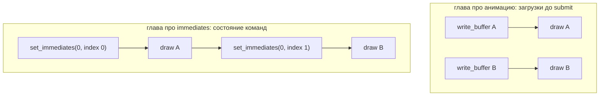

# Immediates и выбор механизма

::: info Только native
Пример требует feature `IMMEDIATES` и запрашивает её явно; без поддержки завершается диагностикой.
:::

Для двух разных значений на два draw мы делали два uniform-буфера и две загрузки.
А если значение — четыре байта?
Для таких случаев в WebGPU есть **immediates**: маленький блок значений, живущий прямо в состоянии команд.

**Эксперимент:** прямоугольник из двух draw; общий `gain` лежит в uniform, а выбор оттенка для каждого треугольника — `u32`-индекс в таблице `tints` из двух знакомых `vec4`.
Индекс передаётся immediate'ом: без загрузок буферов между draw.

## Три носителя параметров

К этому моменту у нас три механизма, и у каждого своя природа:

| Механизм | Где живёт значение | Когда меняется | Сколько стоит |
| --- | --- | --- | --- |
| Vertex attribute | В записи буфера | С загрузкой геометрии | Байты на каждую вершину |
| Uniform / storage | В ресурсе | Загрузка до submit | Загрузка на изменение |
| Immediate | В состоянии команд | `set_immediates` между операциями | Запись в командный поток |

Значение в состоянии команд — как выбранный pipeline или bind group: оно действует на последующие операции прохода, пока не заменено.
Содержимое буферов от этого не копируется и не меняется.

## Требования к устройству

Immediates — опциональная возможность устройства: её запрашивают явно. Размер блока ограничен лимитом `max_immediate_size`.
Оба объявляются локальным примером через `Settings` — оболочка ничего о них не знает:

```rust
shell::run::<DrawImmediates>(shell::Settings {
    title: "wgpu | Draw immediates".into(),
    device_descriptor: wgpu::DeviceDescriptor {
        label: Some("Immediates device"),
        required_features: wgpu::Features::IMMEDIATES,
        required_limits: wgpu::Limits {
            max_immediate_size: 4,
            ..wgpu::Limits::default()
        },
        ..Default::default()
    },
    ..shell::Settings::default()
})
```

Запрос устройства с невыполнимым требованием завершится ошибкой — это та же политика «явных требований» из [«Первого кадра»](../first-frame/).
Механизм описан в стандарте WebGPU/WGSL; историческое имя «push constants» пришло из другого API — здесь мы пользуемся термином стандарта.

## Шейдер

```wgsl
struct Params {
    gain: f32,
};

struct Selection {
    index: u32,
};

@group(0) @binding(0) var<uniform> params: Params;

// Two known tints; the draw picks one by an immediate index.
@group(1) @binding(0) var<storage, read> TINTS: array<vec4<f32>, 2>;

// The immediate block: written by set_immediates before each draw and read
// like any module-scope variable.
var<immediate> selection: Selection;

@fragment
fn fs_main(input: VertexOutput) -> @location(0) vec4<f32> {
    let tint = TINTS[selection.index];
    return vec4<f32>(input.color * tint.rgb * params.gain, 1.0);
}
```

`var<immediate>` — ещё одно адресное пространство, рядом с изученными uniform, storage и приватными переменными.
У него нет `@group/@binding`: блок принадлежит не привязке, а pipeline и командному потоку.
Размер блока задаётся в layout'е — ровно под нашу структуру:

```rust
let pipeline_layout = gpu
    .device
    .create_pipeline_layout(&PipelineLayoutDescriptor {
        label: Some("Immediates pipeline layout"),
        bind_group_layouts: &[Some(&params_layout), Some(&tints_layout)],
        // The immediate block of this pipeline: one u32.
        immediate_size: 4,
    });
```

## Запись: значение между draw'ами

```rust
pass.set_immediates(0, bytemuck::bytes_of(&self.selected[0]));
pass.draw_indexed(0..3, 0, 0..1);
pass.set_immediates(0, bytemuck::bytes_of(&self.selected[1]));
pass.draw_indexed(3..6, 0, 0..1);
```

Первый аргумент — смещение внутри блока, у нас 0.
Схема против загрузок из [главы «Меняем данные во времени»](../gain-animation/):



Запись draw по-прежнему не «фотографирует» содержимое ресурсов — но immediate и не ресурс: его значение принадлежит самой последовательности команд, и потому смена между draw'ами корректна по построению.

Кадр:


Автоматическая проверка сверяет обе половины с эталоном [«Индексированная геометрия»](../indexed-geometry/) (первый — совпадение, второй — отличие). Затем кадр сравнивается с собственным эталоном. Отдельный прогон обнуляет выбор: оба значения immediates становятся `0`, и оба draw обязаны показать натуральный цвет — immediate-значение держится до следующей записи.

```sh
cargo run -p draw-immediates
cargo test -p foundations-verify
```

## Выбор механизма

Правило простое: выбором управляют размер и частота изменения.

- Постоянные атрибуты геометрии — vertex buffer.
- Параметры «на сцену/проход» — uniform.
- Таблицы и большие массивы — storage.
- Пара значений «на draw» — immediates, когда feature доступна.

Совместная схема — камера в uniform, объекты в storage, индекс объекта в immediate — появится после главы [«Геометрия, материал, объект»](../../space-light/scene-objects/); здесь закладывается её последний кирпич.

## Проверьте модель

1. Удалите второй `set_immediates`. Что прочтёт второй draw и почему это не «старое значение буфера»?
2. Почему `selection` не имеет `@group/@binding`, хотя читается как module-scope переменная?
3. Что изменится, если задать `immediate_size: 8` в `main.rs` и в layout'е, оставив структуру из одного `u32`? (Пример запрашивает устройство с `max_immediate_size: 4` — начните с этого.)
4. Граница `index < 2`: где она проверяется и что будет при `index = 2` на GPU?

::: details Решения и контрольные выводы

1. Индекс 0: значение из предыдущей записи действует на последующие операции, пока не заменено. Это состояние команд, а не снимок ресурса.
2. Immediate-блок привязан к pipeline layout'у (его размер) и командному потоку (его содержимое); системы групп он не участвует.
3. Сначала — поднять запрошенный в `main.rs` лимит `max_immediate_size` до 8: блок шире лимита устройства — ошибка валидации layout'а ещё до кадра. После этого кадр не изменится: блок станет шире структуры, лишние байты — просто неиспользуемое место, но лимит расходуется.
4. На CPU — учебной проверкой данных (её можно добавить в `init`); на GPU чтение за границей массива — динамическая ошибка: конкретное возвращённое значение не обещано (может быть любое значение из буфера или ноль), без паники и без ошибки валидации. Полагаться на это значение нельзя — валидная программа за границу не выходит.

:::

Параметры собраны; пора вернуться к обещанию главы [«Изображение и числа»](../image-data/) и разобрать sRGB-кодирование до конца — [на следующей странице](../srgb-mixing/) среднее кодов наконец встретится со средним света.
