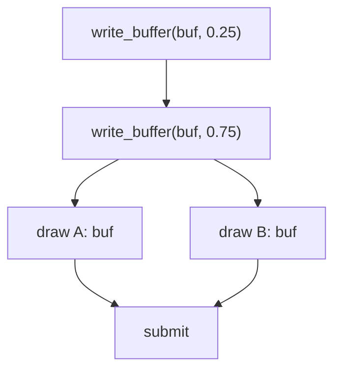
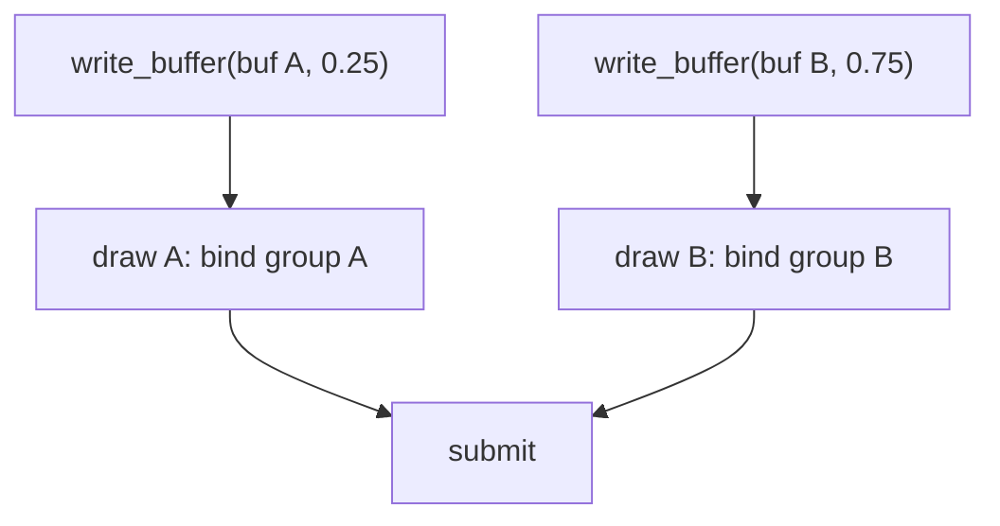

# Меняем данные во времени

::: info Только native
Продолжаем через [фреймворк](../framework-triangle/); вводится время и несколько draw в одном проходе.
:::

Uniform-буфер из [прошлой главы](../uniform-params/) загружался один раз при инициализации.
Теперь параметр живёт во времени, и встаёт вопрос: **какие значения увидит каждый draw?**

**Эксперимент:** прямоугольник рисуется двумя draw — по одному треугольнику, каждый со своим uniform-буфером.
Всеми управляет один закон: `gain = min(v · t, 1)` при `v = 0.25` в секунду; за 4 секунды прямоугольник набегает от чёрного к полному цвету.
Пауза — `Space`, сброс — `R`.

## Что видит записанный draw

Запись draw — команда со ссылками на ресурсы, а не фотография их содержимого.
Рассмотрим наивную попытку «разных значений для двух draw» через один буфер:



Обе загрузки выполняются до submit; когда GPU исполняет команды, в буфере лежит **последнее** записанное значение.
Оба draw увидят `0.75` — загрузка не «встраивается» между записями команд.

Корректная схема — раздельные ресурсы:



Каждая загрузка живёт в своём буфере, каждая привязка указывает на свой диапазон, и порядок загрузок перестаёт влиять на результат.
Это не требование «всегда два буфера на два draw», а механика: содержимое ресурса и запись команд — разные вещи.

## Часы сэмпла

Время — локальное состояние сэмпла, не фреймворка:

```rust
let now = Instant::now();
if let Some(last) = self.last_instant
    && !self.paused
{
    self.elapsed += now.duration_since(last).as_secs_f32();
}
self.last_instant = Some(now);
```

`Instant` измеряет прошедшее время; каждый кадр добавляет к `elapsed` время, прошедшее с предыдущего.
Часы останавливаются вместе с кадрами: пока redraw не запрашивается, время не идёт.
Оболочка осталась прежней — непрерывность обеспечиваем мы сами:

```rust
// Continuous animation: ask for the next frame after every redraw.
if matches!(event, WindowEvent::RedrawRequested) {
    window.request_redraw();
}
```

Это первое использование пересылки событий из [главы «Граница оконного фреймворка»](../framework-triangle/): сэмпл получил и событие, и окно, и запросил следующий кадр.
Тот же путь дают клавиши:

```rust
if let WindowEvent::KeyboardInput { event: key_event, .. } = event
    && key_event.state == ElementState::Pressed
    && let PhysicalKey::Code(key_code) = key_event.physical_key
{
    match key_code {
        KeyCode::Space => self.paused = !self.paused,
        KeyCode::KeyR => {
            self.elapsed = 0.0;
        }
        _ => {}
    }
}
```

Три условия собраны в одну цепочку — **let-chain** (издание 2024).

## Кадр: загрузки перед submit, два draw

Загрузка uniform выполняется в методе `draw` сэмпла — до записи команд в encoder:

```rust
let gain = (SPEED * self.elapsed).min(1.0);
let params = Params::with_gain(gain);
// Serialize once: both draws consume the same bytes.
let params_bytes = serialize(&params);
for buffer in &self.uniform_buffers {
    gpu.queue.write_buffer(buffer, 0, &params_bytes);
}
```

В снимке оба треугольника подчиняются одному закону времени; отдельные буферы нужны не для разных значений сейчас, а чтобы такая возможность была честной (упражнение ниже).

Запись прохода:

```rust
pass.set_pipeline(&self.pipeline);
pass.set_vertex_buffer(0, self.vertex_buffer.slice(..));
pass.set_index_buffer(self.index_buffer.slice(..), wgpu::IndexFormat::Uint16);
// First triangle: indices 0..3 with params 0.
pass.set_bind_group(0, &self.bind_groups[0], &[]);
pass.draw_indexed(0..3, 0, 0..1);
// Second triangle: indices 3..6 with params 1, before one submit.
pass.set_bind_group(0, &self.bind_groups[1], &[]);
pass.draw_indexed(3..6, 0, 0..1);
```

Индексы `[0, 1, 2, 2, 1, 3]` делятся на диапазоны `0..3` и `3..6` — по треугольнику на draw; смена bind group между draw'ами и есть «переключение параметров».

Кадр-эталон — момент `t = 2 с`, `gain = 0.5`:


Автоматическая проверка воспроизводит оба контрольных момента: `t = 2` даёт линейное деление на два каждого пикселя геометрии, `t = 0` — чёрная геометрия на сером фоне (проверяются центр геометрии и угол фона).

```sh
cargo run -p gain-animation
cargo test -p gain-animation
```

## Проверьте модель

1. При `v = 0.25` и `t = 2` чему равен gain? А при `t = 8`?
2. Задайте буферам разные константы (например, `0.25` и `0.75`), убрав часы. Что увидите и почему теперь порядок загрузок не важен?
3. Пауза останавливает картинку, но не окно. Почему resize во время паузы продолжает работать?
4. Обе загрузки в кадре пишут одинаковые байты. Можно ли в этом случае обойтись одним буфером и что изменится для упражнения 2?

::: details Решения и контрольные выводы

1. `min(0.25·2, 1) = 0.5`; `min(0.25·8, 1) = 1` — рост останавливается на полном значении.
2. Половины прямоугольника будут разной яркости: каждая читает свою привязку. Порядок загрузок не важен, потому что диапазоны разные — записи не перезаписывают друг друга.
3. Resize и перерисовка фона — события окна и фреймворка; пауза останавливает только наши часы внутри сэмпла.
4. Для одинаковых значений — да, один буфер с одной bind group достаточен. Разные значения потребуют раздельных диапазонов — как в упражнении 2.

:::

Uniform удобен для малых параметров, но каждая запись в нём стоит загрузки.
[Следующая глава](../vertex-pulling/) покажет второй способ чтения данных в шейдере — read-only storage — и сравнит его с vertex fetch на одной геометрии.
