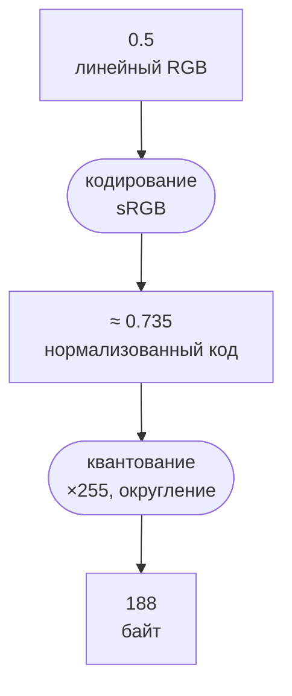

<script setup>
import PixelsDiagram from './PixelsDiagram.vue'
</script>


# Изображение и числа

::: info Только native
Курс посвящён нативным приложениям Rust; браузер и WASM остаются за рамками.
В этой главе достаточно CPU: программа печатает числа в терминале, окна ещё нет.
:::

Как изменить ровно один цвет в изображении, не затронув соседние?
Прежде чем создавать окно и обращаться к графическому процессору, договоримся, что именно хранится в памяти.
Знание Rust предполагается; графические понятия начнём с сетки и четырёх чисел.

**Эксперимент:** берём изображение 2×2, печатаем координаты и байты, обнуляем красный канал справа внизу.
Остальные 15 байт должны остаться прежними.
Результат программы будет текстовым; рисунок ниже показывает ожидаемое содержание изображения.

## Где находится пиксель

В этой главе изображение — прямоугольная сетка цветовых элементов.
Один элемент называется **пикселем**.
Это элемент наших данных; при увеличении одну ячейку можно показать большим квадратом.

Ширина `width` задаёт число столбцов, высота `height` задаёт число строк.
Пара `(x, y)` означает столбец и строку, оба отсчитываются от нуля.
Принимаем начало сверху слева: `x` растёт вправо, `y` растёт вниз.
Экранные координаты, которые появятся в главе о первом кадре, используют то же соглашение; математические координаты позже принесут ось Y вверх.

Для 2×2 допустимы только `x = 0, 1` и `y = 0, 1`.
Пиксель `(1, 0)` находится справа сверху, `(0, 1)` слева снизу.
Последняя допустимая координата на единицу меньше размера: `(2, 1)` уже вне изображения.

## Какие числа задают цвет

**Канал** хранит одну составляющую значения пикселя.
В RGB их три: красная (`R`, red), зелёная (`G`, green) и синяя (`B`, blue).
В принятой здесь модели нулевые RGB дают чёрный, максимальные — белый.
Красный и зелёный вместе дают жёлтый, зелёный и синий дают голубой: складываются вклады света, а не краски.

Добавим четвёртый канал `A`, **alpha**.
В наших данных он всегда равен 255 и задаёт полную непрозрачность; наличие A в массиве само по себе ничего не смешивает.
Смешивание нового цвета с уже записанным (**blending**) появится в главе о прозрачности [«Over и представление alpha»](../../space-light/blend-over/).
Пока фиксируем раскладку: пиксель — четыре байта, A — четвёртый из них.

Формат **RGBA8** в нашем массиве — это четыре последовательных канала R, G, B, A по 8 бит каждый.
Каждый занимает один `u8`, допустимы 256 целых значений от 0 до 255 включительно.
Один пиксель занимает 4 байта, всё изображение: `2 × 2 × 4 = 16` байт.
Имя RGBA8 описывает каналы и разрядность, но само по себе ещё не говорит, как RGB связаны с количеством света.

Вот данные эксперимента. RGB трактуем как коды sRGB для вывода; точный смысл кодирования разберём ниже.
Alpha везде 255, то есть нормализованная единица.

Константы в начале `src/main.rs` задают размеры и исходный массив:

```rust
const WIDTH: usize = 2;
const HEIGHT: usize = 2;
const CHANNELS: usize = 4;

// Rows run from top to bottom; each pixel stores R, G, B, A bytes.
const IMAGE: [u8; WIDTH * HEIGHT * CHANNELS] = [
    255, 0, 0, 255, 0, 255, 0, 255, // y = 0: red, green
    0, 0, 255, 255, 255, 255, 255, 255, // y = 1: blue, white
];
```

<PixelsDiagram />

Рисунок увеличивает каждый пиксель до квадрата и добавляет подписи, которых нет в исходных данных.
Четыре цвета расположены несимметрично, поэтому перепутанные строки или каналы легче заметить.
Нижний правый квадрат после изменения имеет RGB `(0, 255, 255)`; все остальные сохраняют цвет.

## Как сетка помещается в массив

Rust-массив здесь одномерный. Сначала кладём всю верхнюю строку слева направо, затем следующую.
Такой порядок называют **построчным**, или row-major.
Между строками нет дополнительных байтов, между пикселями нет промежутков.
Это наш компактный CPU-формат; внутренняя раскладка GPU-изображений будет другой.

Перед строкой `y` лежит `y × width` пикселей; внутри неё пропускаем ещё `x`.
Получаем номер пикселя `y × width + x`.
Умножаем на четыре байта и находим **смещение** от начала массива:

```text
pixel_offset = 4 * (y * width + x)
R: offset + 0   G: offset + 1   B: offset + 2   A: offset + 3
```

Смещение измеряется в байтах.
Для `(1, 1)` оно равно `4 × (1 × 2 + 1) = 12`: каналы занимают позиции 12, 13, 14, 15.
Последняя позиция 15 согласуется с длиной массива 16.

Следом за константами в `src/main.rs` определены две функции адресации и записи:

```rust
fn pixel_offset(x: usize, y: usize) -> usize {
    assert!(x < WIDTH && y < HEIGHT, "pixel coordinates out of bounds");
    CHANNELS * (y * WIDTH + x)
}

fn set_red(image: &mut [u8; WIDTH * HEIGHT * CHANNELS], x: usize, y: usize, red: u8) {
    image[pixel_offset(x, y)] = red;
}
```

`pixel_offset` намеренно работает только с фиксированными размерами этого снимка.
Проверка координат нужна до вычисления адреса: например, `(2, 0)` иначе попало бы на начало следующей строки.
`set_red` записывает один байт по адресу R, не трогая остальные каналы.
Библиотека изображений не нужна: работаем с сырыми байтами, без загрузчиков форматов и скрытых преобразований цвета.

## Что означает половина канала

Для хранения байты удобны, а для вычислений обычно удобнее диапазон от 0 до 1.
**Нормализация** беззнакового байта переводит его в этот диапазон делением на 255.
Такое представление называют UNORM, от unsigned normalized.
Получаются `0 → 0.0`, `255 → 1.0`, а `128 → 128/255 ≈ 0.502`.
Нормализация меняет числовой масштаб, но не смысл цвета.

Обратное преобразование требует выбрать один из 256 кодов.
Это **квантование**: непрерывный диапазон заменяется конечным набором значений, часть точности теряется.
В нашем примере сначала ограничиваем конечное входное число диапазоном `[0, 1]`, затем умножаем на 255 и округляем до ближайшего целого.
Ровно посередине выбираем большее: `0.5 × 255 = 127.5 → 128`.
Например, `0.25 → 64`, `0.75 → 191`; за пределами диапазона получаем 0 или 255.
NaN и бесконечности отклоняем.

Функция `quantize_channel` в том же файле выполняет только это числовое преобразование:

```rust
// This quantizes a normalized channel; it does not encode linear RGB as sRGB.
fn quantize_channel(value: f32) -> u8 {
    assert!(value.is_finite(), "channel must be finite");
    (value.clamp(0.0, 1.0) * 255.0).round() as u8
}
```

Для входа внутри `[0, 1]` ошибка после обратной нормализации не превышает половины шага, то есть `0.5/255 ≈ 0.001961` без учёта погрешности `f32`.
Это числовая оценка; заметность ошибки для глаза она не измеряет.
Значения вне диапазона теряют больше информации из-за ограничения.

### Половина света не равна коду 128

В **линейном RGB** значения пропорциональны вкладу соответствующего света.
`0.5` — половина светового вклада: каждой составляющей света вдвое меньше, чем у белого `1.0`.
Одинаковые линейные RGB дают нейтральный серый; половина — доля света, а не воспринимаемой яркости.

**sRGB** задаёт распространённый способ представления цвета для изображений и вывода.
В частности, он использует нелинейное кодирование RGB: равные шаги кода не соответствуют равным прибавкам света.
Кодов всего 256, и нелинейность распределяет их так, что тёмные оттенки различаются точнее светлых.
Кодирование и нормализация поэтому — разные операции.

Для следующих глав достаточно зафиксировать одну цепочку преобразований:



Стандартная функция sRGB даёт `0.73536`; подстановка в квантование даёт `round(0.73536 × 255) = 188`.
Полную кусочную функцию и обратное преобразование выведем в разделе о цветовом кодировании.
Если же просто вызвать `quantize_channel(0.5)`, получится **128**, поскольку кодирования sRGB в этой функции нет.
Байт 128, прочитанный как sRGB, соответствует примерно `0.216` линейного вклада, а не `0.5`.

В первом оконном примере мы явно выберем **sRGB-цель**, то есть изображение назначения с этим правилом хранения RGB.
Она автоматически закодирует записываемый линейный цвет; передавать туда нужно `0.5`, а не заранее закодированные `0.735`.
Иначе кодирование случится дважды.
Alpha этому цветовому преобразованию не подвергается: её 255 нормализуется в 1 без sRGB-кривой.
У крайних RGB 0 и 1 кодирование сохраняет значения, поэтому четыре исходных цвета не требуют вычисления этой кривой.

## Запускаем опыт

Снимок состоит из `Cargo.toml` с метаданными workspace и `src/main.rs`, внешних зависимостей нет.
Полный [`src/main.rs` с печатью, точкой входа и тестами](https://github.com/Bromles/wgpu-tutorial/blob/master/code/guide/foundations/image-data/src/main.rs) связывает показанные фрагменты в исполняемую программу.
Из корня репозитория:

```sh
cargo run -p image-data
cargo test -p image-data
```

Для диагностики `print_image` перебирает строки, затем столбцы и печатает координаты, смещение и четыре байта каждого пикселя.
В `main` после `let mut image = IMAGE;` выполняются эти три строки, не меняющие размеры, порядок каналов или alpha:

```rust
print_image("before", &image);
set_red(&mut image, 1, 1, quantize_channel(0.0));
print_image("after", &image);
```

Это фрагмент тела `main`; после него выводится результат `quantize_channel(0.5)`.

Стандартный вывод программы, без служебных сообщений Cargo:

```text
before
(0,0) offset=00 RGBA=[255, 0, 0, 255]
(1,0) offset=04 RGBA=[0, 255, 0, 255]
(0,1) offset=08 RGBA=[0, 0, 255, 255]
(1,1) offset=12 RGBA=[255, 255, 255, 255]
after
(0,0) offset=00 RGBA=[255, 0, 0, 255]
(1,0) offset=04 RGBA=[0, 255, 0, 255]
(0,1) offset=08 RGBA=[0, 0, 255, 255]
(1,1) offset=12 RGBA=[0, 255, 255, 255]
normalized 0.5 -> byte 128
```

Три теста проверяют соответствие координат и цветов, единственный изменённый байт и квантование каналов.
Последний также проверяет все 256 кодов: деление на 255 и обратное квантование возвращают исходный байт.
Внешний вид зависит от дисплея, его настроек и окружения; точность чисел проверяем выводом и тестами.

## Проверьте модель

1. Без запуска найдите адрес B у `(0, 1)`. Какое значение там хранится?
2. Предскажите результат замены R у `(1, 1)` на `quantize_channel(0.25)`. Сколько байт изменится относительно исходного массива?
3. Можно ли получить половину линейного белого, записав sRGB-байты `(128, 128, 128, 255)`? Включает ли A=255 смешивание?

::: details Решения и численные проверки

1. Начало пикселя: `4 × (1 × 2 + 0) = 8`. B находится по адресу `8 + 2 = 10`, значение 255.
2. `round(0.25 × 255) = 64`. Последний пиксель станет `[64, 255, 255, 255]`; изменится только байт 12, остальные 15 останутся прежними. Это изменение кода R, не назначение линейного вклада 0.25.
3. Нет: код 128 означает около 0.216 линейного вклада. Для 0.5 ориентир равен 188 по каждому RGB. Alpha=255 означает нормализованную единицу, но операцию blending нужно задавать отдельно; в этом примере её нет.
   :::

Мы научились отличать координату от адреса, канал от пикселя и нормализацию от кодирования света.
Но запись в CPU-массив ещё ничего не показывает в окне.
В главе [«CPU, GPU и очередь»](../cpu-gpu-queue/) разберём, кто выполняет будущие команды рисования и почему отправленная работа может ещё выполняться.
