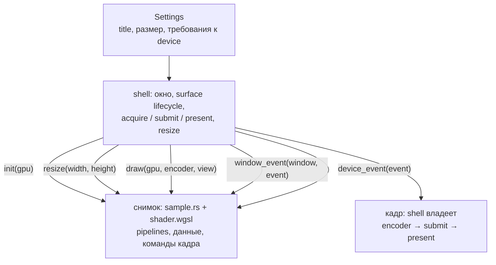

# Граница оконной оболочки

::: info Только native
Продолжаем [«От трёх точек к треугольнику»](../first-triangle/): wgpu 30, winit, pollster.
Ни одной новой графической возможности в этой главе нет.
:::

Что можно вынести из `main.rs` в общий код, ничего не спрятав от читателя?
Каждая следующая глава прибавляет данные и шейдеры; если одновременно тащить за собой две сотни строк lifecycle, урок утонет в повторах.
**Эксперимент этой главы — перенос кода:** тот же треугольник, тот же цвет и фон, то же окно, но вся оконная обвязка живёт в общей библиотеке `shell`.

Правило переноса простое: **выносить можно только уже объяснённое**.
Всё, что попадает в оболочку, берётся из главы [«Первый кадр»](../first-frame/) или [«Жизненный цикл поверхности»](../surface-lifecycle/) и переносится оттуда без изменений.
Участок без такого происхождения в оболочку не принимается.

## Запускаем снимок

```sh
cargo run -p shell-triangle
```

Ожидаемый кадр — в точности кадр [главы «От трёх точек к треугольнику»](../first-triangle/), вплоть до байта: автоматическая проверка сверяет снимок этой главы с эталоном `first-triangle.png`, допуск — **нулевой** (у самой главы «От трёх точек к треугольнику» допуск ненулевой — она задаёт эталон).
Resize, минимизация и восстановление работают как прежде: оболочка содержит ту же политику событий, что и [«Жизненный цикл поверхности»](../surface-lifecycle/).

## Карта ответственности



Пример не видит ни окна, ни event loop, ни surface: всё это у оболочки.
Оболочка не знает слов «треугольник», «буфер» или «камера»: она вызывает пять методов сэмпла и больше ничего.

Контракт вызовов:

| Метод сэмпла | Когда вызывается | Что делает |
| --- | --- | --- |
| `Sample::init(gpu)` | После создания (или пересоздания после `Lost`) контекста | Создаёт pipelines и прочие GPU-ресурсы под формат поверхности |
| `Sample::resize(width, height)` | Сразу после `init` (с фактическим размером окна), до первого `draw`; затем на каждое изменение размера окна | Локальные ресурсы, зависящие от размера: aspect проекции, depth-аттачмент — в будущих главах. Сэмплу не нужен «запасной» размер — контракт гарантирует настоящий. По умолчанию ничего |
| `Sample::draw(&mut self, gpu, encoder, view)` | Каждый допустимый redraw, до submit | Записывает команды кадра в переданный encoder |
| `Sample::window_event(window, event)` | Каждое событие нашего окна, пока жив контекст | Локальная реакция главы: клавиши, фокус; по умолчанию ничего |
| `Sample::device_event(event)` | Каждое событие устройства (например, относительное движение мыши), пока жив контекст | Локальная реакция главы; по умолчанию ничего |

`Gpu` — это `device`, `queue` и `format`: три значения, которые глава [«Первый кадр»](../first-frame/) уже объяснила.
Handles в wgpu дёшевы и клонируются, поэтому оболочка отдаёт их копию, а не себя.

Владение кадром осталось у оболочки: сэмплу передаются `encoder` и `view`, а `submit` и `present` делает оболочка.
Такой порядок сохраняет вывод [«Жизненного цикла поверхности»](../surface-lifecycle/): до повторной configure не остаётся живого surface frame, и между acquire и present нельзя вставить configure.

## Код оболочки

Крейт `shell` — это `main.rs` [главы «От трёх точек к треугольнику»](../first-triangle/), из которого убрано всё специфичное для конкретного примера.

Перенесено без изменений: `Context::new` со всей инициализацией из [«Первого кадра»](../first-frame/) (instance, adapter, запрос device по дескриптору, capabilities, выбор sRGB-формата, FIFO, `on_uncaptured_error`), `Context::resize`, вся машина состояний `App` из [«Жизненного цикла поверхности»](../surface-lifecycle/) (`active`/`occluded`/`size`/`retry_at`, семь исходов acquire, `about_to_wait` с `WaitUntil`), обработчики `resumed`/`suspended`/`window_event` и выход по Escape/крестику.

Изменились три вещи.

Требования к устройству приходят снаружи — пример описывает их в `Settings`, а оболочка передаёт дескриптор в `request_device`:

```rust
pub struct Settings {
    pub title: String,
    pub inner_size: (u32, u32),
    pub device_descriptor: wgpu::DeviceDescriptor<'static>,
}
```

Поле `sample: Sample` ушло из `Context` в `App` и стало `Option`: контекст и его ресурсы пересоздаются после `Lost`, а сэмпл создаётся заново вместе с ним. Сразу за `init` оболочка сообщает сэмплу фактический размер окна — событие `Resized`, пришедшее до создания контекста, не теряется, а после пересоздания в уже изменённом окне сэмпл получает текущий размер, не полагаясь на новое событие:

```rust
if self.context.is_none() {
    let context = Context::new(window.clone(), &self.settings)?;
    let gpu = context.gpu();
    let mut sample = S::init(&gpu)?;
    sample.resize(self.size.width, self.size.height);
    self.sample = Some(sample);
    self.context = Some(context);
}
```

`Context::render` больше не знает, что рисует — запись кадра делегирована сэмплу, а submit/present остались на месте:

```rust
let mut encoder = self
    .device
    .create_command_encoder(&wgpu::CommandEncoderDescriptor {
        label: Some("Shell encoder"),
    });
sample.draw(&self.gpu(), &mut encoder, &view);
self.queue.submit([encoder.finish()]);
```

И одна добавка, а не перенос: событие нашего окна сначала пересылается сэмплу «как есть», и только затем оболочка применяет свою lifecycle-обработку.
Её собственная ветка `Resized` вдобавок доставляет размер через контракт `resize`.
Само событие сэмплу ничего не говорит о порядке: размер приходит методом, а не событием:

```rust
// Raw forwarding first: chapter-local code reacts to its own events.
if let Some(sample) = &mut self.sample {
    sample.window_event(window, &event);
}
```

События устройства — второго рода поток ввода: они принадлежат устройству, а не окну. Оболочка пересылает их так же сырыми, без фильтрации; относительное движение мыши — тема главы [«Управляемая камера»](../../space-light/camera-fly/).

Это forwarding: оболочка не фильтрует, не накапливает и не интерпретирует события; всё это появится локально в тех главах, где это нужно.

Одна тонкость lifecycle, без которой forwarding неполон: сэмпл создаётся лениво — внутри первого `RedrawRequested`, позже места, где оболочка пересылает события. Оболочка доставляет это событие только что созданному сэмплу повторно: анимационные снимки заказывают следующий кадр именно из обработчика `RedrawRequested`, и без этой доставки непрерывный цикл зависел бы от случайной дополнительной перерисовки ОС. Статичные снимки событие игнорируют — их событийное поведение не меняется.

## Код снимка

Снимок `shell-triangle` сократился до трёх файлов.

`src/shader.wgsl` — шейдер [главы «От трёх точек к треугольнику»](../first-triangle/) без изменений кода (другой только заголовочный комментарий).
`src/sample.rs` — прежний `Sample::new` и `Sample::draw` под новой подписью трейта; переименованы метки ресурсов и комментарии.
`src/main.rs` — вся оконная программа главы:

```rust
fn main() -> Result<(), Box<dyn Error>> {
    tracing_subscriber::fmt()
        .with_max_level(tracing::Level::INFO)
        .init();
    shell::run::<Triangle>(shell::Settings {
        title: "wgpu | Shell triangle".into(),
        ..shell::Settings::default()
    })
}
```

Тонкая деталь для будущих глав: у пакета есть и `lib.rs`, открывающий `sample` наружу.
Единственный потребитель — крейт `foundations-verify`, который рисует тот же кадр offscreen без окна; статья не показывает `lib.rs`, потому что читателю он не нужен.

## Заморозка

После этой главы функциональный объём `shell` заморожен: исправления ошибок допустимы, наращивание — нет.
Никаких камер, таймеров, генераторов геометрии, загрузчиков текстур или renderer-абстракций внутри; поздние главы вводят свои механизмы локально.
Если какой-то способности будет не хватать, это станет явным учебным решением, а не тихим изменением раннего кода.
Уточнение контракта — не наращивание: первоначальная версия не оговаривала, кто и когда сообщает сэмплу размер цели и откуда приходит поток относительного движения мыши. Оба вопроса — часть lifecycle, и оба закрыты методами `resize` и `device_event`; содержательной нагрузки в оболочке не прибавилось.

Оболочка уже умеет всё, что требует план основ: параметры устройства из `Settings` позволят главе про immediates запросить соответствующую feature, а пересылка событий даст главе про анимацию её паузу и сброс.

## Проверьте модель

1. Сравните кадры `cargo run -p first-triangle` и `cargo run -p shell-triangle`. Что именно доказывает их совпадение и чего оно не доказывает?
2. Пройдите resize/minimize/restore в обоих снимках. Какая часть кода отвечает за одинаковое поведение?
3. Для каждого участка `shell/src/lib.rs` назовите главу и раздел, где он объяснён. Нашёлся ли участок без происхождения?
4. Почему `Sample::draw` получает `encoder` и `view`, а не создаёт encoder сама и не делает present?

::: details Решения и контрольные выводы

1. Совпадение кадров доказывает, что перенос не изменил ни цветовой контракт, ни геометрию, ни порядок submit/present на проверенном разрешении. Оно не доказывает корректность всех веток lifecycle: `Lost`, `Timeout` и suspend по-прежнему проверяются интерактивно, как в [«Жизненном цикле поверхности»](../surface-lifecycle/).
2. Машина состояний `App` и `Context` внутри `shell`: оба снимка делят один и тот же код, поэтому и поведение одно.
3. Инициализация и configure — «Первый кадр»; машина состояний, retry и владение frame — «Жизненный цикл поверхности»; делегирование draw — переработка render из [главы «От трёх точек к треугольнику»](../first-triangle/). Без происхождения остаются только `Settings` и трейт — это и есть предмет настоящей главы.
4. Кто владеет кадром, тот и отправляет: так оболочка гарантирует, что между acquire и present живого кадра не появится configure, а сэмпл остаётся переносимым между окном и offscreen-проверкой.

:::

С этого момента главы начинаются не с окна, а с данных.
В [«Интерполяции»](../vertex-colors/) три вершины треугольника получат разные цвета, и мы разберём, откуда берётся плавный переход между ними.
