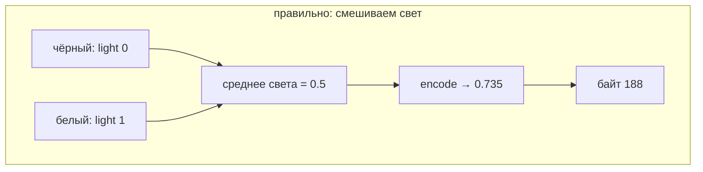
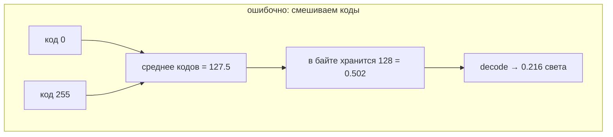

<script setup>
import SrgbCurveDiagram from './SrgbCurveDiagram.vue'
</script>


# Цвет и его кодирование

::: info Только native
Диагностическая страница: те же два draw и uniform-привязки, что и раньше; новая математика — на CPU.
:::

В [«Изображении и числах»](../image-data/) мы приняли контракт «0.5 кодируется примерно в 188» без формулы.
Настало время выполнить обещание: вывести кусочную функцию целиком и увидеть на экране, чем смешивание света отличается от смешивания кодов.

**Эксперимент:** два прямоугольника рядом.
Левый показывает правильное смешивание чёрного и белого **в линейных значениях** — код 188.
Правый показывает среднее **кодов** чёрного и белого — декодированное значение около 0.21 света, код 127.

## Полная функция

Локальный `color.rs` теперь содержит обе операции:

```rust
/// Linear light -> sRGB code in [0, 1].
pub fn srgb_encode(linear: f32) -> f32 {
    assert!(
        (0.0..=1.0).contains(&linear),
        "linear value must be in [0, 1]"
    );
    if linear <= 0.003_130_8 {
        12.92 * linear
    } else {
        1.055 * linear.powf(1.0 / 2.4) - 0.055
    }
}

/// sRGB code in [0, 1] -> linear light.
pub fn srgb_decode(code: f32) -> f32 {
    assert!((0.0..=1.0).contains(&code), "code must be in [0, 1]");
    if code <= 0.040_45 {
        code / 12.92
    } else {
        ((code + 0.055) / 1.055).powf(2.4)
    }
}
```

Функция **кусочная**: у нуля код пропорционален свету (12.92·x), дальше — степенная ветвь `1.055·x^(1/2.4) − 0.055`.
Излом специально подобран так, чтобы ветви стыковались; константы стыка (`0.0031308`, `0.04045`) заданы в стандарте с конечной точностью — поэтому тесты проверяют непрерывность до ~1e-4.

<SrgbCurveDiagram />

Кривая выше диагонали: код растёт быстрее света в тёмной части.
Отсюда все знакомые числа: `encode(0.5) ≈ 0.735 → 188`, а `decode(128/255) ≈ 0.21` — меньше половины света.

Соседние тесты фиксируют контракт: 0.5 → 188, decode→encode не теряет ни одного из 256 кодов, ветви стыкуются. Показанный тест — про расхождение двух политик смешивания:

```rust
#[test]
fn mixing_policies_disagree() {
    // Correct: mean light, then encode.
    let correct = quantize_u8(srgb_encode(mean_linear(0.0, 1.0)));
    assert_eq!(correct, 188);
    // Erroneous: mean of stored codes.
    let wrong_code = mean_of_codes(0, 255);
    assert_eq!(wrong_code, 127);
    // Decoded, the wrong code is much less than half the light.
    let wrong_linear = srgb_decode(f32::from(wrong_code) / 255.0);
    assert!((wrong_linear - 0.212).abs() < 0.001);
    assert!(wrong_linear < 0.5);
}
```

## Две цепочки

Правильный порядок операций и ошибочный:





Идеальное среднее кодов 0 и 255 — 127.5: хранение в байте округляет до 128 (0.502), целочисленная арифметика примера даёт 127 (0.498). Для контраста с 188 разница огромна при любом из двух «половинных» значений.

Среднее кодов — операция над другим объектом: над кодами, а не над светом.
Проблема возникает, когда результат выдают за «половину яркости».

## Диагностический кадр

Значения для обеих половин вычисляются на CPU в `Sample::init` — теми же функциями из `color.rs`:

```rust
let correct_linear = mean_linear(0.0, 1.0);
let wrong_code =
    mean_of_codes(quantize_u8(srgb_encode(0.0)), quantize_u8(srgb_encode(1.0)));
let wrong_linear = srgb_decode(f32::from(wrong_code) / 255.0);
```

Левый quad получает uniform-цвет `(0.5, 0.5, 0.5)`, правый — `(0.212, 0.212, 0.212)`.
Обе записи идут через знакомый uniform-путь с одной структурой `Tone { color: vec4 }`; immediates не требуются.

Финальное кодирование выполняет sRGB-цель ровно один раз — как в [«Первом кадре»](../first-frame/): мы передаём линейные значения, поверхность кодирует.


Правый прямоугольник темнее **фона**, хотя «среднее чёрного и белого» интуитивно сулит серый в тон фону.
Фон — линейные 0.5 (код 188), и это честная половина света.

Автоматическая проверка щупает обе половины на ожидаемые коды и сверяет кадр с эталоном.

```sh
cargo run -p srgb-mixing
cargo test -p srgb-mixing
```

## Что кодируется, а что нет

Зафиксируем границы:

- sRGB-кодируется **хранение и вывод** RGB; вычисления — в линейных значениях.
- **Alpha не кодируется**: её 255 — нормализованная единица без кривой.
- Числовые данные (высоты, индексы, маски) — не цвет; к ним transfer function не применяют.
- UNORM-нормализация байта (`128/255 ≈ 0.502`) — масштаб числа, не decode; путать её с кодированием — та же ошибка, что и среднее кодов.

Эти правила понадобятся немедленно: [первая текстура](../texture-load/) — изображение из главы 01, чьи байты — sRGB-коды, а чтение в шейдер возвращает свет.

## Проверьте модель

1. Почему правый прямоугольник темнее левого, хотя обе половины «среднее чёрного и белого»?
2. Вычислите `encode(0.25)` и сравните с квантованием из главы 01 (`0.25 → 64`). Почему результаты разные?
3. UNORM-декод байта 128 даёт 0.502, а sRGB-decode — 0.216 для кода 0.5. Каким одним предложением различить эти операции?
4. Кадр кодируется целью один раз. Где именно была бы вторая, если бы uniform хранил уже готовый код 0.735?

::: details Решения и контрольные выводы

1. Левое — среднее света 0.5 (код 188), правое — среднее кодов 127, то есть всего ~0.21 света.
2. Глава 01 применяла только квантование `round(x·255)` без transfer function: 0.25·255 = 63.75 → 64. С кодированием: `encode(0.25) ≈ 0.537 → 137`. Разница — именно кривая.
3. Нормализация меняет масштаб числа (`байт → [0,1]`), decode переводит между светом и кодом по кривой; у нормализации нет 2.4-й степени.
4. Мы передали бы 0.735 в sRGB-цель, и цель закодировала бы его повторно: `encode(0.735) ≈ 0.873 → 223` — двойное кодирование делает «светлый серый» почти белым.

:::

Свет и коды разделены. [Дальше](../texture-load/) — первый ресурс-изображение: текстура 2×2 из той же таблицы RGBA8, знакомой с самого начала курса.
