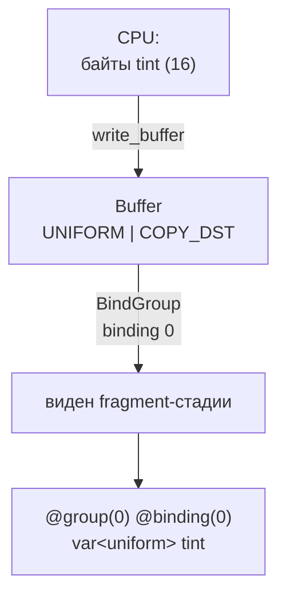

# Shader bindings и layout: ресурс и привязка

::: info Только native
Продолжаем через [фреймворк](../framework-triangle/); новая сущность — привязка ресурса к шейдеру.
:::

Параметры пока вшивались в данные: изменить цвет вершины — значит перезагрузить буфер.
Настоящие «настройки сцены» — tint, яркость, будущая камера — меняются без пересборки геометрии.
Для этого шейдеру нужен доступ к ресурсам, привязанным извне.

**Эксперимент:** прямоугольник из [прошлой главы](../indexed-geometry/) умножается на `tint` — uniform-вектор `(1, 1, 1, 1)`.
Нейтральное значение выбрано сознательно: кадр обязан остаться прежним байт в байт, меняется только путь параметра.

## Путь параметра



Четыре участника, и у каждого своя ответственность:

| Участник | Что задаёт |
| --- | --- |
| `Buffer` | Байты и usages: `UNIFORM` — источник привязки, `COPY_DST` — цель загрузки |
| `BindGroupLayout` | Тип и размер привязки, видимость по стадиям |
| `BindGroup` | Конкретный буфер (+offset/размер) в слотах layout'а |
| `PipelineLayout` | Какие группы и в каком порядке принимает pipeline |

## Uniform-буфер

**Uniform** — первое из адресных пространств WGSL — областей памяти со своими правилами доступа: маленькие константы, одинаковые для всех вызовов стадии, только для чтения.
Размер привязки в этой главе — ровно 16 байт: один `vec4<f32>`.
У вектора из четырёх `f32` и размер, и выравнивание равны 16: запись `vec4` обязана начинаться по адресу, кратному 16 (это требование называют выравниванием). Правило станет критичным на следующей странице, когда полей станет несколько.

Создание и загрузка в `Sample::init`:

```rust
let uniform_buffer = gpu.device.create_buffer(&BufferDescriptor {
    label: Some("Tint uniform buffer"),
    size: 16,
    usage: BufferUsages::UNIFORM | BufferUsages::COPY_DST,
    mapped_at_creation: false,
});
gpu.queue
    .write_buffer(&uniform_buffer, 0, bytemuck::cast_slice(&TINT));
```

Значение — модульная константа снимка:

```rust
// One vec4<f32> uniform: 16 bytes of payload, 16 bytes of alignment. The
// neutral tint leaves the indexed-geometry frame unchanged.
const TINT: [f32; 4] = [1.0, 1.0, 1.0, 1.0];
```

## Layout и группа

`BindGroupLayout` описывает слот привязки:

```rust
let bind_group_layout =
    gpu.device
        .create_bind_group_layout(&BindGroupLayoutDescriptor {
            label: Some("Tint bind group layout"),
            entries: &[BindGroupLayoutEntry {
                binding: 0,
                visibility: ShaderStages::FRAGMENT,
                ty: BindingType::Buffer {
                    ty: BufferBindingType::Uniform,
                    has_dynamic_offset: false,
                    min_binding_size: BufferSize::new(16),
                },
                count: None,
            }],
        });
```

- `binding: 0` — номер слота внутри группы; шейдер обратится к нему как `@binding(0)`.
- `visibility: FRAGMENT` — привязка видна только фрагментной стадии; остальные её не видят.
- `min_binding_size` — минимальный размер привязываемого диапазона; wgpu проверит его при создании группы.

`BindGroup` наполняет слот конкретным ресурсом:

```rust
let bind_group = gpu.device.create_bind_group(&BindGroupDescriptor {
    label: Some("Tint bind group"),
    layout: &bind_group_layout,
    entries: &[BindGroupEntry {
        binding: 0,
        resource: wgpu::BindingResource::Buffer(BufferBinding {
            buffer: &uniform_buffer,
            offset: 0,
            size: None,
        }),
    }],
});
```

`offset` и `size` задают **диапазон внутри буфера**: сам буфер может быть больше, а привязка — его часть.
Это различие вернётся, когда данных станет много.

Pipeline теперь получает явный layout вместо автоматического пустого:

```rust
let pipeline_layout = gpu
    .device
    .create_pipeline_layout(&PipelineLayoutDescriptor {
        label: Some("Tint pipeline layout"),
        bind_group_layouts: &[Some(&bind_group_layout)],
        immediate_size: 0,
    });
```

`immediate_size: 0` — размер блока immediates; этот механизм появится в своей главе.

## Шейдер

В WGSL ресурс объявляется на уровне модуля и попадает в группу:

```wgsl
@group(0) @binding(0) var<uniform> tint: vec4<f32>;

@fragment
fn fs_main(input: VertexOutput) -> @location(0) vec4<f32> {
    return vec4<f32>(input.color * tint.rgb, 1.0);
}
```

`@group(0)` — номер группы, совпадающий с индексом в `set_bind_group(0, ...)`; `@binding(0)` — слот внутри неё.
`var<uniform>` выбирает адресное пространство: доступ на чтение, единый для всех вызовов.
Атрибуты `@location` вершинного интерфейса и пары `@group/@binding` — разные системы нумерации: первые связывают стадии между собой, вторые — шейдер с внешними ресурсами.

## Запись draw

Новая строка одна — `set_bind_group`: с этого момента и до смены все draw'и этого прохода видят привязку.

```rust
pass.set_pipeline(&self.pipeline);
pass.set_bind_group(0, &self.bind_group, &[]);
pass.set_vertex_buffer(0, self.vertex_buffer.slice(..));
pass.set_index_buffer(self.index_buffer.slice(..), wgpu::IndexFormat::Uint16);
pass.draw_indexed(0..6, 0, 0..1);
```

Автоматическая проверка сравнивает кадр с эталоном [«Индексированная геометрия»](../indexed-geometry/) с нулевым допуском:

```sh
cargo run -p uniform-tint
cargo test -p uniform-tint
```

## Проверьте модель

1. Задайте `TINT = [0.5, 1.0, 1.0, 1.0]`. Какой линейный цвет получит белый угол и каким будет его sRGB-код?
2. Почему `visibility` стоит ограничивать одной стадией, если шейдер всё равно читает только своё?
3. Что именно проверяет wgpu благодаря `min_binding_size: 16` и что не проверяет?
4. Сколько байтов занял бы uniform-буфер с двумя `vec4`? Почему ответ «32», а не «зависит от полей», вы увидите на следующей странице.

::: details Решения и контрольные выводы

1. Линейный `(0.5, 1, 1)`; sRGB-коды ≈ `(188, 255, 255)` — голубоватый.
2. Это и производительность (ресурс не транслируется в ненужные стадии), и корректность: ошибочная привязка ловится на границе стадии, а не в произвольном месте.
3. Достаточность размера диапазона при создании группы. Не проверяется: смысл байтов — tint с перепутанными каналами пройдёт валидацию.
4. 32: два вектора по 16 байт без зазоров. А вот `vec4` + `f32` — уже не «20», и это тема следующей страницы.

:::

Одно поле — простой случай.
[Дальше](../uniform-params/) полей станет два, появятся padding, хвостовое выравнивание и сериализация через encase.
