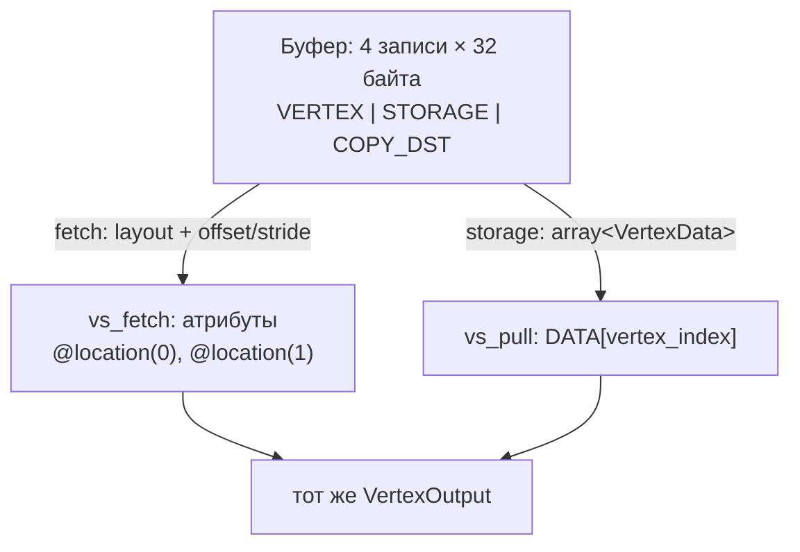

# Read-only storage и vertex pulling

::: info Только native
Продолжаем через [оболочку](../shell-triangle/); проверка поддержки limits — на месте, до создания binding.
:::

До сих пор адрес записи вершины определял layout — шейдер не мог выбрать запись сам.
Второй способ — **storage**: буфер виден шейдеру как массив, который код адресует явно.
Глава сравнивает оба контракта на одних и тех же байтах; приём «вершинный шейдер сам читает свою запись по индексу» называют **vertex pulling**.

**Эксперимент:** прежний анимированный кадр с двумя draw из [главы «Меняем данные во времени»](../gain-animation/).
Клавиша `F` переключает способ чтения геометрии; больше ничего не меняется.
Оба пути обязаны давать одинаковый кадр: байты и записи одни и те же, `Space`/`R` — пауза/сброс времени.

## Две дорожки от одних байтов



Буфер один; различие — в способе доступа.
Fetch ведёт себя как конвейер: `vertex_index × stride + offset` вычисляет фиксированная логика.
Storage — как массив: адрес вычисляет шейдер.

## Storage-привязка

Слой привязки знаком по uniform, меняется тип:

```rust
let storage_layout =
    gpu.device
        .create_bind_group_layout(&BindGroupLayoutDescriptor {
            label: Some("Vertex storage bind group layout"),
            entries: &[BindGroupLayoutEntry {
                binding: 0,
                visibility: ShaderStages::VERTEX,
                ty: BindingType::Buffer {
                    ty: BufferBindingType::Storage { read_only: true },
                    has_dynamic_offset: false,
                    min_binding_size: None,
                },
                count: None,
            }],
        });
```

`read_only: true` — обещание «шейдер не пишет»; за него — менее строгие limits и будущие оптимизации.
Storage не привязан к compute: здесь он читается вершинной стадией — это обычная возможность.

До создания привязки проверяется лимит:

```rust
if gpu.device.limits().max_storage_buffers_per_shader_stage == 0 {
    return Err(
        "This example requires at least one storage buffer in the vertex stage".into(),
    );
}
```

На практике у всех десктопных GPU этот лимит ненулевой; проверка — правило главы [«Первый кадр»](../first-frame/): требования заявлять явно.

Сам буфер получает оба usage'а сразу:

```rust
let vertex_buffer = gpu.device.create_buffer(&BufferDescriptor {
    label: Some("Shared vertex storage"),
    size: size_of_val(&VERTICES) as u64,
    usage: BufferUsages::VERTEX | BufferUsages::STORAGE | BufferUsages::COPY_DST,
    mapped_at_creation: false,
});
```

Одни и те же байты, два права доступа: fetch требует `VERTEX`, storage — `STORAGE`.
Запись `32 байта = vec4 + vec4` подходит обоим. Её stride — 32 в любом адресном пространстве (у двух `vec4` размер и так кратен выравниванию), так что раскладка одна и та же. Различаются только ограничения допустимости в uniform (строже для массивов и вложенных структур) — их показала глава [«Смешанные поля»](../uniform-params/); здесь они роли не играют.

## Шейдер: две точки входа

```wgsl
struct VertexData {
    position: vec4<f32>,
    color: vec4<f32>,
};

@group(1) @binding(0) var<storage, read> DATA: array<VertexData>;

@vertex
fn vs_fetch(input: VertexInput) -> VertexOutput {
    var output: VertexOutput;
    output.position = input.position;
    output.color = input.color.rgb;
    return output;
}

@vertex
fn vs_pull(@builtin(vertex_index) vertex_index: u32) -> VertexOutput {
    // In an indexed draw vertex_index is the index value: the fetch and the
    // pull address the same record without re-reading the index buffer.
    let data = DATA[vertex_index];
    var output: VertexOutput;
    output.position = data.position;
    output.color = data.color.rgb;
    return output;
}
```

`array<VertexData>` — **runtime-sized array**: длина не в типе, она определяется привязанным диапазоном.
Обращение `DATA[i]` читает запись по её stride; при indexed draw `vertex_index` уже несёт значение индекса — читать индексный буфер в шейдере не нужно.

Границы — наша ответственность: `DATA[7]` при четырёх записях не обещает ни паники, ни ошибки валидации.
Индексы корректны, потому что данные известны; защита на CPU — тема будущих глав про динамические данные.

## Два pipeline

Каждый способ — свой pipeline со своим layout'ом: у fetch — vertex buffer и только params, у pulling — params и storage:

```rust
let fetch_layout = gpu
    .device
    .create_pipeline_layout(&PipelineLayoutDescriptor {
        label: Some("Fetch pipeline layout"),
        bind_group_layouts: &[Some(&params_layout)],
        immediate_size: 0,
    });
let pulling_layout = gpu
    .device
    .create_pipeline_layout(&PipelineLayoutDescriptor {
        label: Some("Pulling pipeline layout"),
        bind_group_layouts: &[Some(&params_layout), Some(&storage_layout)],
        immediate_size: 0,
    });
```

Группа 0 — общие params, группа 1 — только у pulling; запись прохода выбирает набор привязок:

```rust
let pipeline = match self.mode {
    Mode::Fetch => &self.pipelines[0],
    Mode::Pulling => &self.pipelines[1],
};
pass.set_pipeline(pipeline);
if self.mode == Mode::Pulling {
    pass.set_bind_group(1, &self.storage_bind_group, &[]);
} else {
    pass.set_vertex_buffer(0, self.vertex_buffer.slice(..));
}
```

Автоматическая проверка гоняет оба режима при `gain = 1` и требует нулевого отличия от эталона [«Индексированная геометрия»](../indexed-geometry/):

```sh
cargo run -p vertex-pulling
cargo test -p foundations-verify
```

## Сравнение: что изменилось

Поменяли мы **способ доступа**: записи те же 32 байта, изображение то же.
Делает ли это storage «быстрее» или «медленнее»? Ни то, ни другое из этого не следует: сравнение поведения — не измерение производительности.
Плюсы pulling проявятся позже: явная адресация позволит прочитать одну запись из нескольких мест, собрать вершину из нескольких массивов или реконструировать атрибут.
Fetch остаётся полностью законным способом — просто другим контрактом.

## Проверьте модель

1. Для индексов `0, 1, 2, 2, 1, 3` выпишите адреса записей, которые прочитает `vs_pull`. Совпадают ли они с адресами fetch?
2. Что изменится, если привязать к storage не весь буфер, а диапазон со `offset: 32`? (Прежде чем обещать кадр — вспомните об ограничениях привязки: смещение и длину буфера, и то, какие индексы использует пример.)
3. Какова раскладка записи `{ vec4, f32 }` в storage и в uniform — и что из этого следует про stride массива таких записей?
4. Поменяйте в `vs_pull` индекс на `vertex_index + 1`. Что можно обещать про кадр, если последний вызов выйдет за границу массива?

::: details Решения и контрольные выводы

1. `0, 32, 64, 64, 32, 96` — те же адреса: оба способа адресуют одни записи, изображение совпадает байт в байт (это и проверяет тест).
2. Сначала — две проверки валидности. Смещение привязки должно быть кратно лимиту устройства `min_storage_buffer_offset_alignment` (по умолчанию 256), так что 32 без понижения лимита — ошибка валидации; смещение 256 кратно лимиту, но превышает размер 128-байтового буфера — привязка не пройдёт валидацию (offset + min_binding_size > buffer size). Даже с валидным смещением и достаточно большим буфером ответ — не «кадр сдвинется»: индекс 3 примера вышел бы за границу нового диапазона, а чтение за границей — динамическая ошибка с непредсказуемым кадром.
3. Одна и та же: поле `f32` на 16, хвост до 32 — правило округления размера общее для всех адресных пространств. И stride `array` из таких записей одинаковый — 32. Различаются не раскладки, а допустимость типов: uniform дополнительно требует кратный 16 stride у любых массивов — здесь он и так 32, так что запись проходит в оба пространства без изменений.
4. Ничего определённого. Чтение за границей — динамическая ошибка: реализация может вернуть любое значение из буфера или нулевое — стандарт не обещает ни конкретного значения, ни нуля. Позиция вышедшей вершины непредсказуема, `w` не обязан быть ни 1, ни 0, и кадр может быть каким угодно — от исходного до исчезнувшего треугольника. Вывод другой: валидная программа не полагается на значение вне границы, защита индексов — тема будущих глав про динамические данные.

:::

Uniform и storage закрывают «большие» параметры и таблицы.
[Следующая глава](../draw-immediates/) добавит третий механизм — immediates: крошечные значения, живущие прямо в состоянии команд.
