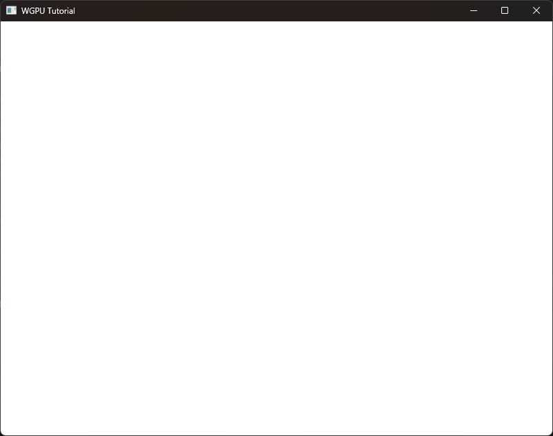

---
next:
  text: "Инициализация wgpu"
  link: "/guide/getting-started/init-wgpu"
---

# Создание окна

[Полный код главы](https://github.com/Bromles/wgpu-tutorial/tree/master/code/guide/getting-started/creating-window)

## Первые шаги

Первое, что нам необходимо сделать, прежде чем погружаться в чудесный мир графики - создать окно приложения, в которое
мы будем выводить нашу картинку.

<div class="info custom-block" style="padding-top: 8px">
<p class="custom-block-title">Примечание</p>
<p>
Мы можем использовать графическое API и без окна, рендеря в текстуру и сохраняя ее на диск как изображение. 
Пример подобного подхода есть в 
<a href="https://github.com/gfx-rs/wgpu/tree/trunk/examples/features/src/render_to_texture">репозитории wgpu</a>.
</p>
</div>

Сложность заключается в том, что у каждой операционной системы для этого надо использовать отдельное API, а у некоторых
даже более одного (например, Linux, где у каждого оконного сервера оно своё). Вдобавок, нам будет необходимо считывать
пользовательский ввод, такой как движения мыши, нажатия клавиш, а также касания экрана (в случае мобильного приложения),
что
несет с собой аналогичные проблемы.

К счастью, с этой проблемой уже многие сталкивались, и существуют кроссплатформенные решения. В экосистеме Rust для
этого есть как привязки к популярным библиотекам C++, таким как GLFW и SDL, так и собственное, написанное исключительно
на Rust решение под названием [winit](https://crates.io/crates/winit).

Мы будем использовать winit, поскольку это одновременно и упростит нам настройку и портирование благодаря отсутствию
кода на C++ в зависимостях, и приведет к лучшей совместимости с экосистемой ввиду его подавляющей распространенности.
Все
популярные проекты на Rust, так или иначе связанные с графикой, в первую очередь поддерживают winit, вне зависимости от
используемого графического API. Также дизайн API winit упрощает написание кроссплатформерного кода, поддерживающего как
дескопные, так и мобильные платформы, с нюансами их работы вроде реконфигураций.

Использование именно winit необязательно для освоения данного руководства, вы можете использовать любую библиотеку или
работать без нее. wgpu поддерживает не только winit, но и библиотеку
[raw-window-handle](https://github.com/rust-windowing/raw-window-handle) от его авторов, с которой совместимы все
используемые оконные решения в Rust экосистеме.

## Зависимости проекта

Для начала обойдемся простым списком библиотек. Ниже приведена секция зависимостей нашего `Cargo.toml`:

```toml
winit = "0.30"
tokio = { version = "1.47", features = ["parking_lot", "rt"] }
tracing = "0.1"
tracing-subscriber = "0.3"
wgpu = "27.0"
bytemuck = { version = "1.9", features = ["derive"] }
encase = "0.12"
glam = { version = "0.30", features = ["debug-glam-assert", "encase", "bytemuck"] }
image = "0.25"
```

<div class="warning custom-block" style="padding-top: 8px">
<p class="custom-block-title">Обратите внимание</p>
<p>
wgpu требует resolver 2 в Cargo.toml для корректной работы. В отдельных крейтах Rust он используется по-умолчанию, начиная с
2021 издания. Если же у вас более раннее издание, либо вы используете cargo workspace, то необходимо явно его указать
в Cargo.toml
</p>
</div>

Кроме уже упомянутых winit и wgpu, мы будем использовать tokio для выполнения асинхронных функций. Вы можете заменить
его на любой другой асинхронный рантайм, такой как pollster, встречающийся в примерах wgpu. Tokio выбран как самый
популярный рантайм, предоставляющий все необходимые возможности не только для минимальной настройки, но и для дальнейшей
реализации большого проекта.

Также очень важны tracing и tracing-subscriber, не только позволяющие нам выводить логи и снимать метрики приложения,
но и включающие вывод отладочной информации и ошибок самой wgpu.

Остальные библиотеки пригодятся по ходу данного руководства и будут описаны позднее.

<div class="warning custom-block" style="padding-top: 8px">
<p class="custom-block-title">Обратите внимание</p>
<p>
Если не настроить tracing или какой-либо его аналог, например env-logger, то при критической ошибке внутри wgpu мы не
увидим подробных сообщений в логах, лишь краткое описание паники.
</p>
</div>

## Наконец-то код

Для использования winit, мы должны определить свой тип обработчика событий приложения (перечисление или структуру), а
затем реализовать для
него трейт[`ApplicationHandler`](https://docs.rs/winit/latest/winit/application/trait.ApplicationHandler.html),
содержащий необходимые методы жизненного цикла.

Это позволяет удобно смоделировать состояние приложения через перечисление:

```rust
enum App {
    Loading,
    Ready { window: Arc<Window> },
}
```

Здесь каждый вариант соотносится с текущим состоянием приложения, то есть в `Ready` мы будем вкладывать необходимые для
работы ресурсы.

Трейт `ApplicationHandler` имеет следующие обязательные для реализации методы, наравне с множеством опциональных:

```rust
trait ApplicationHandler {
    fn resumed(&mut self, event_loop: &ActiveEventLoop);
    fn window_event(&mut self, event_loop: &ActiveEventLoop, window_id: WindowId, event: WindowEvent);
}
```

Здесь `resumed` отвечает за инициализацию нашего приложения. Название именно такое, поскольку на мобильных платформах
операционная система может множество раз приостанавливать и возобновлять приложение в ходе его работы, требуя от нас
повторной инициализации ресурсов. На десктопных же платформах этот метод отвечает за событие запуска приложения.

Метод `window_event` является нашим основным обработчиком, в котором мы будем реагировать на события, переданные
операционной системой или winit в окна нашего приложения.

Все методы жизненного цикла принимают ссылку на `event loop`, позволяющий управлять приложением. Он представляет собой
объект цикла обработки событий, исполняемого внутри winit. Он же далее используется при запуске приложения для старта
данного
цикла.

Реализация выглядит стандартно:

```rust
impl ApplicationHandler for App {
    fn resumed(&mut self, event_loop: &ActiveEventLoop) {
        // ...
    }

    fn window_event(
        &mut self,
        event_loop: &ActiveEventLoop,
        _window_id: WindowId,
        event: WindowEvent,
    ) {
        // ...
    }
}
```

Итак, приступим к заполнению обработчиков:

::: code-group

```rust [resumed]
fn resumed(&mut self, event_loop: &ActiveEventLoop) {
    if let Self::Loading = self {
        let window_attributes = WindowAttributes::default().with_title("WGPU Tutorial");

        let window = Arc::new(
            event_loop
                .create_window(window_attributes)
                .expect("Failed to create window"),
        );

        center_window(window.clone());

        *self = Self::Ready { window }
    }
}
```

```rust [center_window]
fn center_window(window: Arc<Window>) {
    if let Some(monitor) = window.current_monitor() {
        let screen_size = monitor.size();
        let window_size = window.outer_size();

        window.set_outer_position(winit::dpi::PhysicalPosition {
            x: screen_size.width.saturating_sub(window_size.width) as f64 / 2.0
                + monitor.position().x as f64,
            y: screen_size.height.saturating_sub(window_size.height) as f64 / 2.0
                + monitor.position().y as f64,
        });
    }
}
```

:::

Здесь мы проверяем, что приложение в данный момент не инициализировано, и приступаем к инициализации:

1. Создаем аттрибуты окна, такие как его заголовок.
2. Создаем само окно через `event loop` с указанными аттрибутами, и оборачиваем его в `Arc` для передачи по приложению.
3. Центрируем окно, получив текущий монитор, выяснив его размеры и изменив позицию окна с их учетом.
4. Меняем состояние приложения, показывая таким образом его готовность к работе.

<div class="warning custom-block" style="padding-top: 8px">
<p class="custom-block-title">Касательно оптимизаций</p>
<p>
    Данное руководство сосредоточено на освоении графики с нуля, а не написании максимально оптимизированного графического решения. Поэтому мы будем использовать <code>Arc</code> повсеместно вместо обычных ссылок и явных лайфтаймов, а также применим другие упрощения, вроде работы в одном потоке там, где можно было бы распараллелить код.
</p>
<p>
    Простота, читаемость и понятность концепций в данном случае важнее, чем пригодность кода для реального проекта.
</p>
</div>

Теперь мы можем переходить к реализации главного обработчика событий окна:

::: code-group

```rust [window_event] 
fn window_event(
    &mut self,
    event_loop: &ActiveEventLoop,
    _window_id: WindowId,
    event: WindowEvent,
) {
    let Self::Ready { window, .. } = self else {
        return;
    };
    match event {
        WindowEvent::RedrawRequested => {
            debug!("Rendering");
            window.request_redraw();
        }
        WindowEvent::Resized(_) => {
            debug!("Resized");
            window.request_redraw();
        }
        WindowEvent::CloseRequested => {
            event_loop.exit();
        }
        WindowEvent::KeyboardInput { event, .. } => handle_keyboard_input(event_loop, event),
        _ => {}
    }
}
```

```rust [handle_keyboard_input]
fn handle_keyboard_input(event_loop: &ActiveEventLoop, event: KeyEvent) {
    match (event.physical_key, event.state) {
        (PhysicalKey::Code(KeyCode::Escape), ElementState::Pressed) => {
            event_loop.exit();
        }
        _ => {}
    }
}
```

:::

Мы исполняем данный код, только если приложение уже проинициализировано. В таком случае мы извлекаем необходимые нам
данные из перечисления и переходим к обработке событий.

winit предоставляет нам возможность обрабатывать множество самых разнообразных событий, связанных с окнами, устройствами
и операционной системой. В дальнейшем мы будем использовать это для обработки нажатий клавиш и движений мыши
(аналогично можно обрабатывать касания экрана, жесты тачпада, и другие события). Но для начала обойдемся главными
событиями окна:

- `RedrawRequested` - у нас запросили перерисовку содержимого окна. Пока что здесь лишь отладочный вывод, но в будущем
  именно тут мы будем производить отрисовку нового кадра через графическое API. Также в конце обработчика события мы
  вручную запрашиваем перерисовку этого же окна, чтобы оно постоянно обновлялось без действий со стороны пользователя (в
  реальном приложении этот момент нужно оптимизировать, например, избегая перерисовки статичной картинки, или снижая
  частоту кадров при работе в фоне).

- `Resized` - размеры окна были изменены действиями пользователя или операционной системой. В будущем мы будем получать
  здесь новые размеры, чтобы обновить графический контекст. На данный момент мы снова лишь выводим отладочное сообщение
  и запрашиваем перерисовку содержимого.

- `CloseRequested` - у нас запросили закрытие окна, что равносильно закрытию приложения при единственном окне. Так как
  мы на данный момент работаем только с одним окном, то просто вызываем выход из цикла winit через `event loop`.

- `KeyboardInput` - пользователь нажал кнопку на клавиатуре. В данном случае мы закрываем приложение, если нажата
  клавиша Esc. Обработка данного события вынесена в отдельную функцию, которую можно удобно дополнять по ходу работы.

<div class="info custom-block" style="padding-top: 8px">
<p class="custom-block-title">Дополнительная информация</p>
<p>
Важно понимать разницу между <code>PhysicalKey</code> и <code>LogicalKey</code>. Первое означает положение клавиши на
клавиатуре, вне зависимости от текущей раскладки. Второе же означает именно логическую клавишу на текущей активной
раскладке.

Чаще всего нас интересуют именно физические клавиши (например, клавиши WASD удобны для перемещения именно из-за своего
положения, а не активной раскладки). Однако, из-за разницы в клавиатурах и их прошивках, в реальной игре мы обязаны
дать пользователю переназначать клавиши.

</p>
</div>

<details class="details custom-block" style="padding-top: 8px">
<summary>Примечание</summary>
Рекомендуется в будущем ознакомиться как с другими событиями окна, так и с другими возможными методами обработки событий
жизненного цикла приложения. Там есть множество удобных и важных вещей, например обработка предупреждений от
операционной системы о слишком большой потреблении оперативной памяти, что критически важно делать на мобильных
устройствах во избежание принудительного закрытия приложения.
</details>

Наконец, связываем всё это воедино в `main`:

```rust
fn main() {
    tracing_subscriber::fmt()
        .with_max_level(tracing::Level::INFO)
        .init();

    let event_loop = EventLoop::new().expect("Failed to create event loop");

    let mut app = App::Loading;

    event_loop
        .run_app(&mut app)
        .expect("Failed to run event loop");
}
```

Сначала мы инициализируем tracing для вывода логов, затем создаем `event loop`, создаем объект нашего приложения в
неинициализированном состоянии, и передаем его в `event loop` для исполнения.

winit сначала вызовет наш обработчик события `resumed` для инициализации приложения, а затем будет в цикле вызывать
`window_event` для обработки событий окна, которые мы сами же и создаем внутри данного обработчика.

## Результаты работы

В результате выполнения данного кода мы должны увидеть в центре экрана пустое окно. Содержимое и внешний вид будут
различаться в зависимости от операционной системы, ниже приведен скриншот с Windows 11:



Окно корректно закрывается по нажатию на системную кнопку в рамке или клавишу Esc, а также позволяет менять его размер.

<div class="info custom-block" style="padding-top: 8px">
<p class="custom-block-title">Дополнительная информация</p>
<p>
Если сейчас собрать наше приложение и запустить из файла вместо IDE, то на системах семейства Windows одновременно с
окном приложения откроется еще отдельное окно консоли. Это происходит потому, что по-умолчанию Rust предполагает, что
мы делаем консольное приложение, следовательно, инструктирует систему открыть нам консоль при запуске.

Для предотвращения подобного поведения в релизной сборке, нужно добавить следующую строчку в самый верх файла,
содержащего нашу `main` функцию:

`#![cfg_attr(not(debug_assertions), windows_subsystem = "windows")]`

Это скажет Rust, что мы делаем графическое приложение и не нуждаемся в консоли для его работы, но только в релизной
сборке, так как во время разработки нам может понадобиться отладочный вывод.

</p>
</div>
