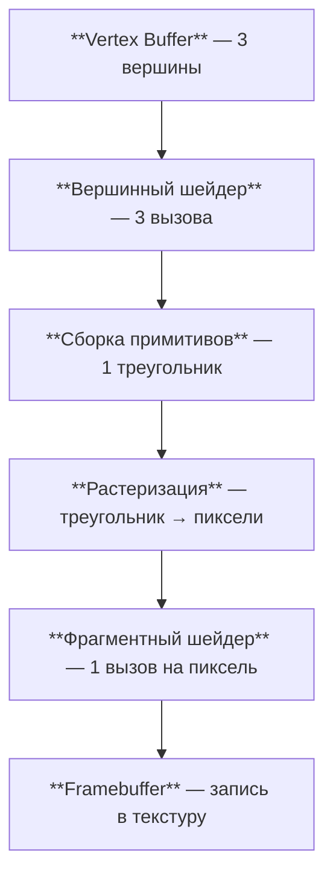

# Первый треугольник

[Полный код главы](https://github.com/Bromles/wgpu-tutorial/tree/master/code/guide/getting-started/hello-triangle)

**Что уже должно быть понятно:**

- окно, event loop, `ApplicationHandler`
- `Instance`, `Adapter`, `Device`, `Queue`, `Surface`
- `RenderPass`, `LoadOp::Clear`

**Что появится в этой главе:**

- учебный каркас (`framework`)
- язык шейдеров WGSL
- графический конвейер (`RenderPipeline`)

**Итог:** окно с зелёным фоном и тёмно-красным треугольником в центре

---

В прошлой главе мы инициализировали wgpu и залили окно зелёным цветом с помощью `RenderPass`. Теперь мы нарисуем
настоящую геометрию — треугольник. Для этого нам понадобятся новые сущности: шейдеры и графический конвейер (render
pipeline).

## Учебный каркас

В предыдущих главах мы написали значительное количество кода для создания окна, инициализации wgpu, обработки событий
и ошибок. Этот код будет одинаковым во всех следующих примерах, поэтому мы вынесли его в учебный каркас (`framework`) и
дальше не будем каждый раз переписывать.

Это не движок: здесь нет ECS, сцен, материалов, загрузчика уровней и архитектуры игры. Это только обвязка, чтобы главы
были про графику.

### trait Example

Каркас определяет трейт `Example`, который мы будем реализовывать в каждой главе:

```rust
pub trait Example: 'static {
    fn init(ctx: &GpuContext) -> Self;
    fn resize(&mut self, ctx: &GpuContext, new_size: PhysicalSize<u32>);
    fn render(&mut self, ctx: &GpuContext, view: &TextureView, encoder: &mut CommandEncoder);
}
```

- `init` — вызывается один раз при запуске. Получает `GpuContext`, содержащий `device`, `queue`, `surface`,
  `surface_config` и `surface_format`. Здесь мы создаём ресурсы, живущие всё время работы примера
- `resize` — вызывается при изменении размера окна
- `render` — вызывается каждый кадр. Получает готовый `TextureView` (представление кадра поверхности) и
  `CommandEncoder` (кодировщик команд). Нам остаётся только записать команды отрисовки

### GpuContext

`GpuContext` содержит всё, что мы настраивали в прошлых главах вручную:

```rust
pub struct GpuContext {
    pub device: Device,
    pub queue: Queue,
    pub surface: Surface<'static>,
    pub surface_config: SurfaceConfiguration,
    pub surface_format: TextureFormat,
}
```

Все поля публичны — каркас не скрывает типы wgpu, а лишь убирает рутину по их созданию.

### Запуск примера

Для запуска достаточно вызвать одну функцию:

```rust
fn main() {
    framework::run::<Triangle>("Hello Triangle");
}
```

Каркас создаст окно, инициализирует wgpu, обработает event loop, resize, ошибки `get_current_texture`, вызовет
`pre_present_notify` и `queue.submit`. Всё, что было описано в предыдущих главах, работает под капотом.

<div class="info custom-block" style="padding-top: 8px">
<p class="custom-block-title">Что именно скрывает каркас</p>

- окно — создание, скрытие до первого кадра, центрирование
- event loop — `ApplicationHandler`, `ControlFlow::Wait`, `request_redraw`
- инициализация wgpu — `Instance`, `Adapter`, `Device`, `Queue`, `Surface`
- обработка ошибок — `Outdated`/`Lost`/`Suboptimal` → переконфигурация, `Occluded`/`Timeout` → пропуск кадра
- получение кадра — `get_current_texture`, создание `TextureView` и `CommandEncoder`
- отправка — `queue.submit`, `pre_present_notify`, `frame.present`
- выход по Escape

</div>

## Графический конвейер: что происходит внутри

Разберёмся, как GPU превращает три точки в заполненный треугольник на экране. Этот процесс
называется **графическим конвейером** (render pipeline) — данные проходят через несколько стадий, каждая из которых
выполняет свою задачу:



1. **Вершинный шейдер** — наша программа на WGSL, вызывается один раз для каждой вершины. Принимает данные вершины
   (позицию, цвет, и т.д.) и возвращает позицию в clip space — координатах от -1 до 1. Это единственная обязательная
   стадия — без неё GPU не знает, где рисовать
2. **Сборка примитивов** — GPU группирует вершины в геометрические примитивы. Мы указываем `TriangleList`, поэтому
   каждые три вершины образуют один треугольник
3. **Растеризация** — GPU определяет, какие пиксели экрана находятся внутри треугольника. Каждый такой пиксель
   называется **фрагментом**. На этом этапе также выполняется интерполяция — значения, заданные в вершинах (например,
   цвет), плавно размазываются по всем фрагментам
4. **Фрагментный шейдер** — наша программа на WGSL, вызывается один раз для каждого фрагмента. Возвращает цвет
   пикселя. Если фрагмент находится за другим объектом (depth test) или за пределами экрана — он отбрасывается
5. **Framebuffer** — результат записывается в текстуру поверхности, которая выводится на экран

Эта диаграмма будет расти вместе с нашим пониманием — в следующих главах мы будем добавлять к ней новые элементы
(индексные буферы, uniform-буферы, текстуры, depth test), чтобы каждый раз видеть полную картину.

Всё остальное, что мы настраиваем при создании конвейера — это параметры этих стадий: какой шейдер использовать,
в каком формате выводить цвет, как обрабатывать геометрию.

## Шейдеры

Шейдеры — программы, выполняемые на GPU. Пишутся на WGSL (WebGPU Shading Language) — языке с синтаксисом, похожим
на Rust.

Для треугольника нужны два шейдера. Создадим `shader.wgsl` рядом с `main.rs`:

```wgsl
@vertex
fn vs_main(@builtin(vertex_index) in_vertex_index: u32) -> @builtin(position) vec4<f32> {
    let x = f32(i32(in_vertex_index) - 1) / 2;
    let y = f32(i32(in_vertex_index & 1u) * 2 - 1) / 2;

    return vec4<f32>(x, y, 0.0, 1.0);
}

@fragment
fn fs_main() -> @location(0) vec4<f32> {
    return vec4<f32>(0.5, 0.0, 0.0, 0.5);
}
```

### Вершинный шейдер

Функция `vs_main`, отмеченная атрибутом `@vertex`, является вершинным шейдером. Она вызывается видеокартой один раз
для каждой вершины. В нашем случае мы рисуем 3 вершины (треугольник), поэтому функция будет вызвана 3 раза.

Параметр `@builtin(vertex_index)` — это встроенный индекс текущей вершины, передаваемый GPU автоматически. Для трёх
вершин он принимает значения 0, 1 и 2.

Результатом функции является позиция вершины — `@builtin(position)`. Это четырёхмерный вектор `vec4<f32>`, где `x` и
`y` задают координаты экрана (от -1 до 1), `z` — глубину (от 0 до 1), а `w` используется для перспективного деления
(пока всегда 1.0).

Вычислим позиции трёх вершин:

| vertex_index |         x          |           y            |
|:------------:|:------------------:|:----------------------:|
|      0       | (0 - 1) / 2 = -0.5 | (0 × 2 - 1) / 2 = -0.5 |
|      1       |  (1 - 1) / 2 = 0   | (1 × 2 - 1) / 2 = 0.5  |
|      2       | (2 - 1) / 2 = 0.5  | (0 × 2 - 1) / 2 = -0.5 |

Получаем треугольник с вершинами в точках (-0.5, -0.5), (0, 0.5) и (0.5, -0.5) — расположенный в центре экрана:


Координаты от -1 до 1 — это clip space. Левый нижний угол экрана = (-1, -1), правый верхний = (1, 1). GPU
автоматически переводит их в пиксели экрана.

<div class="info custom-block" style="padding-top: 8px">
<p class="custom-block-title">Примечание</p>

Здесь мы вычисляем позиции вершин прямо в шейдере, используя только `vertex_index`. Такой подход подходит
для простых демонстраций, но в реальных приложениях позиции вершин обычно передаются из CPU через вершинные буферы. Мы
познакомимся с ними в следующих главах.

</div>

### Фрагментный шейдер

Функция `fs_main`, отмеченная `@fragment`, является фрагментным шейдером. Она вызывается видеокартой один раз для
каждого пикселя (точнее, фрагмента) внутри треугольника.

Результат функции — `@location(0) vec4<f32>` — это цвет пикселя. Значение `vec4<f32>(0.5, 0.0, 0.0, 0.5)` задаёт
тёмно-красный цвет с полупрозрачностью (каналы RGBA). `@location(0)` указывает, что результат записывается в первое
цветовое вложение (color attachment), которое мы настроим при создании конвейера.

## Графический конвейер

Графический конвейер (render pipeline) — это главная сущность в процессе рендера. Он описывает состояние, которое
должна иметь GPU во время отрисовки: какие шейдеры использовать, в каком формате выводить цвет, как обрабатывать
геометрию и многое другое.

Конвейер создаётся один раз в `Example::init` и хранится в структуре `Triangle`:

```rust
struct Triangle {
    pipeline: RenderPipeline,
}
```

### Создание шейдерного модуля

```rust
let shader_module = ctx.device.create_shader_module(include_wgsl!("shader.wgsl"));
```

Макрос `include_wgsl!` встраивает файл в бинарник на этапе компиляции и проверяет синтаксис WGSL.

### Вершинная стадия

```rust
vertex: VertexState {
    module: &shader_module,
    entry_point: Some("vs_main"),
    buffers: &[],
    compilation_options: PipelineCompilationOptions::default(),
},
```

- `module` — ссылка на шейдерный модуль, из которого берётся функция
- `entry_point` — имя функции-входной точки в шейдере, то есть нашей `vs_main`
- `buffers` — описание вершинных буферов, из которых шейдер будет читать данные. Пока у нас нет вершинных буферов,
  поэтому массив пуст — все позиции вычисляются в шейдере
- `compilation_options` — опции компиляции шейдера, оставляем по умолчанию

### Фрагментная стадия

```rust
fragment: Some(FragmentState {
    module: &shader_module,
    entry_point: Some("fs_main"),
    targets: &[Some(ColorTargetState {
        format: ctx.surface_format,
        blend: Some(BlendState {
            color: BlendComponent::REPLACE,
            alpha: BlendComponent::REPLACE,
        }),
        write_mask: ColorWrites::ALL,
    })],
    compilation_options: PipelineCompilationOptions::default(),
}),
```

Фрагментная стадия обёрнута в `Some`, поскольку она может отсутствовать (например, при рендере только в глубину).

- `module` и `entry_point` — те же, что и в вершинной стадии, но указывают на `fs_main`
- `targets` — массив описаний цветовых целей, в которые будет выводиться результат. У нас одна цель — поверхность окна
    - `format` — формат цвета, должен совпадать с форматом поверхности
    - `blend` — режим смешивания. `REPLACE` означает, что новый цвет полностью заменяет предыдущий без смешивания
    - `write_mask` — какие каналы цвета записывать. `ALL` — все (красный, зелёный, синий, альфа)

### Примитивы

```rust
primitive: PrimitiveState {
    topology: PrimitiveTopology::TriangleList,
    front_face: wgpu::FrontFace::Ccw,
    polygon_mode: PolygonMode::Fill,
    ..Default::default()
},
```

- `topology` — тип примитивов. `TriangleList` означает, что каждые 3 вершины образуют отдельный треугольник.
  Существуют и другие типы: `LineList`, `PointList`, `TriangleStrip` и так далее
- `front_face` — правило определения передней грани. `Ccw` (Counter-Clockwise) — передней считается грань, вершины
  которой расположены против часовой стрелки
- `polygon_mode` — режим отрисовки. `Fill` — заливка полигона. Также можно использовать `Line` для отображения
  только рёбер или `Point` для отображения только вершин

### Мультисэмплирование и остальные поля

```rust
multisample: MultisampleState {
    count: 1,
    mask: !0,
    alpha_to_coverage_enabled: false,
},
depth_stencil: None,
cache: None,
multiview_mask: None,
```

- `multisample` — настройки сглаживания (MSAA). `count: 1` — без мультисэмплирования
- `depth_stencil` — настройки буфера глубины и трафарета. Пока не используем
- `cache` — кэш скомпилированного конвейера. Позволяет ускорить создание pipeline при повторных запусках
  приложения — GPU не перекомпилирует шейдеры, а читает их из кэша. Пока не используем: сериализация кэша
  зависит от драйвера и платформы, что усложняет код примеров
- `multiview_mask` — маска для рендеринга в несколько слоёв. Не используем

## Отрисовка

Метод `render` из трейта `Example` получает от каркаса готовые `TextureView` и `CommandEncoder`. Нам остаётся только
записать команды отрисовки:

```rust
fn render(&mut self, _ctx: &GpuContext, view: &TextureView, encoder: &mut CommandEncoder) {
    let mut rpass = encoder.begin_render_pass(&RenderPassDescriptor {
        label: Some("Main Render Pass"),
        color_attachments: &[Some(RenderPassColorAttachment {
            view,
            resolve_target: None,
            ops: Operations {
                load: LoadOp::Clear(Color::GREEN),
                store: StoreOp::Store,
            },
            depth_slice: None,
        })],
        depth_stencil_attachment: None,
        timestamp_writes: None,
        occlusion_query_set: None,
        multiview_mask: None,
    });

    rpass.set_pipeline(&self.pipeline);
    rpass.draw(0..3, 0..1);
}
```

Каркас уже создал `TextureView` (представление текущего кадра поверхности) и `CommandEncoder`. После возврата из
`render` каркас вызовет `queue.submit`, `pre_present_notify` и `frame.present`.

Два ключевых вызова на `RenderPass`:

- `set_pipeline` — указывает GPU, какой конвейер использовать для последующих команд отрисовки
- `draw(0..3, 0..1)` — отрисовывает 3 вершины (индексы 0, 1, 2), 1 экземпляр. Первый параметр — диапазон вершин,
  второй — диапазон экземпляров (instancing будет рассмотрен позже)

<div class="info custom-block" style="padding-top: 8px">
<p class="custom-block-title">Что происходит на GPU</p>

1. Вершинный шейдер вызывается 3 раза — по одному для каждой вершины. Он вычисляет позиции вершин треугольника
2. GPU определяет, какие пиксели (фрагменты) находятся внутри треугольника
3. Фрагментный шейдер вызывается для каждого такого пикселя, возвращая тёмно-красный цвет
4. Результаты записываются в текстуру поверхности через color attachment

Фон остаётся зелёным, потому что перед отрисовкой мы очищаем поверхность цветом `Color::GREEN` через
`LoadOp::Clear`.

</div>

## Что получилось

<div class="warning custom-block" style="padding-top: 8px">
<p class="custom-block-title">Типичные ошибки</p>
<p>- Render pipeline <strong>immutable</strong> — после создания нельзя изменить шейдер, формат, blend mode. Нужно создать новый pipeline</p>
<p>- <code>draw(0..3, 0..1)</code> — первый параметр это вершины, второй экземпляры. Перепутать — пустой экран</p>
</div>

Окно с зелёным фоном и тёмно-красным треугольником в центре. Внешний вид будет различаться в зависимости от
операционной системы.

<!-- TODO: скриншот -->

<div class="tip custom-block" style="padding-top: 8px">
<p class="custom-block-title">Попробуем</p>

- Поменяем цвет треугольника в `fs_main` — подставим другие значения RGBA
- Изменим координаты вершин в `vs_main` — сдвинем треугольник в сторону или сделаем его больше
- Поменяем `Color::GREEN` на другой цвет фона
- Попробуем `PolygonMode::Line` вместо `Fill` — увидим только рёбра треугольника

</div>

[Полный код главы](https://github.com/Bromles/wgpu-tutorial/tree/master/code/guide/getting-started/hello-triangle)
