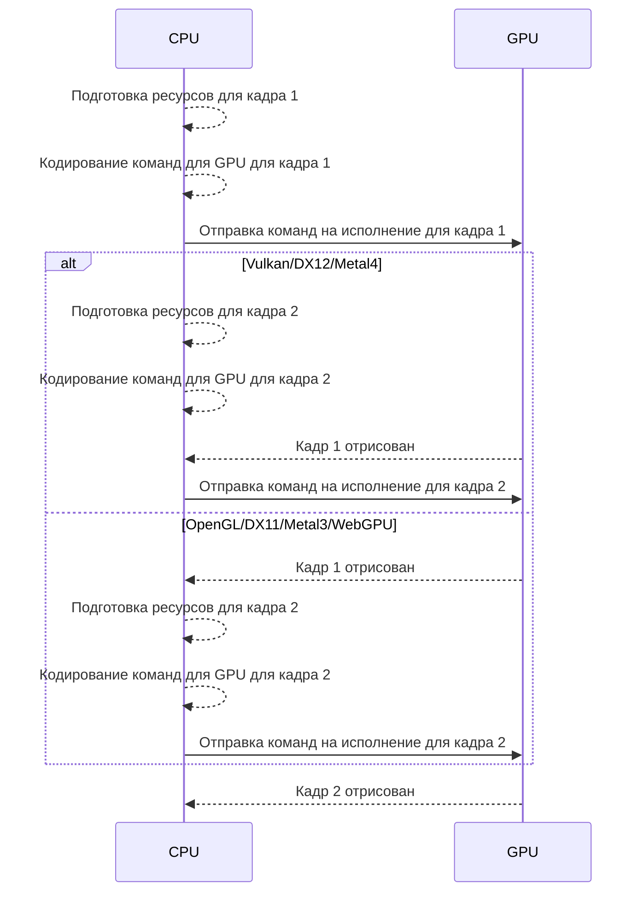
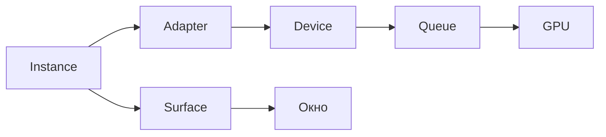
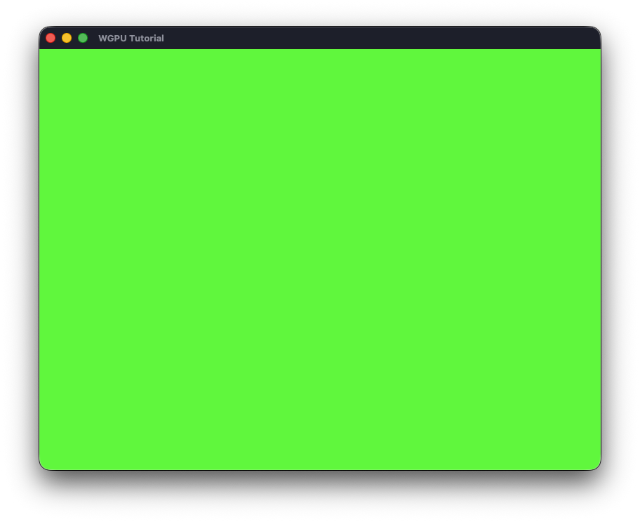

---
prev:
  text: "Создание окна"
  link: "/guide/getting-started/creating-window"
next:
  text: "Первый треугольник"
  link: "/guide/getting-started/hello-triangle"
---

# Инициализация wgpu

[Полный код главы](https://github.com/Bromles/wgpu-tutorial/tree/master/code/guide/getting-started/init-wgpu)

В прошлой главе мы создали окно и базовую структуру приложения с winit. Теперь мы можем инициализировать wgpu и
выполнить простейшую операцию на GPU - заливку окна сплошным цветом.

## Общее устройство API

Перед тем, как писать код, неплохо было бы в целом разобраться, как устроено API wgpu и с чем мы будем работать.

### Главные принципы

#### Работа с GPU

Так как видеокарта обладает собственным графическим процессором и видеопамятью, она выполняет инструкции параллельно
нашему CPU, а данные для этого выполнения должны быть скопированы из оперативной памяти в видеопамять (или, иначе
говоря, с CPU на GPU).

И хотя некоторые устройства имеют архитектуру, где процессор и видеокарта делят одну память (мобильные устройства,
продукция Apple на чипах Apple Silicon и подобное), мы не можем на это надеяться, поскольку на рынке все же преобладают
дискретные видеокарты, являющиеся своим собственным устройством со своей памятью.

Следовательно, процесс использования любого современного графического API больше походит не на вызов функций, а на сбор
и отправку команд, которые будут выполнены когда-то в будущем.

Поэтому, мы можем верхнеуровнево описать работу таким образом:

1. Подготовка ресурсов, создание и копирование данных на GPU
2. Составление списка команд для исполнения, задействующих эти ресурсы
3. Ожидание результата
4. Получение результата с GPU и его использование (вывод изображения на экран, чтение результата вычислений, и так
   далее)

Ресурсы могут использоваться глобально, все время работы приложения. Или только для конкретной сцены. Или вообще только
в рамках одного кадра. Но общая схема от этого не меняется.

#### Синхронизация

Еще один очень немаловажный аспект работы с графическими API - синхронизация ресурсов. Рассмотрим следующую диаграмму



Vulkan, DirectX 12 и Metal 4, в отличие от старых API, требуют от нас ручной синхронизации работы CPU и GPU. Это
напоминает многопоточное программирование, с барьерами и другими примитивами синхронизации. Только нам нужно
синхронизировать параллельность на CPU, параллельность на GPU, и еще и параллельность _между_ CPU и GPU.

Данная схема позволяет добиться максимальной оптимизации, например готовить ресурсы для следующего кадра, не дожидаясь
окончания отрисовки текущего. Однако она же значительно усложняет код и приводит к большому количеству ошибок,
фактически требуя написания более высокоуровневых абстракций вроде графов рендера (`Render Graph`), чтобы избавиться
от повсеместной ручной синхронизации.

Подобный уровень оптимизаций вряд ли понадобится кому-либо кроме очень крупных студий, делающих игры с бюджетами в
десятки и сотни миллионов долларов, у которых как раз есть ресурсы на такие трудозатраты.

Поэтому авторы стандарта WebGPU сознательно отказались от ручной синхронизации ресурсов и пошли тем же путем, что и
Metal 3 - отправка команд на исполнение блокирует поток выполнения, пока они не будут исполнены. Мы все еще можем
составлять ресурсы для нового кадра в других потоках на CPU параллельно, но нам теперь не нужно гадать, выполнились ли
уже отправленные нами команды на GPU, как и не нужно писать отдельную синхронизацию ради этого.

Вместо того чтобы писать свою абстракцию с нуля в каждом проекте, она уже предоставлена нам самим API.

Как следствие, wgpu, как одна из реализаций стандарта, тоже не требует ручной синхронизации, чем значительно упрощает
наш код и работу с API. Это одна из причин, почему на wgpu требуется примерно в 5 раз меньше кода для аналогичных
действий, чем на более низкоуровневых API, при сохранении большинства современных возможностей.

<div class="details custom-block">
<p class="custom-block-title">Есть другие пути</p>

Тем не менее разработчики wgpu придумали много более простых способов оптимизации, такие как `RenderBundle`, позволяющий
записать команды на исполнение один раз, и переиспользовать между несколькими кадрами.

Вы можете посмотреть на то, какие они дают результаты, открыв
[вебсайт с примером](https://webgpu.github.io/webgpu-samples/sample/renderBundles/) в любом поддерживаемом WebGPU
браузере (на момент написания, это Safari на устройствах Apple с macOS или iOS 26, или новее, Firefox на Windows или
любой браузер на базе Chromium на macOS, Windows и Android). Включение чекбокса `useRenderBundles` значительно
увеличивает количество кадров в секунду на большом количестве объектов.

Кроме того, мы можем симулировать данные для N+1 кадра, пока рендерим N-ый кадр, используя технику под названием
`Pipelined Rendering`. Она встречается в движке Destiny 2 и скопирована оттуда в движок Bevy, также использующий wgpu.
Это позволяет значительно ускорить время отрисовки, поскольку к моменту начала наполнения ресурсов для рендера кадра,
все данные симуляции либо уже готовы, либо вот-вот появятся.

</div>

<div class="warning custom-block">
<p class="custom-block-title">Хватит ли скорости работы?</p>

Если вам все еще кажется, что без ручной синхронизации будет слишком трудно добиться адекватной производительности игр,
стоит помнить, что на момент написания данной главы, в 2025 году, Metal 4 только что вышел. Все игры и приложения, 
использующие графические API на системах Apple, на данный момент сделаны на Metal 3 или еще более старых версиях. 

А в Metal 3 и ранее как раз автоматическая синхронизация ресурсов, совсем как в WebGPU. И при этом на платформах с ним
выходят такие игры, как `Baldur's Gate 3`, `Death Stranding` и `Cyberpunk 2077`. 

Более того, `Divinity: Original Sin 2` имеет полноценный порт на iPad, никак не урезанный по сравнению с остальными
версиями, даже с поддержкой облачных сохранений Steam. Что означает, что оптимизировать без этого можно и на мобильных
устройствах.

Если производительности хватило многомиллионным блокбастерам, которые создавались командами из тысяч человек годами, то,
скорее всего, ее хватит и для вашего проекта.

Кроме того, до сих пор множество игр делается на OpenGL, в котором не только нет ручных синхронизаций ресурсов, но и в
целом огромные участки API реализованы крайней неэффективно, намного хуже Metal 3 и WebGPU. И этого тоже хватает для 
реальных проектов.

</div>

## Фазы работы

Взаимодействие с wgpu можно в целом разбить на несколько фаз, описанных ниже.

### Фаза 1. Обнаружение и инициализация устройства

Цель данной фазы - связать приложение с конкретной видеокартой и окном.

Как правило. она выполняется один раз во время запуска приложения.

Сущности:



- `Instance` - точка входа в wgpu, которую необходимо использовать для начала работы с библиотекой.
- `Adapter` - выбранный графический адаптер, он же GPU. Может быть как физическим, так и логическим. Создается из
  `Instance`.
- `Device` - логическое устройство, управляющее ресурсами GPU, обладающее определенным набором возможностей.
  Запрашивается у `Adapter`, при этом один адаптер может породить несколько девайсов (например, с разными включенными
  фичами). Используется для создания большинства сущностей на следующих фазах.
- `Queue` - очередь команд, создаваемая вместе с девайсом и привязанная к нему. Именно ее мы будем использовать для
  отправки операций для выполнения на видеокарте.
- `Surface` - поверхность, привязанная к окну, на которую производится рендеринг. Создается с помощью `Instance`.`

### Фаза 2. Инициализация ресурсов сцены

Цель данной фазы - подготовить ресурсы, живущие более одного кадра, которые будут использоваться для рендера сцены.

Обычно исполняется во время загрузки сцены (уровня, локации, модели и так далее).

Сущности:

- `ShaderModule` - объект, содержащий исходный код нашего шейдера, то есть программы для GPU
- `Buffer` - объект буфера, содержащий некие данные для передачи между CPU и GPU, или внутри самой GPU
- `Texture` - текстура, представляющая некое изображение, понятное GPU. Используется для множества задач, включая и
  передачу данных между CPU и GPU, и сам рендер, и операции внутри GPU. Может быть и многомерной, и содержать разные
  слои
- `Sampler` - сущность сэмплера, позволяющая получить цвет пикселей и другие данные из текстуры по указанным координатам
- `RenderPipeline` - графический конвейер, главная сущность в процессе рендера. Описывает состояние, которое должна
  иметь GPU во время отрисовки кадра, включая шейдеры, формат отрисовки, и другие параметры. Мы познакомимся с ним уже
  в следующей главе.
- `ComputePipeline` - конвейер общих вычислений. Похож на графический, но описывает процесс не отрисовки, а исполнения
  специальных вычислительных шейдеров, позволяющих использовать видеокарту для произвольной нагрузки, не связанной с
  графикой. Одним из таких применений может быть запуск нейросетей. Однако данный тип конвейеров также критически
  необходим во множестве продвинутых техник рендеринга, где он используется вместе с графическим конвейером.

Список сущностей далеко не полон, иначе он занял бы большую часть страницы благодаря тому, сколько возможностей нам
предоставлено библиотекой.

<div class="warning custom-block">
<p class="custom-block-title">Нюанс</p>

Все эти объекты создаются с помощью `Device`, полученного в Фазе 1, и привязаны к нему. Это значит, что при наличии
нескольких используемых девайсов (например, если мы задействуем несколько видеокарт одновременно) нужно не допускать
смешивания ресурсов одного девайса с ресурсами другого.

</div>

<div class="tip custom-block">
<p class="custom-block-title">Самое важное</p>

Главными сущностями здесь являются `RenderPipeline` и `ComputePipeline`, поскольку создание конвейеров - самая "дорогая"
операция с точки зрения нагрузки на видеокарту. Их дальнейшее переключение во время отрисовки тоже потребляет
значительное количество ресурсов, что означает, что нам нужно стараться минимизировать количество этих конвейеров в
приложении и переключать их как можно реже.

</div>

### Фаза 3. Отрисовка кадра

Цель данной фазы - инициализировать или обновить ресурсы, нужные лишь в рамках текущего кадра, составить необходимые
команды для GPU и отправить их на выполнение. Например, записать новые значения в буферы на основании изменившегося
положения объектов в пространстве игры.

Данная фаза исполняется каждый кадр. Если мы целимся на показатель в 60 кадров в секунду, то у нас есть лишь `16 мс`
на каждый кадр (также называется бюджетом кадра), то есть на всё вместе - обновление ресурсов, запись команд, исполнение
их на видеокарте и вывод результата на экран. Если же мы хотим достичь лучших показателей, эти требования становятся
еще строже.

Следовательно, данную фазу нужно делать как можно короче и облегченней.

Сущности:

- `SurfaceTexture` - текстура, получаемая у `Surface`, в которую мы будем производить отрисовку. Тесно связано с
  понятием двойной буферизации, которое будет объяснено ниже
- `TextureView` - представление текстуры, которое можно считать неким аналогом ссылки на изображение, но понятным
  видеокарте
- `CommandEncoder` - кодировщик команд для видеокарты. Мы используем его, чтобы составить список операций для GPU перед
  их отправкой на исполнение
- `RenderPass` - сущность, описывающая непосредственно операцию рендера, создается в рамках существования
  `CommandEncoder`. К ней привязывается `RenderPipeline`, описывающий состояние GPU во время отрисовки, а также на ней
  мы вызываем нужные нам команды рендера вроде `draw`
- `RenderPassColorAttachment` - сущность, описывающая целевые представления текстур, в которые мы будем рендерить. Можно
  воспринимать как описание места назначения для выходного изображения
- `ComputePass` - сущность, описывающая операцию вычислений общего типа на видеокарте, создается в рамках существования
  `CommandEncoder`. Является по отношению к `RenderPass` тем же, чем `ComputePipeline` является для `RenderPipeline`.
  Соответственно, используется для привязки конвейера вычислений и записи команды `dispatch` для его исполнения
- `CommandBuffer` - объект, содержащий список закодированных нами команд для GPU, полученный путем потребления
  `CommandEncoder`. Именно его мы отправляем в `Queue` непосредственно на исполнение

### Фаза 4. Реакция на события

В данной фазе мы обрабатываем внешние события, требующие изменения конфигураций каких-либо ресурсов.

Например, изменение размера окна требует от нас скорректировать размер поверхности и реконфигурировать ее, чтобы
производить рендер уже с новыми размерами.

Также, тут мы можем пересоздавать конвейеры и другие ресурсы, если, к примеру, пользователь изменил графические
настройки игры.

Кроме того, мы должны реагировать и на возможные ошибки, вроде потери поверхности. Многие виды ошибок могут быть
"плавающими", особенно на нестабильных платформах вроде Linux. Это означает, что даже получение конкретного типа ошибки
не означает, что на следующем кадре она повторится, несмотря на кажущуюся критичность.

Новых сущностей в данной фазе нет.

### Фаза 5. Очистка ресурсов

На самом деле этот процесс есть и в других фазах (например, мы очищаем ресурсы кадра после его отрисовки), но он вынесен
здесь отдельно по одной простой причине:

Благодаря Rust и прекрасной реализации wgpu, нам не нужно вручную очищать какие-либо ресурсы. Никаких `destroy`, `free`,
`delete`, с возможностью их забыть или вызвать неправильно. Все необходимые ресурсы будут корректно очищены точно так
же, как и другая память в языке - при выходе из области видимости. Все сущности wgpu внутри себя содержат `Arc`, что
позволяет легко копировать их между потоками и вовремя очищать.

## Переходим к коду

### Обновим зависимости

```toml
winit = "0.30"
tracing = "0.1"
tracing-subscriber = "0.3"
tokio = { version = "1.47", features = ["parking_lot", "rt"] } # [!code ++]
wgpu = "27.0" # [!code ++]
```

<div class="warning custom-block" style="padding-top: 8px">
<p class="custom-block-title">Обратите внимание</p>
<p>
wgpu требует resolver 2 в Cargo.toml для корректной работы. В отдельных крейтах Rust он используется по-умолчанию, начиная с
2021 издания. Если же у вас более раннее издание, либо вы используете cargo workspace, то необходимо явно его указать
в Cargo.toml
</p>
</div>

Кроме самого wgpu мы будем использовать tokio для выполнения асинхронных функций. Вы можете заменить
его на любой другой асинхронный рантайм, такой, как pollster, встречающийся в примерах wgpu. Tokio выбран как самый
популярный вариант, предоставляющий все необходимые возможности не только для минимальной настройки, но и для дальнейшей
реализации большого проекта.

Мы включаем у него фичи `parking_lot`, предоставляющую более оптимизированную реализацию некоторых механизмов
синхронизации, а также `rt`, дающую однопоточный асинхронный рантайм.

### `Renderer`

Для организации кода создадим структуру `Renderer`, содержащую необходимые на данный момент ресурсы для отрисовки

```rust
struct Renderer {
    device: Device,
    queue: Queue,
    surface: Surface<'static>,
    surface_config: SurfaceConfiguration,
}
```

Из отсутствующего на схеме в [Фазe 1](#фаза-1-обнаружение-и-инициализация-устроиства) здесь только
`SurfaceConfiguration`, которая описывает параметры поверхности, такие как ее размер и формат изображения. С помощью
нее мы реагируем на изменения размера окна, и также можем рендерить не на всё окно, а лишь в какой-то его области.

`Instance` и `Adapter` хранить не нужно, так как на данный момент мы не планируем использование нескольких видеокарт или
разных наборов фич.

`Surface` имеет время жизни, привязанное к окну, чтобы гарантировать, что поверхность не может жить дольше окна, на
которое она ссылается. Но так как мы храним окно только в корректном состоянии приложения и в `Arc`, то здесь считаем
для простоты, что время жизни равно `'static`.

Также обновим сущность состояния приложения, чтобы она включала наш объект `Renderer` и флаг необходимости обновления
размера поверхности

```rust
enum App {
    Loading,
    Ready {
        window: Arc<Window>,
        renderer: Box<Renderer>, // [!code ++]
        need_to_resize_surface: bool, // [!code ++]
    },
}
```

<details class="tip custom-block" style="padding-top: 8px">
<summary>Примечание</summary>

`Renderer` здесь завернут в `Box`, чтобы разные варианты перечисления `App` не слишком
различались по занимаемой памяти (хранение указателя требует ее намного меньше, чем самой структуры). На это есть
отдельная [проверка в Clippy](https://rust-lang.github.io/rust-clippy/master/index.html#large_enum_variant)

</details>

Наш `Renderer` имеет следующие методы:

```rust
impl Renderer {
    fn new(window: Arc<Window>, runtime: Arc<Runtime>) -> Self;
    fn resize_surface(&self, size: PhysicalSize<u32>);
    fn render(&mut self, window: Arc<Window>);
}
```

Поясним каждый из них:

- `new` - конструктор, создающий новый экземпляр `Renderer`. Принимает указатели на окно и на асинхронный рантайм, так
  как операции запроса `Instance` и `Adapter` требуют асинхронного выполнения из-за совместимости с браузерной средой.
  Соотносится с [Фазой 1](#фаза-1-обнаружение-и-инициализация-устроиства).
- `resize_surface` - метод, вызываемый при необходимости изменить размеры текущей поверхности. Принимает физический
  размер окна из winit. Относится к [Фазе 4](#фаза-4-реакция-на-события).
- `render` - непосредственно метод отрисовки, принимающий указатель на окно для уведомления winit о скором выводе нового
  кадра. Это необходимо для корректной работы на некоторых платформах, таких как Wayland на Linux, где без данного
  уведомления приложение может быть заблокировано оконным сервером. Принадлежит [Фазе 3](#фаза-3-отрисовка-кадра).

## Метод `new`

```rust
fn new(window: Arc<Window>, runtime: Arc<Runtime>) -> Self {
    let mut physical_size = window.inner_size();
    physical_size.width = physical_size.width.max(1);
    physical_size.height = physical_size.height.max(1);
```

Здесь мы просто получаем текущий внутренний размер окна и сохраняем его в переменную, предварительно убедившись, что
размеры не равны 0, потому что это привело бы к ошибке при конфигурации поверхности.

### `Instance`

```rust
let instance = Instance::new(&InstanceDescriptor {
    backends: Backends::PRIMARY,
    ..Default::default()
});
```

Теперь создаем `Instance`. Тут можно увидеть типичный способ создания сущностей wgpu - конструкторы принимают объекты
дескрипторов, задающие опции создания. Как правило, такие объекты реализуют трейт `Default`, что позволяет
переопределить лишь необходимые параметры, а остальные оставить по-умолчанию.

Так мы здесь и делаем - задаем только поле `backends` равным `PRIMARY`, что означает поддержку Metal, Vulkan, DirectX 12
и WebGPU. То есть тех нижележащих API, которые позволяют использовать полные возможности wgpu, в отличие от вторичных
бэкендов.

Теперь мы получили `Instance` как общую точку входа в API wgpu, и можем приступать к работе с ним.

### `Surface`

```rust
let surface = instance
    .create_surface(window)
    .expect("Failed to create surface");
```

Тут производим создание поверхности на основе имеющегося у нас окна winit. Это автоматически привязывает поверхность к
окну.

<details class="details custom-block" style="padding-top: 8px">
<summary class="custom-block-title">Про двойную буферизацию</summary>
<p>

Видеокарта отрисовывает изображение не мгновенно, а попиксельно, обычно слева направо, сверху вниз. Это значит, что если
мы будем рендерить в то же изображение (ту же текстуру), что сейчас находится на экране, пользователь будет видеть
весь процесс, и выглядеть это будет непрезентабельно.

Для решения данной проблемы была придумана двойная буферизация - мы на самом деле используем две текстуры (два
изображения).
Одна в данный момент находится на экране, тогда как вторая - в скрытом буфере. И мы производим отрисовку во вторую, "
скрытую"
текстуру, чтобы пользователь не видел этого процесса. И только когда кадр отрисован и готов, мы меняем эти буферы
местами -
свежеотрисованный отправляется на экран, тогда как прошлый уходит назад, в "скрытую" часть. И так процесс повторяется,
пока наше приложение работает.

Вы могли натыкаться на то, как этот процесс выполнен в OpenGL - функция `glSwapBuffers` отвечает как раз за
смену позиций этих двух буферов.

Буферизация не обязана быть именно двойной - бывает и тройная, и другие варианты. Но суть примерно одинаковая - у нас
есть текущий кадр на экране, и есть некие кадры "в очереди", с которыми уже и работает видеокарта.

Вы могли слышать термины `Framebuffer` или `Swapchain`. Они как раз относятся к данному процессу.
В некоторых нативных API эти объекты существуют явно, как и в очень старых версиях wgpu. Но сейчас они сокрыты внутри
и не нуждаются в ручном создании или управлении.

Когда мы запрашиваем `SurfaceTexture` у `Surface`, нам возвращается как раз текущая свободная текстура (если такая
есть),
в которую мы можем производить отрисовку.

</p>
</details>

### `Adapter`

```rust
let adapter = runtime.block_on(async {
    instance
        .request_adapter(&RequestAdapterOptions {
            power_preference: PowerPreference::default(),
            force_fallback_adapter: false,
            compatible_surface: Some(&surface),
        })
    .await
    .expect("Failed to request adapter")
});
```

Далее запрашиваем адаптер, для чего нам как раз понадобится асинхронный рантайм.

- `power_preference` - задаем приоритеты по энергопотреблению (запрашивать более производительный или более
  энергоэффективный адаптер. Например, интегрированную или дискретную видеокарту у ноутбука)
- `force_fallback_adapter` - отключаем флаг принудительного запроса резервного адаптера, поскольку он обычно не является
  аппаратным, а мы бы хотели использовать настоящую видеокарту
- `compatible_surface` - указываем, что запрашиваемый адаптер должен быть совместим с созданной нами поверхностью.

### `Device` и `Queue`

```rust
let (device, queue) = runtime.block_on(async {
    adapter
        .request_device(&DeviceDescriptor {
            label: Some("Main device"),
            required_features: adapter.features() & Features::default(),
            required_limits: Limits::default().using_resolution(adapter.limits()),
            memory_hints: MemoryHints::Performance,
            trace: Default::default(),
            experimental_features: ExperimentalFeatures::disabled(),
    })
    .await
    .expect("Failed to request device")
});
```

Переходим к самому главному на данном этапе - созданию девайса и очереди команд, тоже асинхронному.

- `label`- название данного девайса. Подобный параметр присутствует у многих сущностей wgpu. Его можно указывать равным
  `None`, однако осмысленное название в дальнейшем упростит отладку и чтение логов.
- `required_features` - возможности девайса, которые мы запрашиваем. В данном случае мы выбираем те фичи по-умолчанию,
  которые входят в поддерживаемые адаптером
- `required_limits` - запрашиваемые ограничения девайса, такие как максимальный размер текстур, количество одновременно
  используемых буферов, и другие. Запрашиваем ограничения по-умолчанию с учетом доступного разрешения у адаптера
- `memory_hints`- подсказки для менеджера памяти ресурсов видеокарты, позволяющие, например, выбрать между
  приоритизацией производительности или потреблением памяти. Сейчас мы выбрали производительность, но это индивидуально
  для каждого проекта
- `trace` - параметры трассировки, позволяющие записать исполняемые команды wgpu в файл для последующего анализа или
  проигрывания с помощью утилиты [wgpu-player](https://github.com/gfx-rs/wgpu/tree/trunk/player). Оставляем по-умолчанию
- `experimental_features` - возможность подключения экспериментальных возможностей. Их включение требует unsafe, нам они
  на данный момент не нужны, поэтому выключаем.

### `SurfaceConfiguration`

Осталась лишь пара заключительных шагов в этом методе, а именно - настроить нашу поверхность и создать сам объект
`Renderer`.

```rust
let surface_config = surface
    .get_default_config(&adapter, physical_size.width, physical_size.height)
    .expect("Failed to get default surface config");
```

На данный момент мы упростим себе задачу и создадим конфигурацию поверхности по-умолчанию. Мы просто передаем в нужный
метод адаптер, на базе которого будет создана конфигурация, а также длину и ширину поверхности.

В следующих главах мы научимся создавать свою конфигурацию, чтобы гибко настраивать параметры поверхности, такие как
вертикальная синхронизация и тип буферизации.

```rust
    surface.configure(&device, &surface_config);

    Self {
        device,
        queue,
        surface,
        surface_config,
    }
}
```

И, в заключение, мы применяем полученную конфигурацию к поверхности с помощью девайса, конструируем объект `Renderer` и
возвращаем его.

## Метод `resize_surface`

```rust
fn resize_surface(&self, size: PhysicalSize<u32>) {
    let width = size.width.max(1);
    let height = size.height.max(1);
    self.surface.configure(
        &self.device,
        &SurfaceConfiguration {
            width,
            height,
            ..self.surface_config.clone()
        },
    );
}
```

Здесь все просто - мы получаем новый размер поверхности как параметр, применяем защиту от нулевых значений, и вызываем
реконфигурацию поверхности, используя девайс и старую конфигурацию

## Метод `render`

Наконец, мы добрались до самого важного - нашего метода для отрисовки на экран.

```rust
fn render(&mut self, window: Arc<Window>) {
    match self.surface.get_current_texture() {
        Ok(frame) => {
```

Мы начинаем с того, что запрашиваем у поверхности текущую текстуру для отрисовки. Если ее не удалось получить, то мы не
можем обрабатывать текущий кадр.

```rust
let mut encoder = self
    .device
    .create_command_encoder(&CommandEncoderDescriptor {
        label: Some("Main command encoder"),
    });
```

Далее мы создаем кодировщик команд для видеокарты с помощью девайса. Он позволит нам записывать операции, которые потом
будут отправлены в очередь на выполнение

```rust
let view = frame.texture.create_view(&TextureViewDescriptor::default());
```

Теперь нам нужно получить представление текущей текстуры, в которое мы будем непосредственно производить отрисовку.
Можно считать это неким аналогом ссылки, понятной для GPU.

Так как нам сейчас не нужно переопределять никакие параметры, используем дескриптор по-умолчанию

```rust
encoder.begin_render_pass(&RenderPassDescriptor {
    label: Some("Clear render pass"),
    color_attachments: &[Some(RenderPassColorAttachment {
        view: &view,
        resolve_target: None,
        ops: Operations {
            load: LoadOp::Clear(Color::GREEN),
            store: StoreOp::Store,
        },
        depth_slice: None,
    })],
    depth_stencil_attachment: None,
    timestamp_writes: None,
    occlusion_query_set: None,
});
```

Мы начинаем запись команд для рендера с помощью `begin_render_pass`:

- `label` - то же, что и в других случаях - отладочное название данной сущности
- `color_attachments` - массив сущностей, описывающих представления текстур, которые будут использоваться в качестве
  целей рендеринга. В данном случае у нас здесь единственная сущность, так как мы рендерим только в одно окно и в одно
  изображение.
    - `view` - ссылка на представление текстуры, в которую будем рендерить
    - `resolve_target` - ссылка на представление текстуры, которое получит результаты мультисэмплинга. Так как мы не
      используем мультисэмплинг, и пока даже не знаем, что это такое, то передаем `None`
    - `ops` - операции, которые будут применены к текстуре перед и после рендеринга. В данном случае мы очищаем текстуру
      перед рендерингом путем заливки ярко зеленым цветом, и сохраняем результат после.
    - `depth_slice` - слайс глубины для 3д текстур. На данный момент нами не используется, поэтому ставим `None`
- `depth_stencil_attachment` - ссылка на представления глубины и трафарета для использования при отрисовке. Ставим
  `None`
- `timestamp_writes` - ссылка на набор меток времени, замеряемых в процессе рендеринга. Так как мы не используем метки
  времени, то передаем `None`
- `occlusion_query_set` - ссылка на набор запросов на определение видимости объектов. Так как мы не используем
  определение видимости, то передаем `None`

В дальнейшем на сущности `RenderPass`, которую мы получили от `begin_render_pass`, мы будем настраивать множество других
параметров. Но на данный момент мы просто хотим залить экран сплошным цветом, поэтому на этом запись команд и
заканчивается.

```rust
self.queue.submit([encoder.finish()]);
window.pre_present_notify();
frame.present();
```

Три очень важные операции:

- `queue.submit([encoder.finish()])` - мы завершаем запись команд в кодировщик, получая от него готовый закодированный
  `CommandBuffer`. И тут же передаем его в очередь на исполнение. Этот метод заблокирует наш поток выполнения, пока все
  переданные команды не будут исполнены. Это позволяет не использовать сложную ручную синхронизацию параллельной работы
  CPU и GPU, как в современных нативных API, что помогает избегать множества ошибок. После возврата из этого метода наша
  текстура уже содержит результат рендеринга, но еще не отображается на экране.
- `window.pre_present_notify()` - уже упомянутое уведомление winit о том, что мы собираемся выводить кадр на экран.
- `frame.present()` - непосредственно отправка полученного кадра в виде текстуры в очередь отображения на экране. Данный
  метод также блокирует поток выполнения, пока текстура фактически не покажется в окне, что может занять некоторое время
  из-за особенностей работы оконных серверов или заполненной очереди на отображение.

```rust
Err(error) => match error {
    SurfaceError::OutOfMemory => {
        panic!("Surface error: {error}")
    }
    _ => {
        window.request_redraw();
    }
},
```

Наконец, вторая ветка `match` - что мы делаем, если встречаем ошибку при попытке получения текущего кадра из
поверхности.

В данном случае мы проверяем тип ошибки - если это превышение потребления памяти, то мы паникуем, поскольку ничего не
можем здесь сделать. В других же ситуациях мы просто запрашиваем повторную отрисовку у окна, то есть у winit, чтобы
попытаться снова на следующем кадре.

## Обновление методов жизненного цикла

### Метод `resumed`

```rust
fn resumed(&mut self, event_loop: &ActiveEventLoop) {
    if let Self::Loading = self {
        let runtime = Arc::new( // [!code ++]
            runtime::Builder::new_current_thread() // [!code ++]
                .build() // [!code ++]
                .expect("Failed to create tokio runtime"), // [!code ++]
        );

        let window_attributes = WindowAttributes::default()
            .with_title("WGPU Tutorial")
            .with_visible(false); // [!code ++]

        let window = Arc::new(
            event_loop
                .create_window(window_attributes)
                .expect("Failed to create window"),
        );

        center_window(window.clone());

        event_loop.set_control_flow(ControlFlow::Wait); // [!code ++]

        let renderer = Renderer::new(window.clone(), runtime.clone()); // [!code ++]

        *self = Self::Ready {
            window,
            renderer: Box::new(renderer), // [!code ++]
            need_to_resize_surface: false, // [!code ++]
        }
    }

    let Self::Ready { // [!code ++]
        window, renderer, .. // [!code ++]
    } = self // [!code ++]
    else { // [!code ++]
        return; // [!code ++]
    }; // [!code ++]

    renderer.render(window.clone()); // [!code ++]

    window.set_visible(true); // [!code ++]
}
```

Мы добавляем создание рантайма tokio в режиме работы на одном потоке, и дальше применяем маленький трюк с окном.

<div class="details custom-block" style="padding-top: 8px">
<p class="custom-block-title">Почему окно скрыто</p>
<p>

На некоторых системах окно создается с заливкой по-умолчанию, даже если в него ничто не отрисовано. Это выглядит как
мелькнувшее окно одного цвета, прежде чем оно перекрасится нами в нужный. В дальнейшем та же проблема будет преследовать
и при более сложном рендеринге

Для решения данной проблемы мы создаем окно с флагом невидимости, который снимем лишь после отрисовки первого кадра,
чтобы пользователь увидел не, например, просто белый прямоугольник, а уже то, что мы хотим ему показать.

</p>
</div>

Далее мы используем очень важный метод - выставляем `ControlFlow` для жизненного цикла нашего приложения внутри winit. В
режиме `Wait`, который мы здесь выбрали, исполнение цикла будет приостановлено до тех пор, пока не появятся новые
события. На практике это может выглядеть как замершее окно, которое оживает, когда пользователь двигает мышью (потому
что оно получает события от мыши, например). Нам же это не грозит, поскольку мы самостоятельно запрашиваем повторную
отрисовку там, где она нам нужна, через `window.request_redraw()`. Альтернативные варианты исполнения нас здесь не
интересуют, поскольку мы не собираемся ни ожидать событий с таймаутом, ни исполнять цикл впустую вне зависимости от их
наличия.

После этого мы создаем наш экземпляр `Renderer` и само состояние приложения.

После чего мы снова деструктурируем текущее состояние, чтобы извлечь `Renderer`, если приложение уже готово, используем
его для единократной отрисовки первого кадра, и делаем окно видимым.

### Метод `window_event`

```rust
fn window_event(
    &mut self,
    event_loop: &ActiveEventLoop,
    _window_id: WindowId,
    event: WindowEvent,
) {
    let Self::Ready {
        window,
        renderer, // [!code ++]
        need_to_resize_surface, // [!code ++]
        ..
    } = self
    else {
        return;
    };

    match event {
        WindowEvent::RedrawRequested => {
            if *need_to_resize_surface { // [!code ++]
                let size = window.inner_size(); // [!code ++]

                renderer.resize_surface(size); // [!code ++]

                *need_to_resize_surface = false; // [!code ++]
            }

            renderer.render(window.clone()); // [!code ++]

            window.request_redraw();
        }
        WindowEvent::Resized(_) => {
            *need_to_resize_surface = true; // [!code ++]
            window.request_redraw();
        }
        WindowEvent::CloseRequested => {
            event_loop.exit();
        }
        WindowEvent::KeyboardInput { event, .. } => handle_keyboard_input(event_loop, event),
        _ => {}
    }
}
```

Основные изменения в главном цикле приложения:

- Теперь при запросе отрисовки нового кадра мы не логируем данный факт, а сначала проверяем, нет ли необходимости
  обновить размер поверхности. Если есть - делаем это и снимаем флаг, а далее в любом случае выполняем наш новый метод
  `render`
- В обработчик события изменения размера окна добавилось выставление флага на необходимости обновить размер поверхности,
  чтобы при отрисовке следующего кадра мы корректно это обработали.

## Результаты работы

В результате выполнения данного кода мы должны увидеть в центре экрана пустое окно, залитое зеленым цветом. Внешний вид
будет различаться в зависимости от операционной системы, ниже приведен скриншот с macOS:



Сам факт успешной отрисовки говорит нам, что мы корректно подключили и использовали wgpu. А отсутствие артефактов при
изменении размера окна показывает, что обработка события и изменение конфигурации поверхности также работают без ошибок.

[Полный код главы](https://github.com/Bromles/wgpu-tutorial/tree/master/code/guide/getting-started/init-wgpu)
