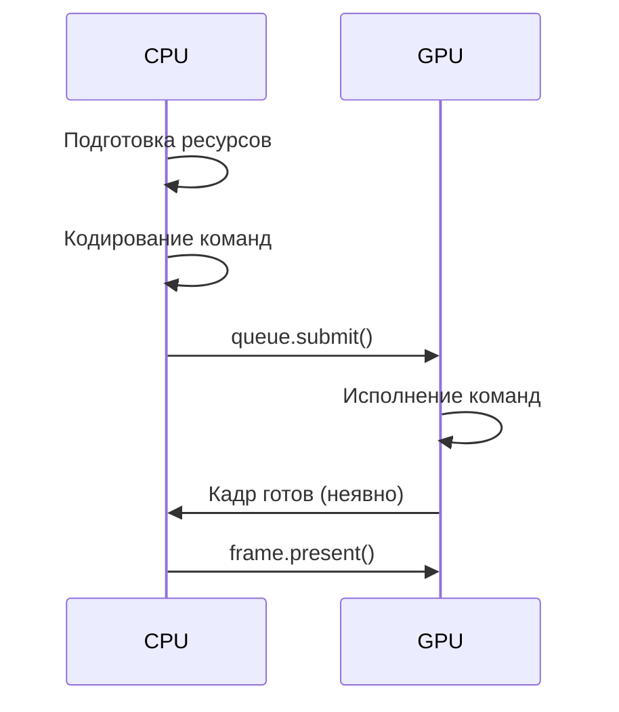
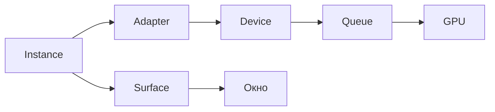
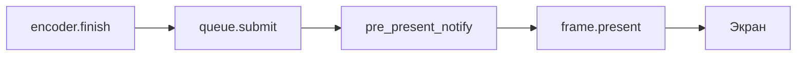
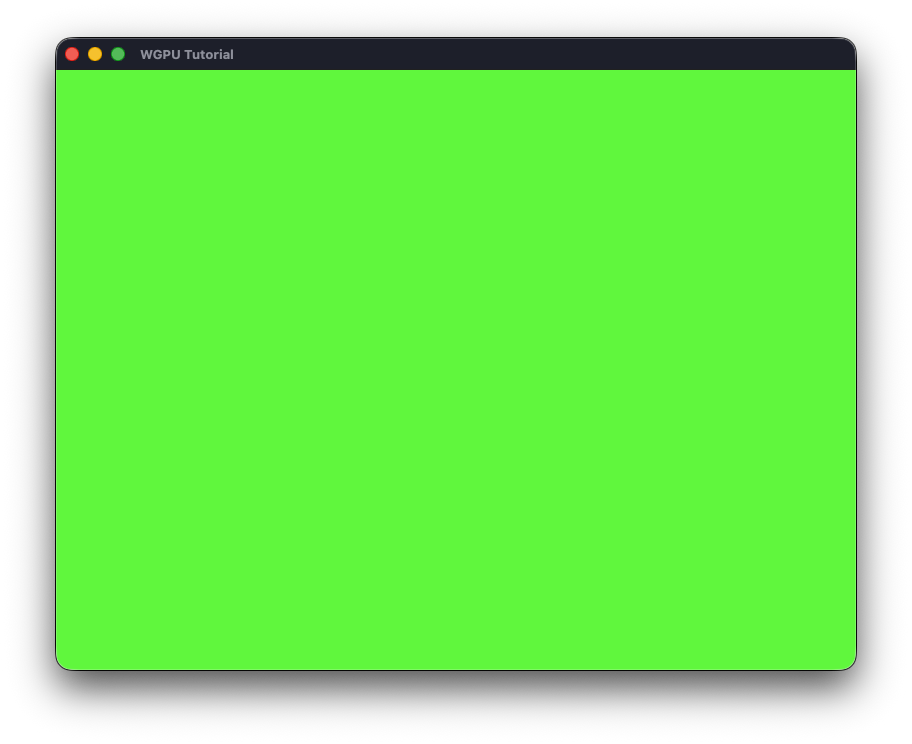

# Инициализация wgpu

[Полный код главы](https://github.com/Bromles/wgpu-tutorial/tree/master/code/guide/getting-started/init-wgpu)

**Что уже должно быть понятно:**

- окно, event loop, `ApplicationHandler`

**Что появится в этой главе:**

- `Instance`, `Adapter`, `Device`, `Queue`, `Surface`
- `SurfaceConfiguration`
- `RenderPass`, `CommandEncoder`, `Queue::submit`
- обработка ошибок `get_current_texture`

**Итог:** окно, залитое зелёным цветом

---

В прошлой главе мы создали окно и базовую структуру приложения с winit. Теперь инициализируем wgpu и зальём окно
сплошным цветом — это наш первый кадр, отрисованный на GPU.

## Как вообще работает wgpu

Видеокарта — отдельное устройство со своим процессором и памятью. Она работает параллельно с CPU, и данные для неё
нужно явно копировать из оперативной памяти в видеопамять. Поэтому работа с GPU выглядит не как вызов функций, а как
сбор и отправка команд, которые выполнятся когда-то потом.

Схема одного кадра:


```mermaid
sequenceDiagram
    participant CPU
    participant GPU
    CPU ->> CPU: Подготовка ресурсов
    CPU ->> CPU: Кодирование команд
    CPU ->> GPU: queue.submit()
    GPU ->> GPU: Исполнение команд
    GPU ->> CPU: Кадр готов (неявно)
    CPU ->> GPU: frame.present()
```

Ключевой момент: на нативных платформах `queue.submit` не блокирует CPU. Мы можем готовить данные для следующего кадра,
пока GPU рисует текущий. Это отличие от стандарта WebGPU, где submit блокирует поток.

Авторы WebGPU сознательно отказались от ручной синхронизации (как в Vulkan/DX12) — она сложна и приводит к ошибкам.
Вместо этого wgpu на нативных платформах идёт путём Metal 3: автоматическая синхронизация с опциональными
оптимизациями. На этом подходе работают Baldur's Gate 3, Death Stranding, Cyberpunk 2077 — производительности хватает
для любых задач.

<details class="details custom-block">
<summary class="custom-block-title">Подробнее о синхронизации</summary>

В старых API (OpenGL, DirectX 11) отправка команд блокировала CPU — просто и предсказуемо, но медленно. Vulkan,
DirectX 12 и Metal 4 требуют ручной синхронизации — мощно, но сложно. WebGPU выбрал блокировку (проще для браузера).
wgpu на нативных платформах — автоматическая синхронизация без блокировки, как Metal 3.

</details>

## Ключевые сущности

Вот главные объекты wgpu:


```mermaid
flowchart LR
    Instance --> Adapter
    Adapter --> Device
    Device --> Queue
    Instance --> Surface
    Queue --> GPU
    Surface --> Window[Окно]
```

- **Instance** — точка входа в wgpu
- **Adapter** — конкретная видеокарта (физическая или логическая)
- **Device** — логическое устройство, управляющее ресурсами GPU. Через него создаются буферы, текстуры, конвейеры
- **Queue** — очередь команд. Через неё отправляем записанные команды на выполнение
- **Surface** — поверхность, привязанная к окну. Именно на неё мы рисуем

Instance и Adapter хранить не нужно — они используются только при инициализации.

<details class="details custom-block">
<summary class="custom-block-title">Сущности следующих глав</summary>

**Ресурсы сцены** (создаются один раз при загрузке):

- `ShaderModule` — код шейдера (программа для GPU)
- `Buffer` — буфер данных (вершины, uniform-переменные)
- `Texture` — изображение в видеопамяти
- `Sampler` — настройка чтения из текстуры
- `RenderPipeline` — графический конвейер (описывает состояние GPU при отрисовке)
- `ComputePipeline` — конвейер вычислений

**Сущности кадра** (создаются и уничтожаются каждый кадр):

- `SurfaceTexture` — текстура, в которую рисуем текущий кадр
- `TextureView` — «ссылка» на текстуру, понятная GPU
- `CommandEncoder` — записывает команды для GPU
- `RenderPass` — операция рендера внутри CommandEncoder
- `CommandBuffer` — готовый список команд (результат CommandEncoder)

**События** (реакция на изменения):

- Изменение размера окна → переконфигурация Surface
- Потеря поверхности → восстановление
- Изменение настроек → пересоздание конвейеров

**Очистка** — не нужна. Все ресурсы wgpu — это `Arc` внутри, Rust автоматически очистит при выходе из области
видимости.

</details>

## Переходим к коду

### Зависимости

```toml
winit = "0.30"
tracing = "0.1"
tracing-subscriber = "0.3"
pollster = "0.4" # [!code ++]
wgpu = "29.0" # [!code ++]
```

wgpu требует resolver 2 в Cargo.toml. Для edition 2021+ он стоит по умолчанию.

`pollster` — минималистичный async-рантайм. Его функция `block_on` выполняет future в текущем потоке — ровно то,
что нужно для вызовов `request_adapter` и `request_device`. Никакого runtime, потоков и зависимостей.

### Структура Renderer

Вынесем работу с GPU в отдельную структуру:

```rust
struct Renderer {
    device: Device,
    queue: Queue,
    surface: Surface<'static>,
    surface_config: SurfaceConfiguration,
}
```

`SurfaceConfiguration` описывает параметры поверхности — размер и формат изображения. С её помощью мы реагируем на
изменение размера окна.

Обновим и состояние приложения:

```rust
enum App {
    Loading,
    Ready {
        window: Arc<Window>,
        renderer: Box<Renderer>, // [!code ++]
        need_to_resize_surface: bool, // [!code ++]
    },
}
```

`Renderer` в `Box`, чтобы варианты перечисления не сильно различались по размеру — на это есть [проверка в
Clippy](https://rust-lang.github.io/rust-clippy/master/index.html#large_enum_variant).

Методы Renderer:

```rust
impl Renderer {
    fn new(window: Arc<Window>) -> Self;
    fn resize_surface(&mut self, size: PhysicalSize<u32>);
    fn render(&mut self, window: Arc<Window>);
}
```

- `new` — инициализация GPU (Instance, Adapter, Device, Queue, Surface)
- `resize_surface` — реакция на изменение размера окна
- `render` — отрисовка кадра. Принимает `Arc<Window>` для вызова `pre_present_notify`, нужного на Wayland

## Метод `new`

```rust
fn new(window: Arc<Window>) -> Self {
    let mut physical_size = window.inner_size();
    physical_size.width = physical_size.width.max(1);
    physical_size.height = physical_size.height.max(1);
```

Получаем текущий размер окна и убеждаемся, что он не нулевой — нулевой размер вызовет ошибку при настройке поверхности.

### Instance

```rust
    let instance = Instance::new(InstanceDescriptor {
backends: Backends::PRIMARY,
..InstanceDescriptor::new_without_display_handle()
});
```

Типичный паттерн wgpu: конструкторы принимают дескрипторы (struct с параметрами), обычно реализующие `Default`. Здесь
мы задаём только `backends: PRIMARY` — это Metal (macOS), Vulkan (Linux/Windows/Android) и DirectX 12 (Windows),
бэкенды с полными возможностями GPU. `Backends::all()` добавит ещё OpenGL/WebGL — запасной вариант для старых систем.

`new_without_display_handle()` создаёт дескриптор без привязки к дисплею — нам не нужно, потому что surface
привязывается отдельно через `create_surface`.

### Surface

```rust
    let surface = instance
.create_surface(window)
.expect("Failed to create surface");
```

Привязываем поверхность к нашему окну winit.

<details class="details custom-block">
<summary class="custom-block-title">Двойная буферизация</summary>

Видеокарта рисует попиксельно. Если рендерить прямо в ту текстуру, что сейчас на экране, пользователь увидит процесс
рисования — разорванный кадр. Поэтому используется минимум две текстуры: одна на экране, вторая — скрытая. Мы рисуем
в скрытую, а когда кадр готов — меняем их местами. Отсюда термин «swapchain» — в старых API он был отдельным объектом,
в wgpu скрыт внутри `Surface`.


Когда мы вызываем `surface.get_current_texture()`, получаем текущую свободную текстуру для отрисовки.

</details>

### Adapter

```rust
    let adapter = pollster::block_on(instance.request_adapter( & RequestAdapterOptions {
power_preference: PowerPreference::default (),
force_fallback_adapter: false,
compatible_surface: Some( & surface),
}))
.expect("Failed to request adapter");
```

Запрашиваем адаптер (видеокарту). `request_adapter` — async-функция (так требует стандарт WebGPU для совместимости
с браузерной средой), поэтому вызываем через `pollster::block_on`.

- `power_preference` — дискретная или интегрированная видеокарта
- `force_fallback_adapter: false` — не использовать программный растеризатор
- `compatible_surface` — адаптер должен поддерживать нашу поверхность

### Device и Queue

```rust
    let (device, queue) = pollster::block_on(adapter.request_device( & DeviceDescriptor {
label: Some("Main device"),
required_features: adapter.features() & Features::default (),
required_limits: Limits::default ().using_resolution(adapter.limits()),
memory_hints: MemoryHints::Performance,
trace: Default::default (),
experimental_features: ExperimentalFeatures::disabled(),
}))
.expect("Failed to request device");
```

`Device` и `Queue` создаются вместе — это главные объекты для работы с GPU.

- `label` — отладочное имя, появится в логах. У многих сущностей wgpu есть этот параметр
- `required_features` — запрашиваем фичи, поддерживаемые адаптером
- `required_limits` — ограничения (размер текстур, количество буферов). `using_resolution` учитывает разрешение адаптера
- `memory_hints: Performance` — подсказка менеджеру памяти: оптимизировать скорость, а не потребление
- `trace` — запись команд в файл для отладки через [wgpu-player](https://github.com/gfx-rs/wgpu/tree/trunk/player)
- `experimental_features: disabled` — экспериментальные фичи требуют unsafe, они нам не нужны

### SurfaceConfiguration

```rust
    let surface_config = surface
.get_default_config( & adapter, physical_size.width, physical_size.height)
.expect("Failed to get default surface config");

surface.configure( & device, & surface_config);

Self {
device,
queue,
surface,
surface_config,
}
}
```

Конфигурация поверхности по умолчанию. В следующих главах мы научимся менять VSync и буферизацию вручную. Применяем
конфигурацию и возвращаем готовый `Renderer`.

## Метод `resize_surface`

```rust
fn resize_surface(&mut self, size: PhysicalSize<u32>) {
    let width = size.width.max(1);
    let height = size.height.max(1);

    self.surface_config.width = width;
    self.surface_config.height = height;

    self.surface.configure(&self.device, &self.surface_config);
}
```

Защита от нулевых размеров, обновление конфигурации и её применение. Вызывается не сразу при событии `Resized`, а
перед следующим кадром — чтобы не перестраивать поверхность несколько раз подряд при перетаскивании.

## Метод `render`

Это главный метод — отрисовка кадра.

### Получение текстуры

```rust
fn render(&mut self, window: Arc<Window>) {
    let frame = match self.surface.get_current_texture() {
        Success(frame) => frame,
        Suboptimal(frame) => {
            warn!("Surface suboptimal, reconfiguring");
            self.surface.configure(&self.device, &self.surface_config);
            frame
        }
        Outdated | Lost => {
            warn!("Surface lost or outdated, reconfiguring");
            self.surface.configure(&self.device, &self.surface_config);
            return;
        }
        Timeout | Occluded => return,
        Validation => {
            warn!("Surface texture validation error");
            return;
        }
    };
```

`get_current_texture` возвращает перечисление `CurrentSurfaceTexture`:

- `Success` — текстура готова, можно рисовать
- `Suboptimal` — текстура готова, но конфигурация поверхности неоптимальна (например, изменилось разрешение или
  формат). wgpu рекомендует использовать этот кадр и сразу переконфигурировать поверхность
- `Outdated` — поверхность устарела (например, после resize). Переконфигурируем и пропускаем кадр
- `Lost` — поверхность потеряна. Аналогично
- `Timeout` — текстура ещё не готова. Пропускаем кадр, на следующем попытаемся снова
- `Occluded` — окно скрыто или перекрыто. Не тратим GPU-время впустую
- `Validation` — ошибка валидации, скорее всего баг в коде. Логируем и пропускаем

`Occluded` особенно полезен на мобильных — когда приложение свёрнуто, рисовать впустую не стоит.

### Кодирование команд

```rust
    let mut encoder = self
.device
.create_command_encoder( & CommandEncoderDescriptor {
label: Some("Main command encoder"),
});

let view = frame.texture.create_view( & TextureViewDescriptor::default ());
```

`CommandEncoder` записывает команды для GPU. `TextureView` — «ссылка» на текстуру, понятная видеокарте.

### Render Pass

```rust
    encoder.begin_render_pass( & RenderPassDescriptor {
label: Some("Clear render pass"),
color_attachments: & [Some(RenderPassColorAttachment {
view: & view,
resolve_target: None,
ops: Operations {
load: LoadOp::Clear(Color::GREEN),
store: StoreOp::Store,
},
depth_slice: None,
})],
depth_stencil_attachment: None,
timestamp_writes: None,
occlusion_query_set: None,
multiview_mask: None,
});
```

Render pass — операция рендера. Здесь мы:

- `color_attachments` — указываем, куда рисовать (в нашу текстуру поверхности)
- `LoadOp::Clear(Color::GREEN)` — перед отрисовкой заливаем зелёным
- `StoreOp::Store` — сохраняем результат
- Остальные параметры (`depth_stencil_attachment`, `timestamp_writes`, ...) — пока не нужны

Пока мы только заливаем экран цветом — других команд в проходе рендера нет. В следующей главе добавим отрисовку
геометрии.

### Отправка и отображение

```rust
    self .queue.submit([encoder.finish()]);
window.pre_present_notify();
frame.present();
}
```


```mermaid
flowchart LR
    A[encoder.finish] --> B[queue.submit]
    B --> C[pre_present_notify]
    C --> D[frame.present]
    D --> E[Экран]
```

- `queue.submit` — отправляем команды на выполнение. Не блокирует CPU на нативных платформах. Если нужно дождаться
  выполнения — `device.poll`
- `pre_present_notify` — уведомление winit о скором выводе кадра. Критично на Wayland — без этого оконный сервер
  может заблокировать приложение
- `frame.present` — отправляем кадр в очередь отображения. Тоже не блокирует — кадр выведется, когда GPU его отрисует

<div class="tip custom-block">
<p class="custom-block-title">Оптимизации</p>

1. На мобильных и Apple Silicon завершение `RenderPass` дорого. Старайтесь переиспользовать проходы, где возможно.

2. `Queue::submit` затратна — она отслеживает ресурсы и синхронизирует их под капотом. Но принимает список
   `CommandBuffer`. Лучше собрать буферы из разных частей программы и отправить одним вызовом, чем вызывать `submit`
   на каждый буфер отдельно.

</div>

## Обновление методов жизненного цикла

### Метод `resumed`

```rust
fn resumed(&mut self, event_loop: &ActiveEventLoop) {
    if let Self::Loading = self {
        let window_attributes = WindowAttributes::default()
            .with_title("WGPU Tutorial")
            .with_visible(false); // [!code ++]

        let window = Arc::new(
            event_loop
                .create_window(window_attributes)
                .expect("Failed to create window"),
        );

        center_window(window.clone());

        event_loop.set_control_flow(ControlFlow::Wait); // [!code ++]

        let renderer = Renderer::new(window.clone()); // [!code ++]

        *self = Self::Ready {
            window,
            renderer: Box::new(renderer), // [!code ++]
            need_to_resize_surface: false, // [!code ++]
        }
    }

    let Self::Ready { // [!code ++]
        window, renderer, .. // [!code ++]
    } = self // [!code ++]
    else { // [!code ++]
        return; // [!code ++]
    }; // [!code ++]

    renderer.render(window.clone()); // [!code ++]

    window.set_visible(true); // [!code ++]
}
```

Создаём Renderer и окно. Окно изначально скрыто — чтобы пользователь не увидел белую заглушку до первого кадра.
После отрисовки снимаем скрытие через `set_visible(true)`.

`ControlFlow::Wait` — event loop засыпает до нового события. Нам это подходит, потому что мы сами запрашиваем
перерисовку через `window.request_redraw()`.

### Метод `window_event`

```rust
fn window_event(
    &mut self,
    event_loop: &ActiveEventLoop,
    _window_id: WindowId,
    event: WindowEvent,
) {
    let Self::Ready {
        window,
        renderer, // [!code ++]
        need_to_resize_surface, // [!code ++]
        ..
    } = self
    else {
        return;
    };

    match event {
        WindowEvent::RedrawRequested => {
            if *need_to_resize_surface { // [!code ++]
                let size = window.inner_size(); // [!code ++]

                renderer.resize_surface(size); // [!code ++]

                *need_to_resize_surface = false; // [!code ++]
            }

            renderer.render(window.clone()); // [!code ++]

            window.request_redraw();
        }
        WindowEvent::Resized(_) => {
            *need_to_resize_surface = true; // [!code ++]
            window.request_redraw();
        }
        WindowEvent::CloseRequested => {
            event_loop.exit();
        }
        WindowEvent::KeyboardInput { event, .. } => handle_keyboard_input(event_loop, event),
        _ => {}
    }
}
```

Resize помечается флагом, а обрабатывается перед следующим кадром — чтобы не переконфигурировать поверхность на каждое
событие при перетаскивании окна.

## Что получилось

В центре экрана — окно, залитое зелёным цветом:



Сам факт зелёного экрана значит, что мы подключили wgpu, получили текстуру поверхности, очистили её и вывели на экран.
Изменение размера без артефактов подтверждает, что обработка событий работает корректно.

[Полный код главы](https://github.com/Bromles/wgpu-tutorial/tree/master/code/guide/getting-started/init-wgpu)
