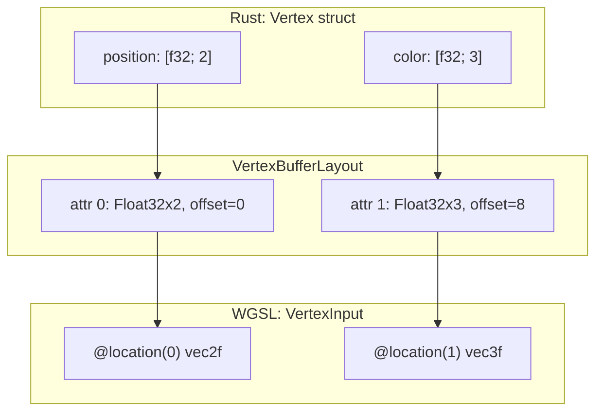
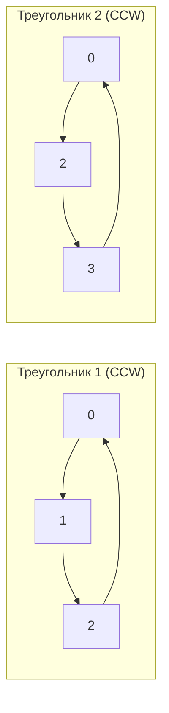
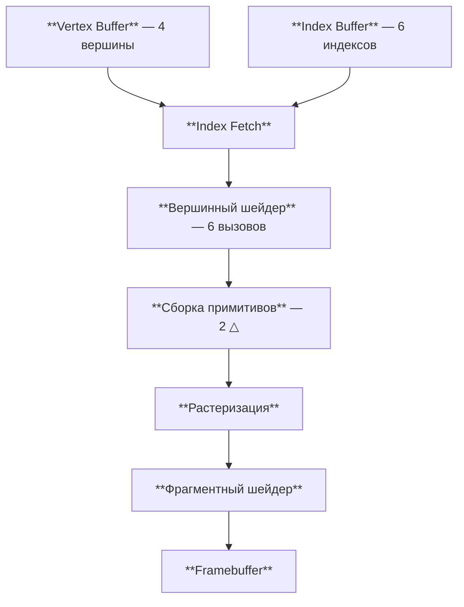

# Вершинные и индексные буферы

[Полный код главы](https://github.com/Bromles/wgpu-tutorial/tree/master/code/guide/gpu-data-model/buffers)

**Что уже должно быть понятно:**

- WGSL: типы, структуры, `@location`, `@builtin`, массивы
- render pipeline, `draw`, шейдеры

**Что появится в этой главе:**

- вершинные буферы (vertex buffers) — данные вершин на GPU
- `VertexBufferLayout` — описание формата вершин
- крейт `bytemuck` — безопасная работа с байтами
- составная геометрия из нескольких треугольников
- порядок обхода вершин (winding order)
- индексный буфер (index buffer) — устранение дублирования вершин
- `set_index_buffer`, `draw_indexed`

**Итог:** цветной прямоугольник из двух треугольников с 4 уникальными вершинами

---

В прошлой главе мы нарисовали цветной треугольник, захардкодив позиции и цвета в массивах внутри шейдера. Это
работает для демонстрации, но не масштабируется: для моделей с тысячами вершин мы не можем прописывать каждую
в коде шейдера. Нужен способ передавать геометрию из Rust на GPU.

## Вершинные буферы

**Вершинный буфер** (vertex buffer) — массив структур в видеопамяти, описывающих каждую вершину. Вместо того, чтобы
вычислять данные в шейдере, мы создаём буфер на стороне Rust, и GPU читает из него при каждом вызове вершинного
шейдера.

### Vertex struct в Rust

Структура вершинных данных должна иметь точно такую же раскладку в памяти, как описано в шейдере. Для этого
используется `#[repr(C)]` — C-совместимая упаковка без скрытых полей:

```rust
#[repr(C)]
#[derive(Clone, Copy, Pod, Zeroable)]
struct Vertex {
    position: [f32; 2],
    color: [f32; 3],
}
```

Крейт `bytemuck` предоставляет трейты `Pod` (Plain Old Data) и `Zeroable`:

- `Pod` гарантирует, что тип можно безопасно интерпретировать как байты (нет `String`, `Vec`, ссылок)
- `Zeroable` гарантирует, что все биты, равные нулю, — допустимое значение

Вместе они позволяют использовать `bytemuck::cast_slice` для преобразования `&[Vertex]` → `&[u8]`, что нужно при
создании буфера.

Добавьте `bytemuck` в зависимости (`Cargo.toml`):

```toml
[dependencies]
framework = { path = "../../../framework" }
wgpu.workspace = true
winit.workspace = true
bytemuck.workspace = true # [!code ++]
```

`#[repr(C)]` гарантирует C-совместимую упаковку — поля расположены в памяти точно так, как описаны.
Без него компилятор может переставить поля или добавить скрытый паддинг, и GPU прочитает данные неверно.

<div class="warning custom-block" style="padding-top: 8px">
<p class="custom-block-title">vec3 и выравнивание</p>

В WGSL структуры в `uniform` address space выравниваются по 16 байт. `vec3<f32>` занимает 12 байт данных,
но с паддингом — 16. Это не влияет на вершинные данные (они читаются через `VertexBufferLayout` с явными offset),
но станет важным при создании uniform-буферов — в следующей главе.

</div>

### Vertex buffer layout

GPU нужно знать, как читать данные из буфера — где начинается каждое поле и какого оно типа. Это описывается через
`VertexBufferLayout`:

```rust
impl Vertex {
    const ATTRIBUTES: [VertexAttribute; 2] = [
        VertexAttribute {
            offset: 0,
            shader_location: 0,
            format: VertexFormat::Float32x2,
        },
        VertexAttribute {
            offset: size_of::<[f32; 2]>() as BufferAddress,
            shader_location: 1,
            format: VertexFormat::Float32x3,
        },
    ];

    fn desc() -> VertexBufferLayout<'static> {
        VertexBufferLayout {
            array_stride: size_of::<Vertex>() as BufferAddress,
            step_mode: VertexStepMode::Vertex,
            attributes: &Self::ATTRIBUTES,
        }
    }
}
```

Разберёмся с каждым полем:

- `array_stride` — размер одной вершины в байтах (`2 × 4 + 3 × 4 = 20`). GPU «шагает» на это расстояние при
  переходе к следующей вершине
- `step_mode: Vertex` — один набор данных для каждой вершины (альтернатива — `Instance`, один набор на экземпляр;
  об этом в [главе про instancing](/guide/3d/instancing/))
- `attributes` — массив описаний полей:
    - `offset` — смещение поля от начала структуры в байтах
    - `shader_location` — номер, соответствующий `@location(N)` в WGSL
    - `format` — тип данных: `Float32x2` → `vec2<f32>`, `Float32x3` → `vec3<f32>`

Раскладка в памяти одной вершины:


Как эти три слоя — Rust, `VertexBufferLayout` и WGSL — связаны между собой:



`VertexBufferLayout` — мост между Rust и WGSL. Он говорит GPU: «байты с offset 0 — это `Float32x2`, передай их
в `@location(0)`». А `@location(0)` в шейдере уже получает эти данные как `vec2<f32>`. Все три слоя должны
согласовываться — если типы или порядок не совпадут, данные будут прочитаны неверно.

Справочник часто используемых `VertexFormat`:

| Rust тип   | VertexFormat | WGSL тип    |
|:-----------|:-------------|:------------|
| `f32`      | `Float32`    | `f32`       |
| `[f32; 2]` | `Float32x2`  | `vec2<f32>` |
| `[f32; 3]` | `Float32x3`  | `vec3<f32>` |
| `[f32; 4]` | `Float32x4`  | `vec4<f32>` |
| `u32`      | `Uint32`     | `u32`       |
| `i32`      | `Sint32`     | `i32`       |

### Шейдер принимает данные из буфера

Шейдер из прошлой главы вычислял позиции и цвета через `vertex_index`. Теперь данные приходят извне — из вершинного
буфера. Входная структура использует `@location`, чтобы указать, из какого атрибута буфера читать данные:

```wgsl
struct VertexInput {
    @location(0) position: vec2<f32>,
    @location(1) color: vec3<f32>,
}

struct VertexOutput {
    @builtin(position) position: vec4<f32>,
    @location(0) color: vec3<f32>,
}

@vertex
fn vs_main(input: VertexInput) -> VertexOutput {
    var output: VertexOutput;
    output.position = vec4<f32>(input.position, 0.0, 1.0);
    output.color = input.color;
    return output;
}

@fragment
fn fs_main(input: VertexOutput) -> @location(0) vec4<f32> {
    return vec4<f32>(input.color, 1.0);
}
```

Массивы `positions` и `colors` исчезли — вместо них шейдер получает данные через `VertexInput`. Вся разница
в источнике данных: раньше — захардкожены в шейдере, теперь — передаются через вершинный буфер.

### Отправляем вершины на GPU

```rust
use wgpu::util::DeviceExt;

let vertex_buffer = ctx.device.create_buffer_init(&wgpu::util::BufferInitDescriptor {
    label: Some("Vertex Buffer"),
    contents: bytemuck::cast_slice(VERTICES),
    usage: BufferUsages::VERTEX,
});
```

`create_buffer_init` — вспомогательный метод из трейта `DeviceExt`. Он создаёт буфер и заполняет его данными за один
вызов. `bytemuck::cast_slice(VERTICES)` преобразует `&[Vertex]` в `&[u8]`.

### Подключаем буфер к конвейеру

В прошлой главе поле `buffers` в `VertexState` было пустым массивом `&[]`. Теперь подключаем описание формата:

```rust
vertex: VertexState {
    module: &shader_module,
    entry_point: Some("vs_main"),
    buffers: &[],                                   // [!code --]
    buffers: &[Vertex::desc()],                     // [!code ++]
    compilation_options: PipelineCompilationOptions::default(),
},
```

И привязываем буфер при отрисовке:

```rust
rpass.set_pipeline(&self.pipeline);
rpass.set_vertex_buffer(0, self.vertex_buffer.slice(..));  // [!code ++]
rpass.draw(0..3, 0..1);
```

`set_vertex_buffer(0, ...)` — привязывает буфер к слоту 0 (соответствует первому элементу в `buffers: &[...]`).

## Из треугольника в прямоугольник

Теперь, когда мы умеем передавать произвольную геометрию через вершинные буферы, попробуем нарисовать прямоугольник.
GPU умеет рисовать только треугольники, поэтому прямоугольник составляем из двух:


В режиме `TriangleList` каждые три вершины образуют один отдельный треугольник. Для двух треугольников нужно 6 вершин:

```rust
const VERTICES: &[Vertex] = &[
    // Первый треугольник
    Vertex { position: [-0.5, -0.5], color: [1.0, 0.0, 0.0] }, // 0 — левый нижний (красный)
    Vertex { position: [-0.5,  0.5], color: [0.0, 1.0, 0.0] }, // 1 — левый верхний (зелёный)
    Vertex { position: [ 0.5,  0.5], color: [0.0, 0.0, 1.0] }, // 2 — правый верхний (синий)

    // Второй треугольник
    Vertex { position: [-0.5, -0.5], color: [1.0, 0.0, 0.0] }, // 0 — левый нижний (красный)
    Vertex { position: [ 0.5,  0.5], color: [0.0, 0.0, 1.0] }, // 2 — правый верхний (синий)
    Vertex { position: [ 0.5, -0.5], color: [1.0, 1.0, 0.0] }, // 3 — правый нижний (жёлтый)
];
```

Изменение в коде отрисовки — `draw` отрисовывает 6 вершин:

```rust
rpass.draw(0..3, 0..1);  // [!code --]
rpass.draw(0..6, 0..1);  // [!code ++]
```

## Порядок обхода (winding order)

При создании конвейера мы указывали `front_face: FrontFace::Ccw` — передней считается грань, вершины которой
расположены **против часовой стрелки**. Порядок вершин определяет, с какой стороны треугольника мы смотрим:



Оба обхода — против часовой стрелки в экранных координатах (ось Y направлена вверх). Если перепутать порядок —
например, указать вершины 0→3→2 вместо 0→2→3 — грань будет считаться задней.

<div class="info custom-block" style="padding-top: 8px">
<p class="custom-block-title">Отсечение задних граней (backface culling)</p>

По умолчанию wgpu не отбрасывает задние грани — отрисовываются все треугольники, вне зависимости от стороны.
Но это можно включить через поле `cull_mode` в `PrimitiveState`:

```rust
primitive: PrimitiveState {
    cull_mode: Some(Face::Back),
    ..Default::default()
},
```

Тогда треугольники с обходом по часовой стрелке (задние грани) будут отброшены ещё до растеризации. Это полезно для
замкнутых 3D-объектов — задние грани не видны наблюдателю, и их отрисовка — пустая трата GPU-времени. Однако
для 2D-графики или прозрачных объектов отсечение задних граней обычно не используют.

</div>

## Проблема: дублирование вершин

В нашем буфере 6 вершин, но уникальных — только 4. Вершины 0 и 2 повторяются, поскольку они лежат на общей
диагонали прямоугольника. Для одного прямоугольника это 40 лишних байт — незаметно. Но для сложных моделей
стоимость растёт:

- Куб: 12 треугольников × 3 вершины = 36, но уникальных — 8 (без нормалей) или 24 (с нормалями)
- Сфера из 1000 треугольников: 3000 вершин вместо ~500 уникальных

## Индексные буферы

Индексный буфер решает проблему дублирования, отделяя «какие вершины есть» от «какие вершины образуют треугольники».

Графический конвейер обновляется — между вершинным буфером и вершинным шейдером появляется шаг разрешения индексов:



GPU считывает индекс, извлекает соответствующую вершину из вершинного буфера и передаёт её вершинному шейдеру.
Индексы не проходят через шейдер — они используются на этапе `Index Fetch`, который выполняется до вершинного шейдера.

```rust
const VERTICES: &[Vertex] = &[
    Vertex { position: [-0.5, -0.5], color: [1.0, 0.0, 0.0] }, // 0
    Vertex { position: [-0.5, 0.5], color: [0.0, 1.0, 0.0] },  // 1
    Vertex { position: [0.5, 0.5], color: [0.0, 0.0, 1.0] },   // 2
    Vertex { position: [0.5, -0.5], color: [1.0, 1.0, 0.0] },  // 3
];

const INDICES: &[u16] = &[
    0, 1, 2,  // первый треугольник
    0, 2, 3,  // второй треугольник
];
```

4 вершины и 6 индексов вместо 6 вершин. Каждый индекс — 2 байта (`u16`), значительно меньше, чем полная вершина
(20 байт).

### Создаём индексный буфер

```rust
let index_buffer = ctx.device.create_buffer_init(&wgpu::util::BufferInitDescriptor {
    label: Some("Index Buffer"),
    contents: bytemuck::cast_slice(INDICES),
    usage: BufferUsages::INDEX,
});
```

Единственное отличие от вершинного буфера — `usage: BufferUsages::INDEX`.

### Используем индексы при отрисовке

```rust
rpass.set_pipeline(&self.pipeline);
rpass.set_vertex_buffer(0, self.vertex_buffer.slice(..));
rpass.set_index_buffer(self.index_buffer.slice(..), IndexFormat::Uint16);  // [!code ++]
rpass.draw(0..6, 0..1);            // [!code --]
rpass.draw_indexed(0..6, 0, 0..1);  // [!code ++]
```

`set_index_buffer` принимает срез буфера и формат индексов:

- `IndexFormat::Uint16` — каждый индекс `u16` (2 байта), максимум 65535 вершин. Если нужно больше —
  `IndexFormat::Uint32`

`draw_indexed` принимает три параметра:

- `0..6` — диапазон индексов. 6 индексов = 2 треугольника
- `0` — base vertex: смещение, добавляемое к каждому индексу. Если в одном большом вершинном буфере хранятся
  несколько объектов, меняя base vertex можно отрисовать любой объект, не перестраивая индексы


- `0..1` — диапазон экземпляров (instancing), как и раньше

## Когда индексные буферы имеют смысл

| Модель              | Уникальных вершин | Без индексов      | С индексами             | Экономия |
|:--------------------|:------------------|:------------------|:------------------------|:---------|
| Прямоугольник       | 4                 | 6 × 20 = 120 Б    | 4×20 + 6×2 = 92 Б       | 23%      |
| Куб                 | 24                | 36 × 20 = 720 Б   | 24×20 + 36×2 = 552 Б    | 23%      |
| Сфера (1000 треуг.) | ~500              | 3000 × 20 = 60 КБ | 500×20 + 3000×2 = 16 КБ | 73%      |

На практике индексные буферы используют почти всегда — даже если экономия памяти невелика, они упрощают работу
с геометрией. Без них модификация общей вершины (например, сдвиг угла прямоугольника) потребовала бы обновления
сразу нескольких дубликатов в буфере.

<div class="info custom-block" style="padding-top: 8px">
<p class="custom-block-title">Почему у куба 24 вершины, а не 8?</p>

У куба 8 углов, но на каждом углу сходятся 3 грани с разными нормалями (векторами, определяющими направление
поверхности). Поскольку нормаль хранится в данных вершины, каждый угол существует в трёх экземплярах — по одному
для каждой грани. 8 углов × 3 грани = 24 вершины. Мы познакомимся с нормалями в [главе про освещение](/guide/lighting/basics/).

</div>

## Что получилось

::: warning Типичные ошибки
- `VertexBufferLayout.array_stride` должен точно совпадать с `size_of::<Vertex>()` — иначе данные сместятся и всё поплывёт
- `shader_location` не связан с порядком в `buffers[]` — он указывает на `@location(N)` в WGSL
- `IndexFormat::Uint16` → максимум 65535 вершин. Если в буфере больше — используйте `Uint32`
- Индекс выходит за пределы вершинного буфера — GPU behaviour undefined, от мусора до crash
- `set_index_buffer` забыт, но `draw_indexed` вызван — panic или пустой экран
- Winding order: менять `FrontFace::Ccw` на `Cw` нужно только если ваши треугольники идут по часовой — иначе ничего не нарисуется
:::

Визуально результат — цветной прямоугольник с плавными переходами между красным, зелёным, синим и жёлтым. Под
капотом важные изменения: данные вершин передаются через вершинный буфер (не захардкожены в шейдере), 4 уникальные
вершины вместо 6, и индексный буфер указывает GPU, как их соединить в треугольники. Этот подход мы и будем
использовать во всех последующих главах.

<!-- TODO: скриншот -->

<div class="tip custom-block" style="padding-top: 8px">
<p class="custom-block-title">Попробуем</p>

- Нарисуем три треугольника, образующих «домик» (крыша + стены), используя 3 треугольника и 9 индексов
- Поменяем `base_vertex` в `draw_indexed` на 1 — что произойдёт и почему?
- Добавим третье поле в `Vertex` (например, `uv: [f32; 2]`) — какие ещё места нужно обновить?

</div>

[Полный код главы](https://github.com/Bromles/wgpu-tutorial/tree/master/code/guide/gpu-data-model/buffers)
