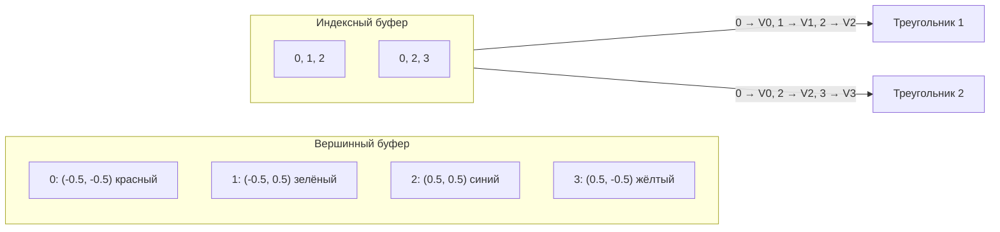

# Индексные буферы

[Полный код главы](https://github.com/Bromles/wgpu-tutorial/tree/master/code/guide/gpu-data-model/index-buffers)

**Что уже должно быть понятно:**

- вершинные буферы, `VertexBufferLayout`
- `TriangleList`, winding order
- отрисовка через `draw`

**Что появится в этой главе:**

- индексный буфер (index buffer)
- `set_index_buffer`, `draw_indexed`
- `IndexFormat`

**Итог:** тот же прямоугольник, но с 4 уникальными вершинами вместо 6

---

В прошлой главе мы нарисовали прямоугольник из двух треугольников — 6 вершин, хотя уникальных всего 4. Вершины по
диагонали дублировались. Для одного прямоугольника это 20 лишних байт. Для реальных моделей — тысячи дубликатов.

Индексный буфер решает эту проблему.

## Как работают индексы

Задаём каждый уникальный угол один раз, а GPU указываем, какие вершины образуют каждый треугольник — через индексы:



```rust
const VERTICES: &[Vertex] = &[
    Vertex { position: [-0.5, -0.5], color: [1.0, 0.0, 0.0] }, // 0
    Vertex { position: [-0.5,  0.5], color: [0.0, 1.0, 0.0] }, // 1
    Vertex { position: [ 0.5,  0.5], color: [0.0, 0.0, 1.0] }, // 2
    Vertex { position: [ 0.5, -0.5], color: [1.0, 1.0, 0.0] }, // 3
];

const INDICES: &[u16] = &[
    0, 1, 2,  // первый треугольник
    0, 2, 3,  // второй треугольник
];
```

4 вершины + 6 индексов вместо 6 вершин. Индексы — целые числа (`u16` или `u32`), по 2 или 4 байта каждый.

## Создание индексного буфера

```rust
let index_buffer = ctx.device.create_buffer_init(&wgpu::util::BufferInitDescriptor {
    label: Some("Index Buffer"),
    contents: bytemuck::cast_slice(INDICES),
    usage: BufferUsages::INDEX,
});
```

От вершинного отличается только `usage: BufferUsages::INDEX`.

## Привязка и отрисовка

В render pass добавляется привязка индексного буфера, а `draw` заменяется на `draw_indexed`:

```rust
rpass.set_pipeline(&self.pipeline);
rpass.set_vertex_buffer(0, self.vertex_buffer.slice(..));
rpass.set_index_buffer(self.index_buffer.slice(..), IndexFormat::Uint16);
rpass.draw_indexed(0..6, 0, 0..1);
```

Новые вызовы:

- `set_index_buffer(slice, format)` — привязывает индексный буфер. `IndexFormat::Uint16` — каждый индекс `u16` (2
  байта). Альтернатива — `Uint32` для моделей с более чем 65535 вершинами
- `draw_indexed(indices, base_vertex, instances)`:
    - `0..6` — диапазон индексов (6 индексов = 2 треугольника)
    - `0` — смещение, добавляемое к каждому индексу. Полезно, когда в одном большом буфере хранятся несколько объектов —
      можно отрисовать каждый, меняя только base vertex
    - `0..1` — диапазон экземпляров (instancing, как и раньше)

## Когда имеет смысл

| Модель              | Уникальных вершин | Без индексов      | С индексами             | Экономия |
|:--------------------|:------------------|:------------------|:------------------------|:---------|
| Прямоугольник       | 4                 | 6 × 20 = 120 Б    | 4×20 + 6×2 = 92 Б       | 23%      |
| Куб                 | 24                | 36 × 20 = 720 Б   | 24×20 + 36×2 = 552 Б    | 23%      |
| Сфера (1000 треуг.) | ~500              | 3000 × 20 = 60 КБ | 500×20 + 3000×2 = 16 КБ | 73%      |

Сфера даёт наибольшую экономию — каждая вершина принадлежит 5–6 треугольникам.

<div class="info custom-block" style="padding-top: 8px">
<p class="custom-block-title">Почему у куба 24 вершины, а не 8?</p>

У куба 8 углов, но на каждом углу сходятся 3 грани с разными нормалями. Если нормаль хранится в вершине, каждый угол
существует в трёх экземплярах: по одному для каждой грани. 8 углов × 3 грани = 24 вершины. Познакомимся с нормалями в
главе про освещение.

</div>

## Результат

Визуально не изменилось — тот же цветной прямоугольник. Но под капотом 4 вершины вместо 6, и индексный буфер указывает
GPU, как их соединить.

<div class="tip custom-block" style="padding-top: 8px">
<p class="custom-block-title">Попробуйте сами</p>

- Добавьте пятую вершину и нарисуйте «домик» (треугольная крыша + квадратные стены), используя 3 треугольника и 9
  индексов
- Поменяйте `base_vertex` в `draw_indexed` на 1 — что произойдёт?

</div>

[Полный код главы](https://github.com/Bromles/wgpu-tutorial/tree/master/code/guide/gpu-data-model/index-buffers)
