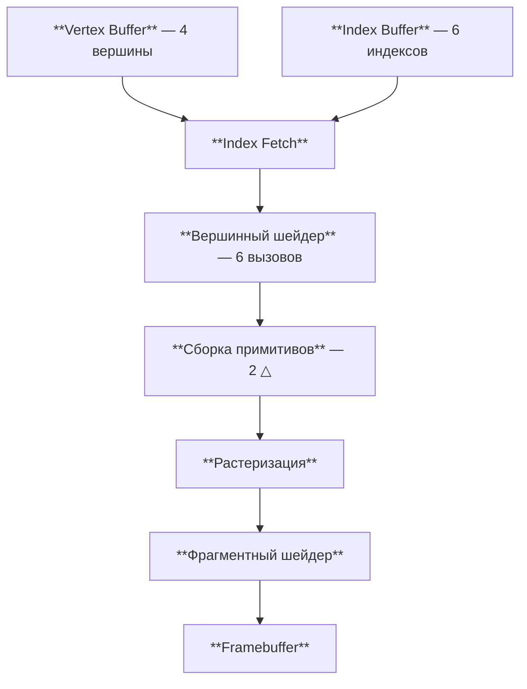
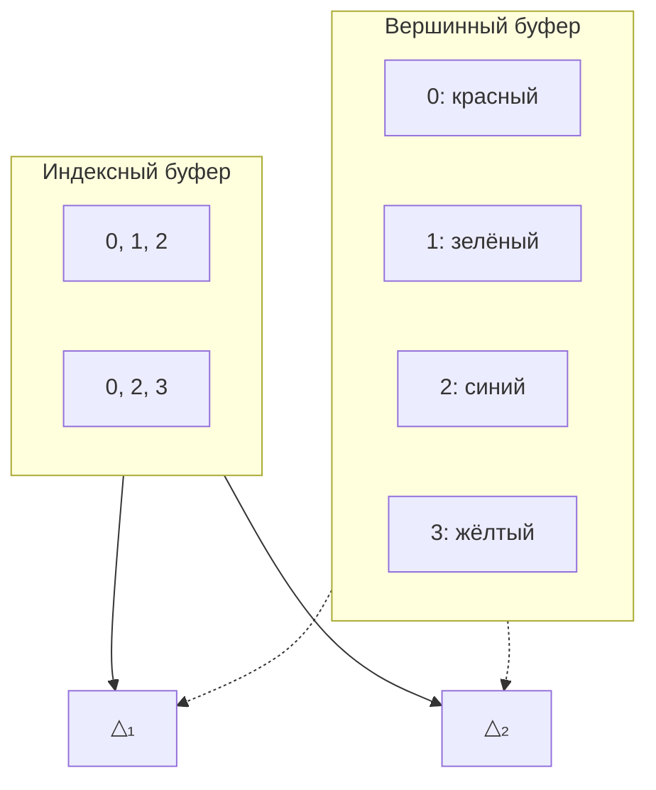

# Индексные буферы

[Полный код главы](https://github.com/Bromles/wgpu-tutorial/tree/master/code/guide/gpu-data-model/index-buffers)

**Что уже должно быть понятно:**

- вершинные буферы, `VertexBufferLayout`
- `TriangleList`, winding order
- отрисовка через `draw`

**Что появится в этой главе:**

- индексный буфер (index buffer)
- `set_index_buffer`, `draw_indexed`
- `IndexFormat`

**Итог:** тот же прямоугольник, но с 4 уникальными вершинами вместо 6

---

В прошлой главе мы нарисовали прямоугольник из двух треугольников. Для этого потребовалось 6 вершин, хотя уникальных
углов у прямоугольника — всего 4. Вершины по диагонали дублировались: 0 и 2 присутствовали в буфере по два раза.
Для одного прямоугольника это 40 лишних байт — мелочь. Но для реальных моделей дублирование становится серьёзной
проблемой: сфера из 1000 треугольников содержит 3000 вершин вместо ~500 уникальных.

Индексный буфер решает эту проблему, отделяя «какие вершины есть» от «какие вершины образуют треугольники».

Графический конвейер обновляется — между вершинным буфером и вершинным шейдером появляется шаг разрешения индексов:



GPU считывает индекс из индексного буфера, извлекает соответствующую вершину из вершинного буфера и передаёт её
вершинному шейдеру. Индексы не проходят через шейдер — они используются на этапе `Index Fetch`, который выполняется
до вершинного шейдера.

## Как работают индексы

Идея проста: мы задаём каждый уникальный угол прямоугольника ровно один раз, а затем отдельным массивом указываем
GPU, какие именно вершины образуют каждый треугольник. Этот массив называется **индексным буфером** — его элементы
ссылаются на позиции вершин в вершинном буфере:



```rust
const VERTICES: &[Vertex] = &[
    Vertex { position: [-0.5, -0.5], color: [1.0, 0.0, 0.0] }, // 0
    Vertex { position: [-0.5, 0.5], color: [0.0, 1.0, 0.0] }, // 1
    Vertex { position: [0.5, 0.5], color: [0.0, 0.0, 1.0] }, // 2
    Vertex { position: [0.5, -0.5], color: [1.0, 1.0, 0.0] }, // 3
];

const INDICES: &[u16] = &[
    0, 1, 2,  // первый треугольник
    0, 2, 3,  // второй треугольник
];
```

Теперь у нас 4 вершины и 6 индексов вместо 6 вершин. Индексы — это просто целые числа, ссылающиеся на позицию
вершины в буфере. Каждый индекс занимает 2 байта (`u16`) или 4 байта (`u32`) — значительно меньше, чем полная
вершина с позицией и цветом (20 байт). GPU считывает индекс, извлекает соответствующую вершину из вершинного
буфера, и использует её для построения треугольника.

## Создаём индексный буфер

Создание индексного буфера почти не отличается от создания вершинного — тот же трейт `DeviceExt`, тот же
`create_buffer_init`:

```rust
let index_buffer = ctx.device.create_buffer_init( & wgpu::util::BufferInitDescriptor {
label: Some("Index Buffer"),
contents: bytemuck::cast_slice(INDICES),
usage: BufferUsages::INDEX,
});
```

Единственное отличие — `usage: BufferUsages::INDEX` вместо `VERTEX`. wgpu использует поле `usage`, чтобы определить,
как GPU будет обращаться к буферу, и оптимизировать его размещение в памяти.

## Используем индексы при отрисовке

В render pass добавляется привязка индексного буфера, а привычный `draw` заменяется на `draw_indexed`:

```rust
rpass.set_pipeline(&self.pipeline);
rpass.set_vertex_buffer(0, self.vertex_buffer.slice(..));
rpass.set_index_buffer(self.index_buffer.slice(..), IndexFormat::Uint16);  // [!code ++]
rpass.draw(0..6, 0..1);            // [!code --]
rpass.draw_indexed(0..6, 0, 0..1);  // [!code ++]
```

Разберём новые вызовы подробнее.

`set_index_buffer` принимает два аргумента — срез буфера и формат индексов:

- `slice(..)` — весь буфер целиком, как и в случае с вершинным
- `IndexFormat::Uint16` — каждый индекс представляет собой `u16` (2 байта). Это ограничивает нас 65535 вершинами.
  Если модели содержат больше вершин, используется `IndexFormat::Uint32` — по 4 байта на индекс

`draw_indexed` принимает три параметра:

- `0..6` — диапазон индексов. 6 индексов = 2 треугольника (каждый треугольник — 3 индекса)
- `0` — смещение, добавляемое к каждому индексу (base vertex). Это может показаться странным — зачем добавлять
  смещение к индексам, которые мы сами задали? Ответ кроется в том, как обычно организуют данные: если в одном
  большом вершинном буфере хранятся несколько объектов, каждый объект начинается со своего смещения. Меняя base
  vertex, можно отрисовать любой объект из буфера, не перестраивая индексы


- `0..1` — диапазон экземпляров (instancing), как и раньше

## Когда индексные буферы имеют смысл

Для прямоугольника выгода мала — мы экономим всего 28 байт. Но для реальных моделей экономия становится существенной:

| Модель              | Уникальных вершин | Без индексов      | С индексами             | Экономия |
|:--------------------|:------------------|:------------------|:------------------------|:---------|
| Прямоугольник       | 4                 | 6 × 20 = 120 Б    | 4×20 + 6×2 = 92 Б       | 23%      |
| Куб                 | 24                | 36 × 20 = 720 Б   | 24×20 + 36×2 = 552 Б    | 23%      |
| Сфера (1000 треуг.) | ~500              | 3000 × 20 = 60 КБ | 500×20 + 3000×2 = 16 КБ | 73%      |

Сфера даёт наибольшую экономию, потому что каждая вершина на её поверхности принадлежит сразу 5–6 треугольникам.
Без индексов каждая такая вершина дублировалась бы 5–6 раз.

<div class="info custom-block" style="padding-top: 8px">
<p class="custom-block-title">Почему у куба 24 вершины, а не 8?</p>

У куба 8 углов, но на каждом углу сходятся 3 грани с разными нормалями (векторами, определяющими направление
поверхности). Поскольку нормаль хранится в данных вершины, каждый угол существует в трёх экземплярах — по одному
для каждой грани. 8 углов × 3 грани = 24 вершины. Мы познакомимся с нормалями в [главе про освещение](/guide/lighting/basics/).

</div>

На практике индексные буферы используют почти всегда — даже если экономия памяти невелика, они упрощают работу
с геометрией. Без них модификация общей вершины (например, сдвиг угла прямоугольника) потребовала бы обновления
сразу нескольких дубликатов в буфере, что легко приводит к ошибкам.

## Что получилось

::: warning Типичные ошибки
- `IndexFormat::Uint16` → максимум 65535 вершин. Если в буфере больше — используйте `Uint32`
- Индекс выходит за пределы вершинного буфера — GPU Behaviour undefined, от мусора до crash
- `set_index_buffer` забыт, но `draw_indexed` вызван — panic или пустой экран
:::

Визуально результат не изменился — тот же цветной прямоугольник. Но под капотом произошли важные изменения: теперь
у нас 4 уникальные вершины вместо 6, и индексный буфер указывает GPU, как их соединить в треугольники. Этот подход
мы и будем использовать во всех последующих главах.

<!-- TODO: скриншот -->

<div class="tip custom-block" style="padding-top: 8px">
<p class="custom-block-title">Попробуем</p>

- Добавим пятую вершину и нарисуем «домик» (треугольная крыша + квадратные стены), используя 3 треугольника и 9
  индексов
- Поменяем `base_vertex` в `draw_indexed` на 1 — что произойдёт и почему?

</div>

[Полный код главы](https://github.com/Bromles/wgpu-tutorial/tree/master/code/guide/gpu-data-model/index-buffers)
