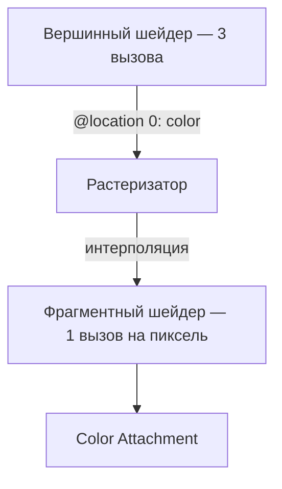

# Шейдеры и WGSL

[Полный код главы](https://github.com/Bromles/wgpu-tutorial/tree/master/code/guide/gpu-data-model/shaders)

**Что уже должно быть понятно:**

- шейдеры, `@vertex`, `@fragment`
- `@builtin(vertex_index)`, `@builtin(position)`, `@location(0)`
- render pipeline, `draw`

**Что появится в этой главе:**

- структуры WGSL с `@location` и `@builtin`
- приведение типов в WGSL (`bool` → `f32`)
- интерполяция данных между вершинным и фрагментным шейдером

**Итог:** треугольник с плавными переходами цветов (красный, зелёный, синий)

---

В прошлой главе мы нарисовали треугольник, но все его пиксели были одного цвета — тёмно-красного. Фрагментный шейдер
возвращал константу, и GPU закрашивал весь треугольник одинаково. Хотелось бы задать каждой вершине свой цвет и увидеть,
как красный плавно перетекает в зелёный, зелёный в синий.

Для этого не нужно менять Rust-код — достаточно переписать шейдер. Мы научим вершинный шейдер выбирать цвет по индексу
вершины, передадим его в фрагментный через структуру, и GPU автоматически интерполирует цвета между вершинами.

## Структура для передачи данных

В прошлой главе вершинный шейдер возвращал `@builtin(position) vec4<f32>` напрямую — единственное значение. Теперь
нужно вернуть два: позицию и цвет. Для этого определим структуру:

```wgsl
struct VertexOutput {
    @builtin(position) position: vec4<f32>,
    @location(0) color: vec3<f32>,
}
```

- `@builtin(position)` — clip-space позиция, обязательное поле выходной структуры вершинного шейдера
- `@location(0)` — «слот» для передачи данных в фрагментный шейдер. Через такие слоты GPU передаёт любые данные
  между стадиями конвейера: цвета, текстурные координаты, нормали

## Цвет из vertex_index

В прошлой главе мы вычисляли позицию из `vertex_index`. Цвет зададим тем же способом — сопоставим каждому индексу
свой цвет: 0 → красный, 1 → зелёный, 2 → синий. Один из приёмов — сравнение `idx == N` даёт `bool`, а приведение `f32(...)`
превращает его в `0.0` или `1.0`:

```wgsl
let color = vec3<f32>(f32(idx == 0u), f32(idx == 1u), f32(idx == 2u));
```

| idx | `idx == 0u` | `idx == 1u` | `idx == 2u` | color           |
|:---:|:-----------:|:-----------:|:-----------:|:----------------|
|  0  |    1.0      |    0.0      |    0.0      | красный (1,0,0) |
|  1  |    0.0      |    1.0      |    0.0      | зелёный (0,1,0) |
|  2  |    0.0      |    0.0      |    1.0      | синий  (0,0,1)  |

Конструктор `vec3<f32>(a, b, c)` собирает три отдельных `f32` в вектор — каждый компонент вычисляется независимо.

## Полный шейдер

```wgsl
struct VertexOutput {
    @builtin(position) position: vec4<f32>,
    @location(0) color: vec3<f32>,
}

@vertex
fn vs_main(@builtin(vertex_index) idx: u32) -> VertexOutput {
    let x = f32(i32(idx) - 1) / 2.0;
    let y = f32(i32(idx & 1u) * 2 - 1) / 2.0;
    let color = vec3<f32>(f32(idx == 0u), f32(idx == 1u), f32(idx == 2u));

    var output: VertexOutput;
    output.position = vec4<f32>(x, y, 0.0, 1.0);
    output.color = color;
    return output;
}

@fragment
fn fs_main(input: VertexOutput) -> @location(0) vec4<f32> {
    return vec4<f32>(input.color, 1.0);
}
```

Разберём новые моменты:

**Вершинный шейдер:**
- Возвращает структуру `VertexOutput` вместо «голого» `vec4<f32>`
- `var output: VertexOutput;` — изменяемая переменная (аналог `let mut` в Rust), поля заполняются по одному
- Позиция вычисляется из `idx` — тот же приём, что в прошлой главе
- Цвет вычисляется из `idx` через сравнения и приведение `bool` → `f32`

**Фрагментный шейдер:**
- Принимает `VertexOutput` как параметр — получает данные, которые вершинный шейдер записал в `@location(0)`
- `vec4<f32>(input.color, 1.0)` — `vec3` + скаляр → `vec4` (конструктор вектора собирает компоненты из разных значений)

## Интерполяция

Данные проходят через конвейер так:



Ключевой момент — между вершинным и фрагментным шейдером стоит **растеризатор**. Он определяет, какие пиксели
находятся внутри треугольника, и для каждого пикселя интерполирует значения `@location`:

```
         зелёный (0, 0.5)
              •
             /|\
            / | \
  красный  /  |  \  синий
 (-0.5,-0.5)•──┼──• (0.5,-0.5)
              серый
         (интерполяция)
```

Фрагмент в центре равноудалён от всех трёх вершин — его цвет ≈ (0.33, 0.33, 0.33), то есть серый. Фрагмент рядом
с красной вершиной будет преимущественно красным. GPU делает это автоматически для всех `@location` — нам не нужно
писать код интерполяции.

<div class="info custom-block" style="padding-top: 8px">
<p class="custom-block-title">Интерполяция</p>

GPU автоматически интерполирует значения `@location` между вершинным и фрагментным шейдером. Это основа для:

- цветов (как в этом примере)
- текстурных координат (UV)
- нормалей (для освещения)

Интерполяция по умолчанию — перспективно-корректная. Явно управлять ею можно через атрибут
`@interpolate(perspective, ...)`.

</div>

## Rust-код не меняется

Единственное изменение в Rust — фон: `Color::GREEN` → `Color::BLACK`. На чёрном фоне цветной треугольник выглядит
лучше. Весь остальной Rust-код (pipeline, render pass, draw) идентичен прошлой главе. Все изменения — в файле
`shader.wgsl`.

<div class="info custom-block" style="padding-top: 8px">
<p class="custom-block-title">Почему данные вычисляются в шейдере?</p>

Мы вычисляем позиции и цвета прямо в шейдере из `vertex_index`. Это работает для треугольника, но не масштабируется:
для реальных моделей с тысячами вершин мы не можем описать каждую формулой. В [следующей главе](/guide/gpu-data-model/buffers/)
мы научимся передавать произвольную геометрию из Rust на GPU через вершинные буферы.

</div>

## WGSL: справка для Rust-разработчика

Мы уже использовали WGSL-конструкции — структуры, `@location`, `var`, векторы, приведение типов. Если вы чувствуете себя
уверенно, можете пропустить этот раздел и вернуться при необходимости. Ниже — систематический обзор языка.

### Скаляры и векторы

```wgsl
var x: f32 = 3.14;        // число с плавающей точкой (32 бита)
var i: i32 = -42;          // знаковое целое
var u: u32 = 100u;         // беззнаковое целое (суффикс `u`)
var b: bool = true;        // логический тип
```

Литералы с плавающей точкой всегда `f32`: `1.0`, `0.5`, `3.14`. Целочисленные по умолчанию `i32`, для `u32`
нужен суффикс: `42u`.

Основной тип для графики — векторы. Доступны `vec2<T>`, `vec3<T>`, `vec4<T>`, где `T` — один из скалярных типов:

```wgsl
let pos = vec2<f32>(0.5, -0.5);       // 2D-координата
let color = vec3<f32>(1.0, 0.0, 0.0); // RGB-цвет
let clip = vec4<f32>(pos, 0.0, 1.0);  // vec2 + 2 скаляра → vec4
let white = vec3<f32>(1.0);           // все компоненты 1.0
```

Доступ к компонентам через swizzling — `.xyzw` или `.rgba`, векторы не различают «координаты» и «цвета»:

```wgsl
let v = vec4<f32>(1.0, 2.0, 3.0, 4.0);
let x = v.x;      // 1.0
let yz = v.yz;    // vec2<f32>(2.0, 3.0)
let xyz = v.xyz;  // vec3<f32>(1.0, 2.0, 3.0)
```

Матрицы (`mat2x2<f32>`, `mat3x3<f32>`, `mat4x4<f32>`) тоже есть, но они понадобятся позже — в главе про
трансформации.

### Переменные и функции

```wgsl
let x = 5.0;         // неизменяемая (аналог let в Rust)
var y = 10.0;         // изменяемая (аналог let mut в Rust)
const PI = 3.14159;   // константа времени компиляции
```

WGSL, как и Rust, требует инициализации при объявлении.

Функции выглядят знакомо, но WGSL не поддерживает рекурсию и обобщённые типы (generics). Каждая функция вызывается
с конкретными типами аргументов:

```wgsl
fn add(a: f32, b: f32) -> f32 {
    return a + b;
}
```

Обратите внимание: `return` обязателен — нет автоматического возврата последнего выражения как в Rust.

### Ключевые отличия от Rust

| WGSL                     | Rust                        | Почему                         |
|:-------------------------|:----------------------------|:-------------------------------|
| `var x = 1.0;`           | `let mut x = 1.0;`          | Изменяемая переменная          |
| `~x`                     | `!x`                        | Побитовое НЕ                   |
| Нет `Option`, `Result`   | `Option<T>`, `Result<T, E>` | Нет алгебраических типов       |
| Нет traits, generics     | `trait`, `<T>`              | Все вызовы статически разрешимы |
| Нет ownership, borrowing | ownership, borrowing        | WGSL — язык с копированием     |
| `for (init; cond; step)` | `for x in iter`             | C-style for вместо итераторов  |
| Нет рекурсии             | Рекурсия                    | Все вызовы статически разрешимы |
| Нет heap-аллокации       | `Box`, `Vec`, `String`      | Все данные — значения          |

Самое важное: WGSL — язык без аллокации. Все данные — значения фиксированного размера. Нет `String` (вместо
них — массивы байтов), нет `Vec` (вместо них — фиксированные массивы), нет ссылок с lifetime. Копирование — всегда
побитовое.

## Что получилось

::: warning Типичные ошибки
- `vec3<f32>` в WGSL struct в uniform-адресном пространстве выравнивается на 16 байт: размер — 12 байт, паддинг — 4 байта. Для vertex I/O (`@location`) это правило не применяется — там `vec3` занимает ровно 12 байт
- Векторные конструкторы: `vec3<f32>(1.0, 2.0, 3.0)` — три отдельных аргумента, не массив
- `return` обязателен в WGSL — нет автоматического возврата последнего выражения как в Rust
:::

Запустив пример, мы увидим треугольник с плавными переходами между красным, зелёным и синим цветами. В центре, где
влияние всех трёх вершин примерно одинаково, цвет будет сероватым.

<!-- TODO: скриншот -->

<div class="tip custom-block" style="padding-top: 8px">
<p class="custom-block-title">Попробуем</p>

- Изменим цвета вершин на другие комбинации
- Добавим `vec4<f32>(0.5, 0.0, 0.0, 1.0)` в массив цветов — что произойдёт при `draw(0..4, 0..1)`?
- Поменяем `Color::BLACK` на другой цвет фона

</div>

[Полный код главы](https://github.com/Bromles/wgpu-tutorial/tree/master/code/guide/gpu-data-model/shaders)
