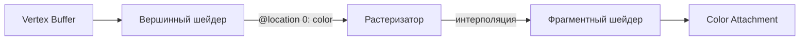

# Шейдеры и WGSL

[Полный код главы](https://github.com/Bromles/wgpu-tutorial/tree/master/code/guide/gpu-data-model/shaders)

**Что уже должно быть понятно:**

- render pipeline, шейдерные модули
- вершинный и фрагментный шейдеры
- `@builtin(vertex_index)`, `@builtin(position)`, `@location(0)`

**Что появится в этой главе:**

- типы и синтаксис WGSL
- структуры и атрибуты в WGSL
- вершинные буферы (vertex buffers)
- интерполяция между шейдерами
- крейт `bytemuck`

**Итог:** треугольник с плавными переходами цветов (красный, зелёный, синий)

---

Сейчас все пиксели треугольника одного цвета. Зададим каждой вершине свой цвет — и GPU плавно интерполирует
его между ними. Для этого нужно передать данные с CPU на GPU через **вершинный буфер**. А чтобы правильно описать
структуры в шейдере, разберёмся в языке WGSL.

## Типы данных WGSL

WGSL (WebGPU Shading Language) — язык шейдеров. Синтаксис похож на Rust, но с важными отличиями.

### Скаляры

```wgsl
var x: f32 = 3.14;   // число с плавающей точкой (32 бита)
var i: i32 = -42;     // знаковое целое
var u: u32 = 100u;    // беззнаковое целое (суффикс `u`)
var b: bool = true;   // логический тип
```

Литералы с плавающей точкой всегда `f32`: `1.0`, `0.5`, `3.14`. Целочисленные по умолчанию `i32`, для `u32`
нужен суффикс: `42u`.

### Векторы

Основной тип для графики. `vec2<T>`, `vec3<T>`, `vec4<T>`:

```wgsl
let pos = vec2<f32>(0.5, -0.5);       // 2D-координата
let color = vec3<f32>(1.0, 0.0, 0.0); // RGB-цвет
let clip = vec4<f32>(pos, 0.0, 1.0);  // vec2 + 2 скаляра → vec4
let white = vec3<f32>(1.0);           // все компоненты 1.0 (splat)
```

Доступ к компонентам:

```wgsl
let v = vec4<f32>(1.0, 2.0, 3.0, 4.0);
let x = v.x;      // 1.0
let yz = v.yz;    // vec2<f32>(2.0, 3.0)
let xyz = v.xyz;  // vec3<f32>(1.0, 2.0, 3.0)
```

Swizzling работает как в GLSL: `.xyzw` или `.rgba` — векторы не различают «координаты» и «цвета».

### Матрицы

`mat2x2<f32>`, `mat3x3<f32>`, `mat4x4<f32>`, а также неквадратные (`mat4x3<f32>`, ...). Познакомимся с ними в главе
про трансформации.

### Массивы

Фиксированного размера: `array<f32, 3>` — массив из трёх `f32`.

## Структуры и атрибуты

Структуры в WGSL объединяют несколько значений. Атрибуты `@location` и `@builtin` определяют, как данные передаются
между стадиями конвейера:

```wgsl
struct VertexInput {
    @location(0) position: vec2<f32>,
    @location(1) color: vec3<f32>,
}
```

- `@location(N)` — номер слота. Соответствует атрибуту вершинного буфера с тем же номером
- `@builtin(position)` — clip-space позиция на выходе вершинного шейдера, экранная позиция на входе фрагментного

## Новый шейдер

В прошлой главе вершинный шейдер вычислял позиции из `vertex_index`, а фрагментный возвращал константу. Теперь
получаем данные из буфера и передаём цвет между стадиями:

```wgsl
struct VertexInput {
    @location(0) position: vec2<f32>,
    @location(1) color: vec3<f32>,
}

struct VertexOutput {
    @builtin(position) position: vec4<f32>,
    @location(0) color: vec3<f32>,
}

@vertex
fn vs_main(input: VertexInput) -> VertexOutput {
    var output: VertexOutput;
    output.position = vec4<f32>(input.position, 0.0, 1.0);
    output.color = input.color;
    return output;
}

@fragment
fn fs_main(input: VertexOutput) -> @location(0) vec4<f32> {
    return vec4<f32>(input.color, 1.0);
}
```

Поток данных через конвейер:



Вершинный шейдер принимает `VertexInput` (позиция + цвет из буфера), преобразует 2D-позицию в 4D для clip space
и передаёт цвет дальше через `@location(0)`. Растеризатор определяет, какие пиксели находятся внутри треугольника,
и интерполирует все значения `@location` между вершинами. Фрагментный шейдер получает уже интерполированный цвет.

<div class="info custom-block" style="padding-top: 8px">
<p class="custom-block-title">Интерполяция</p>

GPU автоматически интерполирует значения `@location` между вершинным и фрагментным шейдером. Это основа для:

- цветов (как в этом примере)
- текстурных координат (UV)
- нормалей (для освещения)

Интерполяция по умолчанию — перспективно-корректная. Явно управлять ею можно через атрибут
`@interpolate(perspective, ...)`.

</div>

## Vertex struct в Rust

Структура в Rust должна иметь точно такую же раскладку в памяти, как в шейдере. `#[repr(C)]` гарантирует
C-совместимую упаковку без скрытых полей:

```rust
#[repr(C)]
#[derive(Clone, Copy, Pod, Zeroable)]
struct Vertex {
    position: [f32; 2],
    color: [f32; 3],
}
```

Крейт `bytemuck` даёт трейты `Pod` и `Zeroable`:

- `Pod` — тип можно безопасно интерпретировать как байты (нет `String`, `Vec`, ссылок)
- `Zeroable` — все нулевые биты — допустимое значение

Вместе они позволяют `bytemuck::cast_slice` превратить `&[Vertex]` в `&[u8]` при создании буфера.

Данные трёх вершин — те же позиции, что в прошлой главе, но с цветами:

```rust
const VERTICES: &[Vertex] = &[
    Vertex { position: [-0.5, -0.5], color: [1.0, 0.0, 0.0] }, // красный
    Vertex { position: [0.0, 0.5], color: [0.0, 1.0, 0.0] }, // зелёный
    Vertex { position: [0.5, -0.5], color: [0.0, 0.0, 1.0] }, // синий
];
```

## Vertex buffer layout

GPU нужно знать, как читать данные из буфера — где начинается каждое поле и какого оно типа. Это описывается через
`VertexBufferLayout`:

```rust
impl Vertex {
    const ATTRIBUTES: [VertexAttribute; 2] = [
        VertexAttribute {
            offset: 0,
            shader_location: 0,
            format: VertexFormat::Float32x2,
        },
        VertexAttribute {
            offset: size_of::<[f32; 2]>() as BufferAddress,
            shader_location: 1,
            format: VertexFormat::Float32x3,
        },
    ];

    fn desc() -> VertexBufferLayout<'static> {
        VertexBufferLayout {
            array_stride: size_of::<Vertex>() as BufferAddress,
            step_mode: VertexStepMode::Vertex,
            attributes: &Self::ATTRIBUTES,
        }
    }
}
```

Поля:

- `array_stride` — размер одной вершины в байтах (`2×4 + 3×4 = 20`). GPU «шагает» на это расстояние при переходе
  к следующей вершине
- `step_mode: Vertex` — один набор данных на вершину (альтернатива — `Instance` для instancing)
- `attributes` — массив описаний полей:
    - `offset` — смещение от начала структуры в байтах
    - `shader_location` — номер, соответствующий `@location(N)` в WGSL
    - `format` — тип: `Float32x2` → `vec2<f32>`, `Float32x3` → `vec3<f32>`

Раскладка в памяти одной вершины:

```
Смещение:  0        4        8       12       16       20
           ├ pos.x ─┤ pos.y ─┤ col.r ─┤ col.g ─┤ col.b ─┤
           ├── @location(0) ──┤──── @location(1) ─────────┤
           ←──────── array_stride (20 байт) ──────────────→
```

Справочник `VertexFormat`:

| Rust тип   | VertexFormat | WGSL тип    |
|:-----------|:-------------|:------------|
| `f32`      | `Float32`    | `f32`       |
| `[f32; 2]` | `Float32x2`  | `vec2<f32>` |
| `[f32; 3]` | `Float32x3`  | `vec3<f32>` |
| `[f32; 4]` | `Float32x4`  | `vec4<f32>` |
| `u32`      | `Uint32`     | `u32`       |
| `i32`      | `Sint32`     | `i32`       |

## Создание вершинного буфера

```rust
use wgpu::util::DeviceExt;

let vertex_buffer = ctx.device.create_buffer_init( & wgpu::util::BufferInitDescriptor {
label: Some("Vertex Buffer"),
contents: bytemuck::cast_slice(VERTICES),
usage: BufferUsages::VERTEX,
});
```

`create_buffer_init` из трейта `DeviceExt` создаёт буфер и заполняет его данными за один вызов.
`bytemuck::cast_slice(VERTICES)` превращает `&[Vertex]` в `&[u8]`.

`usage: BufferUsages::VERTEX` — буфер используется как источник вершинных данных.

## Обновление конвейера

В прошлой главе `buffers` в `VertexState` был пустым — позиции вычислялись в шейдере. Теперь передаём описание
буфера:

```rust
vertex: VertexState {
module: & shader_module,
entry_point: Some("vs_main"),
buffers: & [Vertex::desc()],
compilation_options: PipelineCompilationOptions::default (),
},
```

Остальные настройки конвейера не меняются.

## Отрисовка

Метод `render` почти не изменился — добавились привязка буфера и смена фона:

```rust
fn render(&mut self, _ctx: &GpuContext, view: &TextureView, encoder: &mut CommandEncoder) {
    let mut rpass = encoder.begin_render_pass(&RenderPassDescriptor {
        label: Some("Render Pass"),
        color_attachments: &[Some(RenderPassColorAttachment {
            view,
            resolve_target: None,
            ops: Operations {
                load: LoadOp::Clear(Color::BLACK),
                store: StoreOp::Store,
            },
            depth_slice: None,
        })],
        depth_stencil_attachment: None,
        timestamp_writes: None,
        occlusion_query_set: None,
        multiview_mask: None,
    });

    rpass.set_pipeline(&self.pipeline);
    rpass.set_vertex_buffer(0, self.vertex_buffer.slice(..));
    rpass.draw(0..3, 0..1);
}
```

Новые вызовы:

- `set_vertex_buffer(0, ...)` — привязывает буфер к слоту 0 (первый элемент `buffers` из `VertexState`).
  `slice(..)` выбирает весь буфер
- Фон изменён на `Color::BLACK` — на чёрном цветной треугольник смотрится лучше

`draw(0..3, 0..1)` остался прежним: 3 вершины, 1 экземпляр. Но теперь GPU читает данные из буфера, а не вычисляет
в шейдере.

## WGSL: функции и переменные

Разберём язык подробнее.

### Переменные

```wgsl
let x = 5.0;        // неизменяемая (как let в Rust)
var y = 10.0;        // изменяемая (как let mut)
const PI = 3.14159;  // константа компиляции
```

WGSL, как и Rust, требует инициализации при объявлении:

```wgsl
let pos: vec2<f32> = vec2<f32>(0.5, -0.5);
var count: u32 = 0u;
```

### Функции

```wgsl
fn add(a: f32, b: f32) -> f32 {
    return a + b;
}
```

Без рекурсии, без generics. «Шаблонные» типы вроде `vec2<f32>` — встроенная возможность языка, не пользовательские
generics.

### Встроенные функции

```wgsl
let len = length(v);              // длина вектора
let n = normalize(v);             // нормализация
let d = dot(a, b);                // скалярное произведение
let c = cross(a, b);              // векторное произведение (vec3)
let r = reflect(incident, normal); // отражение
let clamped = clamp(x, 0.0, 1.0); // ограничение диапазона
let s = select(false_val, true_val, condition); // тернарный выбор
```

## WGSL: управление потоком

### Условные операторы

```wgsl
if x > 0.0 {
    result = 1.0;
} else if x < 0.0 {
    result = -1.0;
} else {
    result = 0.0;
}
```

Условие всегда `bool` — неявных преобразований из чисел нет.

### Циклы

```wgsl
for (var i: i32 = 0; i < 10; i++) {
    // C-style цикл
}

while condition {
    // пока истинно
}

loop {
    if done { break; }
    // бесконечный цикл (как loop в Rust)
}
```

`for` в WGSL — C-style с инициализацией, условием и шагом. Итераторов нет.

### switch

```wgsl
switch i {
    case 0 { x = 1.0; }
    case 1, 2 { x = 2.0; }
    default { x = 0.0; }
}
```

### Логические операторы

`&&` и `||` — логические (short-circuit), `&` и `|` — побитовые. `!` — логическое отрицание, `~` — побитовое:

```wgsl
if a && b { ... }   // логическое И
if a || b { ... }   // логическое ИЛИ
let bits = x & y;   // побитовое И
let inv = ~bits;    // побитовое НЕ
if !flag { ... }    // логическое НЕ
```

## Отличия WGSL от Rust

| WGSL                     | Rust                        | Комментарий                           |
|:-------------------------|:----------------------------|:--------------------------------------|
| `var x = 1.0;`           | `let mut x = 1.0;`          | Изменяемая переменная                 |
| `~x`                     | `!x`                        | Побитовое НЕ                          |
| Нет Option, Result       | `Option<T>`, `Result<T, E>` | Нет алгебраических типов              |
| Нет traits, generics     | `trait`, `<T>`              | Функции работают с конкретными типами |
| Нет ownership, borrowing | ownership, borrowing        | WGSL — язык с копированием значений   |
| `for (init; cond; step)` | `for x in iter`             | C-style for вместо итераторов         |
| Нет рекурсии             | Рекурсия                    | Все вызовы статически разрешимы       |
| Нет heap-аллокации       | `Box`, `Vec`, `String`      | Все данные — value types              |

WGSL — язык без аллокации. Все данные — значения фиксированного размера. Нет `String` (массивы байтов),
нет `Vec` (фиксированные массивы), нет ссылок с lifetime.

## Результат

Треугольник с плавными переходами между красным, зелёным и синим. В центре, где влияние всех трёх вершин одинаково,
цвет сероватый.

<div class="tip custom-block" style="padding-top: 8px">
<p class="custom-block-title">Попробуйте сами</p>

- Измените цвета вершин на другие комбинации
- Добавьте четвёртую вершину и нарисуйте два треугольника (пока без индексов)
- Поменяйте `Color::BLACK` на другой цвет фона

</div>

[Полный код главы](https://github.com/Bromles/wgpu-tutorial/tree/master/code/guide/gpu-data-model/shaders)
