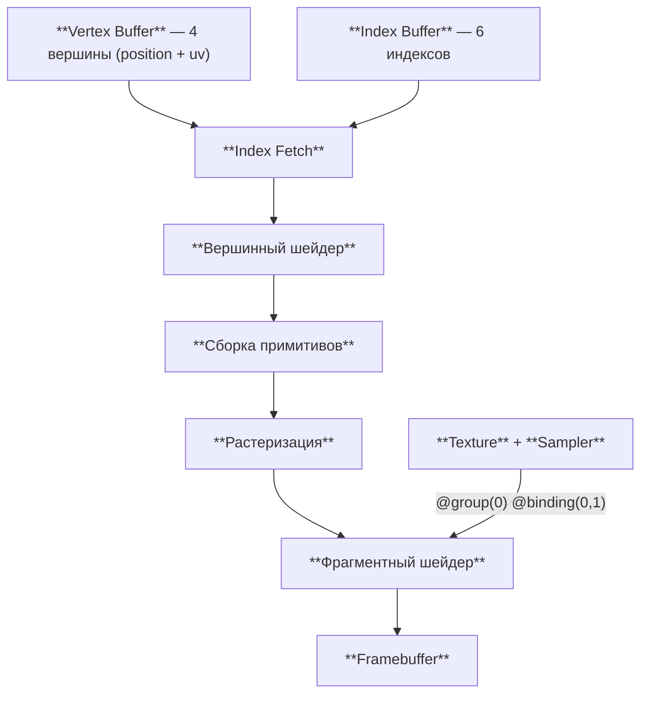

# Текстуры и сэмплеры

[Полный код главы](https://github.com/Bromles/wgpu-tutorial/tree/master/code/guide/gpu-data-model/textures)

**Что уже должно быть понятно:**

- вершинные и индексные буферы
- bind groups: layout, group, pipeline layout
- шейдеры WGSL: структуры, `@location`, `@group`, `@binding`

**Что появится в этой главе:**

- текстурные координаты (UV)
- создание текстуры и texture view
- sampler и режимы фильтрации
- `texture_2d<f32>` и `textureSample()` в WGSL

**Итог:** прямоугольник с шахматным узором, созданным процедурно

---

До сих пор единственным источником цвета был атрибут вершины — мы задавали каждой вершине свой цвет, и GPU интерполировал
его между вершинами. Это даёт плавные переходы, но для детальных изображений (кирпичная стена, трава, лицо персонажа)
нужны тысячи цветов на небольших участках. Хранить по вершине на каждый пиксель текстуры нереально.

Текстуры решают эту проблему: это изображения, хранящиеся на GPU, которые шейдер может читать попиксельно. Вместо того
чтобы задавать цвет в каждой вершине, мы задаём **текстурные координаты** — UV-координаты, указывающие, какая точка
текстуры соответствует данной вершине. GPU интерполирует эти координаты так же, как интерполировал цвета, и фрагментный
шейдер получает для каждого пикселя точную позицию на текстуре.

Конвейер обрастает ещё одним источником данных — текстура и сэмплер подключаются к фрагментному шейдеру через bind group:



На этот раз bind group содержит не буфер, а два ресурса — текстуру и сэмплер. Они всегда работают в паре: текстура
хранит данные, сэмплер определяет, как их читать.

В прошлой главе `@group(0)` содержал uniform-буфер с анимацией. Здесь нам uniform не нужен —
только текстура и сэмплер. Поэтому `@group(0)` теперь занят ими. Номер группы — это просто индекс
в `bind_group_layouts`, и в каждой главе мы свободны выбирать, что помещать в каждую группу.

## UV-координаты

UV-координаты — это двумерные координаты в диапазоне [0, 1], сопоставляющие каждой вершине точку на текстуре.
UV (0, 0) — левый верхний угол текстуры, (1, 1) — правый нижний. Обратите внимание: в текстурах Y направлен
вниз, а в clip space — вверх. Это не вызывает проблем при наложении текстуры на квадрат, но при рендере в
offscreen-текстуру и последующем сэмплировании координату Y нужно инвертировать — мы столкнёмся с этим в главе
про постпроцессинг.


Каждая вершина квадрата получает свою UV-координату, и GPU интерполирует их при растеризации. Фрагмент в центре
квадрата получит UV ≈ (0.5, 0.5) — середину текстуры.

## Вершины с UV

Вместо цвета каждая вершина теперь хранит текстурную координату:

```rust
#[repr(C)]
#[derive(Clone, Copy, Pod, Zeroable)]
struct Vertex {
    position: [f32; 2],
    color: [f32; 3],  // [!code --]
    uv: [f32; 2],     // [!code ++]
}
```

Данные вершин меняются на UV-координаты:

```rust
const VERTICES: &[Vertex] = &[
    Vertex { position: [-0.5, -0.5], uv: [0.0, 1.0] },  // #0: нижний левый
    Vertex { position: [-0.5,  0.5], uv: [0.0, 0.0] },  // #1: верхний левый
    Vertex { position: [ 0.5,  0.5], uv: [1.0, 0.0] },  // #2: верхний правый
    Vertex { position: [ 0.5, -0.5], uv: [1.0, 1.0] },  // #3: нижний правый
];
```

Вершина в нижнем левом углу экрана (position: -0.5, -0.5) получает UV (0, 1) — нижний левый угол текстуры.
Соответствие несложное, но его нужно проверять внимательно: перепутанные координаты — частая причина перевёрнутых
или искажённых текстур.

`VertexBufferLayout` меняется минимально — второй атрибут теперь `Float32x2` (UV) вместо `Float32x3` (цвет):

```rust
VertexAttribute {
    offset: size_of::<[f32; 2]>() as BufferAddress,
    shader_location: 1,
    format: VertexFormat::Float32x3,  // [!code --]
    format: VertexFormat::Float32x2,  // [!code ++]
},
```

## Создание текстуры

Текстура — прямоугольный массив пикселей в памяти GPU. В этом примере мы генерируем
шахматный узор процедурно — 256×256 пикселей с чередующимися белыми и голубыми клетками:

```rust
const TEXTURE_SIZE: u32 = 256;
const CELL_SIZE: u32 = 32;

fn generate_checkerboard() -> Vec<u8> {
    let mut pixels = Vec::with_capacity((TEXTURE_SIZE * TEXTURE_SIZE * 4) as usize);
    for y in 0..TEXTURE_SIZE {
        for x in 0..TEXTURE_SIZE {
            let checker = ((x / CELL_SIZE) + (y / CELL_SIZE)) % 2 == 0;
            if checker {
                pixels.extend_from_slice(&[255, 255, 255, 255]);
            } else {
                pixels.extend_from_slice(&[58, 134, 173, 255]);
            }
        }
    }
    pixels
}
```

Каждый пиксель — 4 байта (R, G, B, A). Всего 256 × 256 × 4 = 262 144 байта.

<details>
<summary>Загрузка изображений с диска</summary>

В реальных проектах текстуры загружают из файлов — PNG, JPEG и т.д. Для этого подходит крейт `image`:

```rust
let img = image::open("texture.png").unwrap().to_rgba8();
let dimensions = img.dimensions();
let pixels = img.as_raw();
```

Остальной код создания текстуры — тот же самый. Отличается только источник данных: массив из файла вместо процедурной
генерации.

</details>

Текстура создаётся в два шага — выделение памяти на GPU и загрузка данных:

```rust
let texture = ctx.device.create_texture(&TextureDescriptor {
    label: Some("Checkerboard Texture"),
    size: Extent3d {
        width: TEXTURE_SIZE,
        height: TEXTURE_SIZE,
        depth_or_array_layers: 1,
    },
    mip_level_count: 1,
    sample_count: 1,
    dimension: TextureDimension::D2,
    format: TextureFormat::Rgba8UnormSrgb,
    usage: TextureUsages::TEXTURE_BINDING | TextureUsages::COPY_DST,
    view_formats: &[],
});
```

Разберём поля `TextureDescriptor`:

- **`size`** — разрешение текстуры. `depth_or_array_layers: 1` для обычной 2D-текстуры
- **`mip_level_count: 1`** — один уровень детализации (без мипмаппинга)
- **`format: Rgba8UnormSrgb`** — 4 канала по 8 бит, sRGB-преобразование при чтении. Значения пикселей хранятся
  в гамма-пространстве (0–255), GPU автоматически переводит их в линейное пространство при сэмплировании
- **`usage`** — `TEXTURE_BINDING` (шейдер может читать текстуру) + `COPY_DST` (можно загружать данные через
  `write_texture`)

Загрузка пикселей в текстуру:

```rust
ctx.queue.write_texture(
    texture.as_image_copy(),
    &pixels,
    TexelCopyBufferLayout {
        offset: 0,
        bytes_per_row: Some(TEXTURE_SIZE * 4),
        rows_per_image: Some(TEXTURE_SIZE),
    },
    Extent3d {
        width: TEXTURE_SIZE,
        height: TEXTURE_SIZE,
        depth_or_array_layers: 1,
    },
);
```

`write_texture` копирует массив байтов из CPU в GPU-текстуру. `TexelCopyBufferLayout` описывает, как данные
расположены в массиве:

- `bytes_per_row` — сколько байт занимает одна строка (256 пикселей × 4 байта = 1024)
- `rows_per_image` — сколько строк в изображении (256)

Последний аргумент — размер области, в которую записываются данные. Для полной загрузки совпадает с размером текстуры.

## Texture View

Шейдер читает текстуру не напрямую, а через **texture view** — «окно» в текстуру:

```rust
let texture_view = texture.create_view(&TextureViewDescriptor::default());
```

Зачем нужен отдельный слой косвенности? Представьте текстуру 1024×1024 с 10 mip-уровнями.
Вы можете создать один view для полного изображения (mip 0), другой — только для mip 3,
третий — для диапазона mip 0–3. Или текстуру-массив из 6 слоёв (cubemap) — и view,
выбирающий конкретную грань. Один объект текстуры, много способов чтения.

Texture view также позволяет переинтерпретировать формат — например, читать `Rgba8Unorm`
как `Rgba8Uint`. Для нашего случая подходит default view — он охватывает всю текстуру целиком.

## Sampler

Sampler определяет, как читать данные из текстуры — фильтрацию при масштабировании и поведение при выходе UV
за пределы [0, 1]:

```rust
let sampler = ctx.device.create_sampler(&SamplerDescriptor {
    label: Some("Texture Sampler"),
    address_mode_u: AddressMode::Repeat,
    address_mode_v: AddressMode::Repeat,
    address_mode_w: AddressMode::Repeat,
    mag_filter: FilterMode::Linear,
    min_filter: FilterMode::Linear,
    mipmap_filter: MipmapFilterMode::Nearest,
    ..Default::default()
});
```

### Фильтрация

Когда тексель (пиксель текстуры) не совпадает один к одному с пикселем экрана, sampler вычисляет итоговый цвет:

- **`Nearest`** — берёт ближайший тексель. Результат — «пиксельный», с резкими переходами между текселями
- **`Linear`** — смешивает четыре ближайших текселя. Результат — плавный, размытый при сильном увеличении

`mipmap_filter` управляет выбором уровня детализации (mip level). Текстура может содержать несколько уменьшенных
копий — мипмапы. При отображении текстуры вдали GPU выбирает более мелкую копию — это предотвращает мерцание
и улучшает производительность. В нашем примере текстура без мипмапов, поэтому `Nearest` достаточен.

`mag_filter` — фильтрация при увеличении (текстура меньше, чем площадь на экране), `min_filter` — при уменьшении.

### Адресный режим

Если UV выходит за пределы [0, 1], адресный режим определяет, что происходит:

| Режим            | Поведение                                    |
|:-----------------|:---------------------------------------------|
| `Repeat`         | Текстура повторяется (тайлинг)               |
| `MirrorRepeat`   | Текстура повторяется с зеркальным отражением |
| `ClampToEdge`    | Крайние пиксели растягиваются                |

В нашем случае UV строго в [0, 1], поэтому адресный режим не играет роли. Но `Repeat` — разумный выбор по умолчанию.

## Bind Group с текстурой и сэмплером

Текстура и сэмплер привязываются к шейдеру через bind group — тот же механизм, что и для uniform-буфера.
Bind group layout описывает, какие ресурсы доступны шейдерам, но не привязывает конкретные буферы:

```rust
let bind_group_layout =
    ctx.device
        .create_bind_group_layout(&BindGroupLayoutDescriptor {
            label: Some("Bind Group Layout"),
            entries: &[
                BindGroupLayoutEntry {
                    binding: 0,
                    visibility: ShaderStages::FRAGMENT,
                    ty: BindingType::Texture {
                        sample_type: TextureSampleType::Float { filterable: true },
                        view_dimension: TextureViewDimension::D2,
                        multisampled: false,
                    },
                    count: None,
                },
                BindGroupLayoutEntry {
                    binding: 1,
                    visibility: ShaderStages::FRAGMENT,
                    ty: BindingType::Sampler(SamplerBindingType::Filtering),
                    count: None,
                },
            ],
        });
```

Отличия от uniform-буфера:

- **binding 0: `BindingType::Texture`** — текстурный ресурс. `sample_type: Float { filterable: true }` разрешает
  линейную фильтрацию. `view_dimension: D2` — обычная 2D-текстура
- **binding 1: `BindingType::Sampler`** — сэмплер. `SamplerBindingType::Filtering` — сэмплер поддерживает фильтрацию
  (не только `Nearest`)

Bind group связывает layout с конкретными ресурсами:

```rust
let bind_group = ctx.device.create_bind_group(&BindGroupDescriptor {
    label: Some("Bind Group"),
    layout: &bind_group_layout,
    entries: &[
        BindGroupEntry {
            binding: 0,
            resource: BindingResource::TextureView(&texture_view),
        },
        BindGroupEntry {
            binding: 1,
            resource: BindingResource::Sampler(&sampler),
        },
    ],
});
```

Вместо `as_entire_binding()` (для буферов) используем `BindingResource::TextureView` и
`BindingResource::Sampler`.

## Шейдер

Сторона WGSL тоже меняется. Вместо uniform-буфера объявляем текстуру и сэмплер:

```wgsl
struct VertexInput {
    @location(0) position: vec2<f32>,
    @location(1) uv: vec2<f32>,
}

struct VertexOutput {
    @builtin(position) position: vec4<f32>,
    @location(0) uv: vec2<f32>,
}

@group(0) @binding(0)
var tex: texture_2d<f32>;

@group(0) @binding(1)
var tex_sampler: sampler;
```

`texture_2d<f32>` — двумерная текстура с данными типа `f32`. После сэмплирования значения каналов будут в диапазоне
[0, 1]. `sampler` — сэмплер, поддерживающий фильтрацию.

Вершинный шейдер передаёт UV дальше без изменений:

```wgsl
@vertex
fn vs_main(input: VertexInput) -> VertexOutput {
    var output: VertexOutput;
    output.position = vec4<f32>(input.position, 0.0, 1.0);
    output.uv = input.uv;
    return output;
}
```

Фрагментный шейдер читает текстуру с помощью `textureSample`:

```wgsl
@fragment
fn fs_main(input: VertexOutput) -> @location(0) vec4<f32> {
    return textureSample(tex, tex_sampler, input.uv);
}
```

`textureSample` принимает три аргумента: текстуру, сэмплер и UV-координату. Возвращает `vec4<f32>` — цвет текселя
с учётом фильтрации, заданной в сэмплере. Эта функция доступна только во фрагментных шейдерах — ограничение
спецификации WebGPU.

Render pass остаётся прежним — `set_bind_group(0, ...)` привязывает bind group с текстурой и сэмплером:

```rust
rpass.set_pipeline(&self.pipeline);
rpass.set_bind_group(0, &self.bind_group, &[]);
rpass.set_vertex_buffer(0, self.vertex_buffer.slice(..));
rpass.set_index_buffer(self.index_buffer.slice(..), IndexFormat::Uint16);
rpass.draw_indexed(0..6, 0, 0..1);
```

## Что получилось

::: warning Типичные ошибки
- UV (0, 0) = **верхний левый** угол текстуры, не нижний. Если изображение перевёрнуто — проверьте UV
- `Rgba8UnormSrgb` автоматически преобразует sRGB → linear при сэмплировании. Для текстур данных (normal maps) используйте `Rgba8Unorm`
- `TextureViewDimension` должен совпадать с типом текстуры в шейдере: `D2` → `texture_2d`, `D2Array` → `texture_2d_array`
:::

Прямоугольник, покрытый шахматным узором из белых и голубых клеток. При изменении размера окна текстура масштабируется
с билинейной фильтрацией — переходы между клетками плавные, а не ступенчатые.

<!-- TODO: скриншот -->

<div class="tip custom-block" style="padding-top: 8px">
<p class="custom-block-title">Попробуем</p>

- Заменим `FilterMode::Linear` на `FilterMode::Nearest` в обоих полях — узор станет «пиксельным»
- Увеличим UV-координаты правой нижней вершины: `uv: [2.0, 2.0]` — увидим повторение текстуры благодаря
  `AddressMode::Repeat`
- Уменьшим размер текстуры до 8×8 (`TEXTURE_SIZE = 8, CELL_SIZE = 4`) — при линейной фильтрации клетки будут размытыми

</div>

<div class="info custom-block" style="padding-top: 8px">
<p class="custom-block-title">Лимиты</p>

WebGPU ограничивает ресурсы, которые можно создать. Актуальные значения для конкретного устройства — в
`adapter.limits()`. Некоторые типичные лимиты (по умолчанию / максимально):

| Параметр                        | По умолчанию | Максимально    |
|:--------------------------------|:-------------|:---------------|
| Размер текстуры                 | 4096 × 4096  | 16384 × 16384  |
| Количество bind group на pipeline | 4          | 8              |
| Количество binding на bind group | 1000       | 64000          |
| Размер uniform-буфера           | 32 КБ        | 256 МБ         |

Если превысить лимит, `request_device` вернёт ошибку. Запрашивать лимиты выше поддерживаемых нельзя — в этом
смысл поля `required_limits` при создании device.

Текстуры в этом руководстве маленькие, и лимиты нас не коснутся. Но при работе с большими текстурами (4K и выше)
стоит проверять `max_texture_dimension_2d`.

</div>

[Полный код главы](https://github.com/Bromles/wgpu-tutorial/tree/master/code/guide/gpu-data-model/textures)
