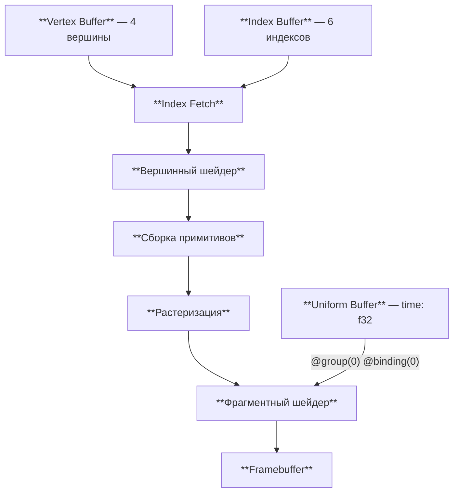
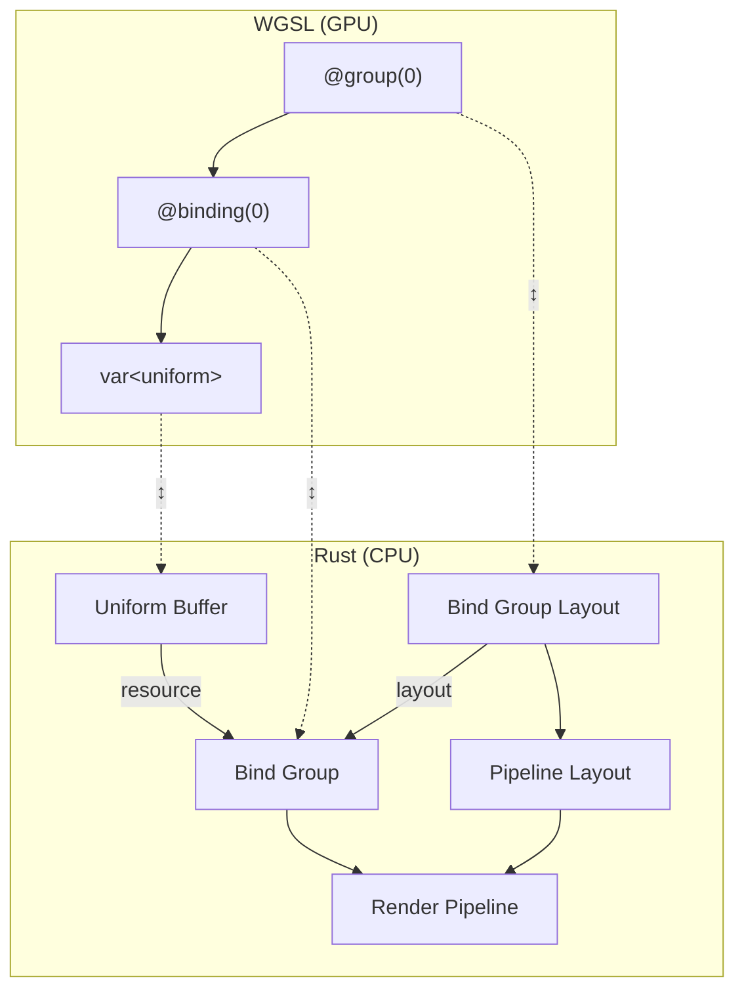
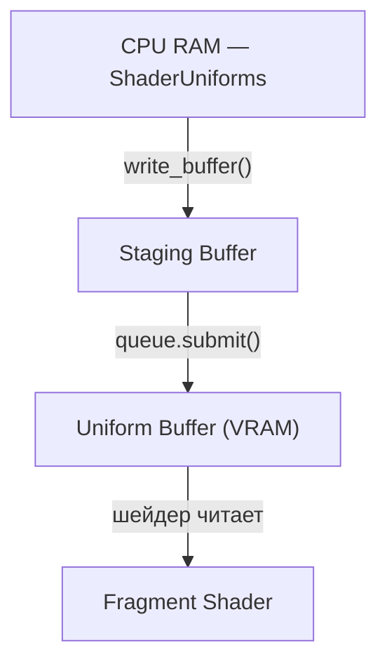
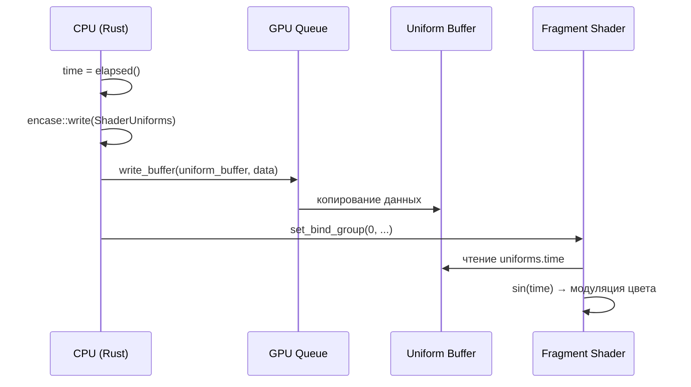

# Uniform и bind groups

[Полный код главы](https://github.com/Bromles/wgpu-tutorial/tree/master/code/guide/gpu-data-model/uniform-bind-groups)

**Что уже должно быть понятно:**

- вершинные и индексные буферы
- `VertexBufferLayout`, атрибуты вершин
- шейдеры WGSL: структуры, `@location`, `@builtin`

**Что появится в этой главе:**

- uniform-буфер: передача данных из CPU в шейдер
- bind group layout, bind group, pipeline layout
- крейт `encase` и выравнивание uniform-структур
- обновление данных каждый кадр

**Итог:** прямоугольник с пульсирующими цветами — оттенки плавно меняются во времени

---

До сих пор все данные, которые получали шейдеры, были статичными. Вершинные буферы мы создавали один раз в `init` и
больше не трогали. Но что если нужно передать в шейдер значение, которое меняется каждый кадр — например, текущее
время, позицию камеры или цвет, зависящий от действий пользователя?

Вершинный буфер не подходит: он привязан к конкретным вершинам, а нам нужно значение, общее для всего вызова отрисовки.
Для этого в WebGPU существует **uniform-буфер** — специальный GPU-буфер, доступный шейдерам на протяжении всего вызова
отрисовки. Каждый кадр мы записываем в него новые данные, и шейдер тут же их видит.

Но просто создать буфер недостаточно — нужно ещё объяснить и GPU, и шейдеру, что этот буфер существует и как к нему
обращаться. Эту роль выполняют **bind groups** — механизм привязки ресурсов в WebGPU.

Наш графический конвейер обрастает ещё одним источником данных — uniform-буфер подключается к фрагментному шейдеру
через bind group:



В отличие от вершинных и индексных буферов, которые «втекают» в конвейер последовательно, uniform-буфер подключается
к шейдеру напрямую — фрагментный шейдер может читать из него в любой момент своей работы.

## Общая картина

В передаче данных в шейдер участвуют несколько сущностей. Вот как они связаны:



Четыре новых сущности, и каждая решает свою задачу:

| Сущность              | Зачем нужна                                                                             |
|:----------------------|:----------------------------------------------------------------------------------------|
| **Uniform Buffer**    | Хранит данные на GPU, обновляется каждый кадр                                           |
| **Bind Group Layout** | Описывает *форму* привязки: «binding 0 — uniform-буфер, видимый во фрагментном шейдере» |
| **Bind Group**        | Привязывает *конкретный* буфер к описанной форме                                        |
| **Pipeline Layout**   | Связывает bind group layouts с render pipeline                                          |

Зачем четыре сущности вместо одной? Bind group layout — это «контракт», описывающий формат, но не конкретные данные. Bind group —
«экземпляр контракта» с реальным буфером. Это разделение позволяет менять данные (создавать новый bind group), не
пересоздавая pipeline.

## Uniform-буфер и выравнивание

Начнём с Rust-структуры, данные которой будем передавать в шейдер:

```rust
use encase::ShaderType;

#[derive(ShaderType)]
struct ShaderUniforms {
    time: f32,
}
```

Единственное поле — `time: f32`, количество секунд с момента запуска. Передавать будем каждый кадр.

Крейт **encase** решает проблему выравнивания. WGSL требует, чтобы структуры в адресном пространстве `uniform` были
выровнены по 16 байт. Наша структура занимает 4 байта, но GPU ожидает 16 — остальные 12 байт должны быть заполнены
паддингом. encase делает это автоматически: `ShaderUniforms::min_size()` возвращает 16, а при записи в буфер `write()`
добавляет нужное количество нулей.


WGSL видит эту память как структуру `Uniforms { time: f32 }` — паддинг прозрачен для шейдера, но обязателен для
корректного чтения GPU. Если бы мы попытались передать только 4 байта без выравнивания, результат был бы
непредсказуемым.

```rust
let uniform_buffer = ctx.device.create_buffer(&BufferDescriptor {
    label: Some("Uniform Buffer"),
    size: ShaderUniforms::min_size().into(),
    usage: BufferUsages::UNIFORM | BufferUsages::COPY_DST,
    mapped_at_creation: false,
});
```

Два флага `usage`:

- `UNIFORM` — буфер доступен шейдерам через адресное пространство `uniform`
- `COPY_DST` — разрешает запись в буфер со стороны CPU через `queue.write_buffer()`

<details>
<summary>Почему бы не использовать bytemuck, как для вершин?</summary>

Для вершинных буферов мы используем `bytemuck::cast_slice`, потому что `VertexBufferLayout` позволяет явно задать
смещение и размер каждого атрибута. Мы сами контролируем, как данные расположены в памяти.

Uniform-буферы — другое дело. WGSL требует 16-байтового выравнивания структур в адресном пространстве `uniform`, и
правила неочевидны: `vec3<f32>` занимает 12 байт, но выравнивается на 16; матрицы выравниваются поколоночно; массивы
дополняются до кратного 16. Считать паддинг вручную для сложных структур мучительно и чревато ошибками.

encase через derive-макрос `ShaderType` автоматически вычисляет правильное выравнивание и размеры, генерируя тот же
layout, который ожидает WGSL. В workspace уже есть `glam` с фичей `encase` — векторные и матричные типы
реализуют `ShaderType` из коробки.

В этом руководстве мы используем:

- **bytemuck** для вершинных данных (где layout контролируется вручную)
- **encase** для uniform-буферов (где WGSL диктует правила выравнивания)

</details>

<div class="info custom-block" style="padding-top: 8px">
<p class="custom-block-title">Размер uniform-буфера ограничен</p>

Uniform-буферы не подходят для хранения больших объёмов данных. По умолчанию максимальный размер привязки —
32 КБ (`max_uniform_buffer_binding_size`), хотя адаптер может поддерживать до 256 МБ. Для массивов текстур,
больших наборов матриц или целых сцен нужны другие типы ресурсов: storage-буферы (`var<storage>`) — они не имеют
таких жёстких ограничений и доступны для чтения и записи из шейдера. Мы познакомимся с ними в одной из следующих глав.

</div>

## Bind Group Layout — контракт привязки

Bind group layout описывает, какие ресурсы доступны шейдерам, но не привязывает конкретные буферы:

```rust
let bind_group_layout =
    ctx.device
        .create_bind_group_layout(&BindGroupLayoutDescriptor {
            label: Some("Bind Group Layout"),
            entries: &[BindGroupLayoutEntry {
                binding: 0,
                visibility: ShaderStages::FRAGMENT,
                ty: BindingType::Buffer {
                    ty: BufferBindingType::Uniform,
                    has_dynamic_offset: false,
                    min_binding_size: Some(ShaderUniforms::min_size()),
                },
                count: None,
            }],
        });
```

Разберём поля `BindGroupLayoutEntry`:

- **`binding: 0`** — индекс привязки внутри группы. В шейдере это `@binding(0)`
- **`visibility: ShaderStages::FRAGMENT`** — ресурс доступен только фрагментному шейдеру. Если бы нужно было
  использовать uniform и в вершинном шейдере (например, для матрицы проекции), указали бы
  `ShaderStages::VERTEX | ShaderStages::FRAGMENT`
- **`ty: BindingType::Buffer { ty: Uniform, ... }`** — тип ресурса: uniform-буфер
- **`has_dynamic_offset: false`** — не используем динамические смещения (продвинутая возможность, понадобится позже)
- **`count: None`** — один буфер, а не массив

## Bind Group — конкретные данные

Bind group связывает layout с реальным буфером:

```rust
let bind_group = ctx.device.create_bind_group(&BindGroupDescriptor {
    label: Some("Bind Group"),
    layout: &bind_group_layout,
    entries: &[BindGroupEntry {
        binding: 0,
        resource: uniform_buffer.as_entire_binding(),
    }],
});
```

`as_entire_binding()` привязывает весь буфер целиком — от начала до конца. Если бы мы хотели привязать только часть
буфера, использовали бы `slice(..)` с явным диапазоном.

## Pipeline Layout

До этого мы передавали `layout: None` при создании pipeline, и wgpu автоматически генерировал пустой layout. Теперь,
когда у нас есть bind group layout, нужно указать его явно:

```rust
let pipeline_layout = ctx
    .device
    .create_pipeline_layout(&PipelineLayoutDescriptor {
        label: Some("Pipeline Layout"),
        bind_group_layouts: &[Some(&bind_group_layout)],
        immediate_size: 0,
    });
```

`bind_group_layouts` — массив описаний групп привязки. Первый элемент соответствует `@group(0)` в шейдере, второй —
`@group(1)` и так далее. Пока у нас одна группа с одной привязкой.

`immediate_size: 0` — размер области для immediate-данных (замена push constants из Vulkan; продвинутая тема, нам пока
не нужна).

При создании render pipeline теперь указываем явный layout:

```rust
let pipeline = ctx.device.create_render_pipeline(&RenderPipelineDescriptor {
    // ...
    layout: None,                    // [!code --]
    layout: Some(&pipeline_layout),  // [!code ++]
    // ...
});
```

## Сторона WGSL

В шейдере объявляем структуру и привязываем её к группе и индексу привязки:

```wgsl
struct Uniforms {
    time: f32,
};

@group(0) @binding(0)
var<uniform> uniforms: Uniforms;
```

- `@group(0)` — соответствует индексу в `bind_group_layouts` (первый элемент = 0)
- `@binding(0)` — соответствует `binding: 0` в `BindGroupLayoutEntry`
- `var<uniform>` — переменная в uniform-адресном пространстве

WGSL определяет несколько адресных пространств для переменных:

| Адресное пространство | Доступ | Назначение |
|:--|:--|:--|
| `uniform` | только чтение | Данные из uniform-буфера, ограничение ~16 КБ на привязку |
| `storage` | чтение и/или запись | Произвольные данные, без жёсткого ограничения размера |
| `private` | чтение/запись | Локальные переменные шейдера (аналог стека) |
| `workgroup` | чтение/запись | Разделяемая память между потоками compute shader |

Мы будем использовать `uniform` для всех глав до compute shader, где появится `storage`.

Фрагментный шейдер использует `time` для создания пульсирующего эффекта:

```wgsl
@fragment
fn fs_main(input: VertexOutput) -> @location(0) vec4<f32> {
    return vec4<f32>(input.color, 1.0);                                // [!code --]
    let t = uniforms.time;                                              // [!code ++]
    let r = input.color.r * (0.5 + 0.5 * sin(t));                      // [!code ++]
    let g = input.color.g * (0.5 + 0.5 * sin(t + 2.094));             // [!code ++]
    let b = input.color.b * (0.5 + 0.5 * sin(t + 4.189));             // [!code ++]
    return vec4<f32>(r, g, b, 1.0);                                    // [!code ++]
}
```

Каждый цветовой канал модулируется синусоидой с фазовым сдвигом 2π/3 (≈ 2.094 радиана) между каналами. Выражение
`0.5 + 0.5 * sin(t)` даёт значения в диапазоне [0, 1], поэтому цвет никогда не уходит в отрицательные значения или
пересыщение. Результат — плавная «волна» цвета, пробегающая по прямоугольнику.

## Обновляем данные каждый кадр

Осталось записывать новое значение `time` в uniform-буфер на каждом кадре:

```rust
struct AnimatedQuad {
    // ...
    uniform_buffer: Buffer,   // [!code ++]
    bind_group: BindGroup,    // [!code ++]
    start_time: Instant,      // [!code ++]
}

impl Example for AnimatedQuad {
    fn render(&mut self, ctx: &GpuContext, view: &TextureView, encoder: &mut CommandEncoder) {
        let time = self.start_time.elapsed().as_secs_f32();  // [!code ++]

        let mut uniform_data = encase::UniformBuffer::new(Vec::new());  // [!code ++]
        uniform_data.write(&ShaderUniforms { time }).unwrap();          // [!code ++]
        ctx.queue.write_buffer(&self.uniform_buffer, 0, &uniform_data.into_inner());  // [!code ++]

        // ... render pass ...
    }
}
```

Три шага каждый кадр:

1. Вычисляем `time` через `Instant::elapsed()`
2. Сериализуем структуру через `encase::UniformBuffer::write()` — получаем `Vec<u8>` с правильным выравниванием
3. Записываем байты в GPU-буфер через `queue.write_buffer()`

`queue.write_buffer()` — удобный метод для небольших обновлений: он копирует данные в staging-буфер и отправляет
команду копирования в GPU-очередь. Данные становятся доступны шейдерам после `queue.submit()` — это происходит в
framework сразу после вызова `render()`.



`write_buffer` не пишет в GPU-буфер напрямую — данные сначала попадают во временный staging-буфер в памяти, доступной
и CPU, и GPU. При `queue.submit()` команда копирования из staging-буфера в настоящий uniform-буфер ставится в очередь
вместе с остальными командами рендера.

<div class="info custom-block" style="padding-top: 8px">
<p class="custom-block-title">StagingBelt</p>

Каждый вызов `write_buffer` создаёт новый staging-буфер. Для одного-двух uniform-буферов это незаметно, но при
сотнях обновлений за кадр аллокации становятся накладными. В wgpu есть `queue::Queue::write_buffer_with` и утилита
[`StagingBelt`](https://docs.rs/wgpu/latest/wgpu/util/struct.StagingBelt.html) из `wgpu::util` — она переиспользует
один staging-буфер вместо создания новых.

</div>

В render pass добавляется одна новая строка — привязка bind group:

```rust
rpass.set_pipeline(&self.pipeline);
rpass.set_bind_group(0, &self.bind_group, &[]);  // [!code ++]
rpass.set_vertex_buffer(0, self.vertex_buffer.slice(..));
rpass.set_index_buffer(self.index_buffer.slice(..), IndexFormat::Uint16);
rpass.draw_indexed(0..6, 0, 0..1);
```

`set_bind_group(0, ...)` привязывает bind group к индексу 0 — тот же индекс, что `@group(0)` в шейдере. Пустой срез
`&[]` — массив динамических смещений (не используем).


<div class="warning custom-block" style="padding-top: 8px">
<p class="custom-block-title">Порядок bind groups имеет значение</p>

Самому wgpu всё равно, в каком порядке расположены bind groups — нумерация `@group(0)`, `@group(1)` и т.д. выбирается 
нами произвольно. Но нижележащие API (Vulkan, DirectX, Metal) оптимизируют переключение ресурсов, и для этого группы
рекомендуется располагать по частоте обновления — от редких к частым:

| Индекс | Частота изменения | Пример содержимого                  |
|:-------|:------------------|:------------------------------------|
| 0      | Один раз / редко  | Статические текстуры, данные сцены  |
| 1      | На кадр           | Матрица проекции, параметры камеры  |
| 2      | На материал       | Текстура материала, параметры света |
| 3      | На объект         | Модельная матрица, цвет объекта     |

</div>

## Что получилось

::: warning Типичные ошибки
- 16 KB лимит на uniform-буфер (`max_uniform_buffer_binding_size`) — превысите, получите ошибку
- `size` буфера должен быть не меньше `ShaderUniforms::min_size()` — иначе GPU прочитает мусор
- Забыть `COPY_DST` в usage — `write_buffer` вернёт ошибку: буфер не принимает запись
- `visibility` не включает нужный шейдер — переменная в WGSL будет недоступна, ошибка компиляции шейдера
:::

Тот же прямоугольник из прошлой главы, но теперь его цвета плавно пульсируют: красный канал нарастает и спадает,
затем зелёный, затем синий — создавая эффект «цветовой волны». Это первый пример данных, которые меняются каждый
кадр под управлением CPU.

<!-- TODO: скриншот -->



Этот паттерн — uniform-буфер, обновляемый каждый кадр — ляжет в основу всего последующего: матриц камеры, параметров
освещения, времени для анимаций. Bind groups будут становиться сложнее, но принцип останется тем же.

<div class="tip custom-block" style="padding-top: 8px">
<p class="custom-block-title">Попробуем</p>

- Изменим формулу в шейдере: заменим `sin(t)` на `cos(t * 2.0)` — как изменится характер анимации?
- Добавим в `ShaderUniforms` второе поле `speed: f32` и будем передавать его из Rust. В шейдере умножим `t` на `speed`
  — так можно управлять скоростью анимации из кода

</div>

[Полный код главы](https://github.com/Bromles/wgpu-tutorial/tree/master/code/guide/gpu-data-model/uniform-bind-groups)
