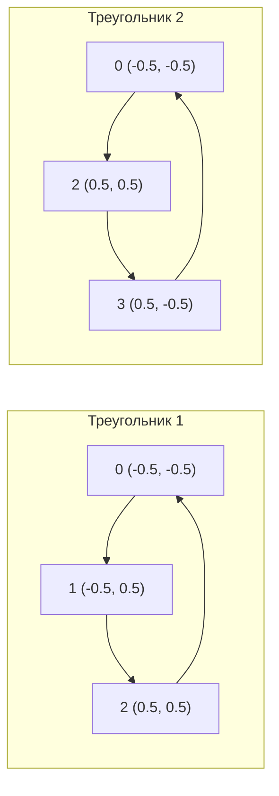

# Вершинные буферы

[Полный код главы](https://github.com/Bromles/wgpu-tutorial/tree/master/code/guide/gpu-data-model/vertex-buffers)

**Что уже должно быть понятно:**

- WGSL: типы, структуры, `@location`, `@builtin`
- `VertexBufferLayout`, `VertexAttribute`
- `bytemuck`, `Pod`, `Zeroable`
- `create_buffer_init`, `set_vertex_buffer`

**Что появится в этой главе:**

- составная геометрия из нескольких треугольников
- порядок обхода вершин (winding order)
- диагональ прямоугольника — общее ребро двух треугольников

**Итог:** цветной прямоугольник из двух треугольников

---

В прошлой главе мы передали GPU три вершины с позициями и цветами, и получили цветной треугольник. Теперь попробуем
нарисовать прямоугольник. Сложность в том, что GPU умеет рисовать только треугольники (а также точки и линии, но не
четырёхугольники), поэтому нам придётся составить прямоугольник из двух треугольников. Этот подход — не ограничение wgpu
или WebGPU, так работает вся компьютерная графика: любую сложную форму можно разбить на треугольники.

## Из треугольника в прямоугольник

Прямоугольник можно разбить на два треугольника, проведя диагональ. Четыре угла прямоугольника и его диагональ:

```
  1 ──────── 2
  │ ╲        │
  │   ╲      │
  │     ╲    │
  │       ╲  │
  0 ──────── 3
```

Вершины 0–1–2 образуют левый треугольник, 0–2–3 — правый. Обратите внимание: диагональ 0→2 является общим ребром
для обоих треугольников — это важно, поскольку без неё между треугольниками осталась бы щель.

В режиме `TriangleList` каждые три вершины образуют один отдельный треугольник. Никакой логической связи между
треугольниками нет — GPU просто берёт три вершины, рисует треугольник, берёт следующие три, рисует ещё один, и так
далее. Поэтому для двух треугольников нам нужно 6 вершин:

```rust
const VERTICES: &[Vertex] = &[
    // Первый треугольник
    Vertex { position: [-0.5, -0.5], color: [1.0, 0.0, 0.0] }, // 0 — левый нижний (красный)
    Vertex { position: [-0.5,  0.5], color: [0.0, 1.0, 0.0] }, // 1 — левый верхний (зелёный)
    Vertex { position: [ 0.5,  0.5], color: [0.0, 0.0, 1.0] }, // 2 — правый верхний (синий)

    // Второй треугольник
    Vertex { position: [-0.5, -0.5], color: [1.0, 0.0, 0.0] }, // 0 — левый нижний (красный)
    Vertex { position: [ 0.5,  0.5], color: [0.0, 0.0, 1.0] }, // 2 — правый верхний (синий)
    Vertex { position: [ 0.5, -0.5], color: [1.0, 1.0, 0.0] }, // 3 — правый нижний (жёлтый)
];
```

Вершины 0 и 2 повторяются — они общие для обоих треугольников, и для каждого из них приходится дублировать данные.
Это кажется расточительным, и это действительно расточительно — но пока оставим так, а в следующей главе решим проблему
с помощью индексных буферов.

## Порядок обхода (winding order)

При создании конвейера в прошлых главах мы указывали `front_face: FrontFace::Ccw` — это означает, что передней
считается грань, вершины которой расположены **против часовой стрелки**. Порядок, в котором мы перечисляем вершины
в буфере, определяет, с какой стороны треугольника мы смотрим на него:



Оба обхода — против часовой стрелки в экранных координатах (ось Y направлена вверх). Если перепутать порядок —
например, указать вершины 0→3→2 вместо 0→2→3 — грань будет считаться задней. Пока мы не включали backface culling,
поэтому такой треугольник всё равно отрисуется, но `FrontFace` определяет ориентацию для будущего использования.

<div class="info custom-block" style="padding-top: 8px">
<p class="custom-block-title">Backface culling</p>

По умолчанию wgpu не отбрасывает задние грани — отрисовываются все треугольники, вне зависимости от стороны.
Но это можно включить через поле `cull_mode` в `PrimitiveState`:

```rust
primitive: PrimitiveState {
    cull_mode: Some(Face::Back),
    ..Default::default()
},
```

Тогда треугольники с обходом по часовой стрелке (задние грани) будут отброшены ещё до растеризации. Это полезно для
замкнутых 3D-объектов — задние грани не видны наблюдателю, и их отрисовка — пустая трата GPU-времени. Однако
для 2D-графики или прозрачных объектов backface culling обычно не используют.

</div>

## Шейдер не меняется

Хорошая новость — шейдер из прошлой главы не нуждается в изменениях. Он просто принимает позицию и цвет вершины и
передаёт их дальше через интерполяцию. Вся разница заключается в количестве вершин в буфере. Это ещё одно
подтверждение того, что вершинный буфер — гибкий механизм: мы можем менять геометрию, вообще не трогая шейдерный код.

## Рисуем прямоугольник

Единственное изменение в коде — вызов `draw` теперь отрисовывает 6 вершин вместо 3:

```rust
rpass.set_pipeline(&self.pipeline);
rpass.set_vertex_buffer(0, self.vertex_buffer.slice(..));
rpass.draw(0..6, 0..1);
```

Остальной код (создание буфера, конвейер, render pass) остаётся таким же, как в прошлой главе. GPU прочитает из буфера
6 вершин, сгруппирует их в два треугольника (первые три и последние три), и нарисует их один за другим.

## Проблема: дублирование вершин

В нашем буфере 6 вершин, но уникальных — только 4. Две вершины (0 и 2) повторяются, поскольку они лежат на общей
диагонали прямоугольника. Для одного прямоугольника это всего 40 лишних байт — незаметно. Но для сложных моделей
стоимость растёт очень быстро:

- Куб: 12 треугольников × 3 вершины = 36, но уникальных вершин — 8 (без нормалей) или 24 (с нормалями)
- Сфера из 1000 треугольников: 3000 вершин вместо ~500 уникальных

Чем больше модель, тем больше вершин находятся на общих рёбрах и тем сильнее дублирование. Решение этой проблемы —
**индексные буферы**, которым посвящена следующая глава.

## Что получилось

Запустив пример, мы увидим прямоугольник с плавными переходами между четырьмя цветами: красным, зелёным, синим и
жёлтым. По диагонали видно, как два треугольника сливаются в один прямоугольник — без щели и без наложения.

<div class="tip custom-block" style="padding-top: 8px">
<p class="custom-block-title">Попробуем</p>

- Нарисуем три треугольника, образующих «домик» (крыша + стены)
- Поменяем порядок вершин одного треугольника на обратный — что изменится визуально?
- Попробуем нарисовать пять треугольников, образующих звезду

</div>

[Полный код главы](https://github.com/Bromles/wgpu-tutorial/tree/master/code/guide/gpu-data-model/vertex-buffers)
