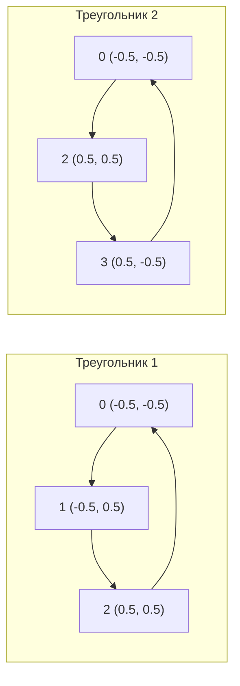

# Вершинные буферы

[Полный код главы](https://github.com/Bromles/wgpu-tutorial/tree/master/code/guide/gpu-data-model/vertex-buffers)

**Что уже должно быть понятно:**

- WGSL: типы, структуры, `@location`, `@builtin`
- `VertexBufferLayout`, `VertexAttribute`
- `bytemuck`, `Pod`, `Zeroable`
- `create_buffer_init`, `set_vertex_buffer`

**Что появится в этой главе:**

- составная геометрия из нескольких треугольников
- порядок обхода вершин (winding order)
- диагональ прямоугольника — общее ребро двух треугольников

**Итог:** цветной прямоугольник из двух треугольников

---

В прошлой главе мы передали GPU три вершины с позициями и цветами. Шагнём дальше — нарисуем прямоугольник. GPU умеет
рисовать только треугольники (точки и линии тоже, но не четырёхугольники), поэтому прямоугольник = два треугольника.

## Из треугольника в прямоугольник

Четыре угла прямоугольника и его диагональ:

```
  1 ──────── 2
  │ ╲        │
  │   ╲      │
  │     ╲    │
  │       ╲  │
  0 ──────── 3
```

Вершины 0–1–2 образуют левый треугольник, 0–2–3 — правый. Общая диагональ 0→2 принадлежит обоим.

В режиме `TriangleList` каждые три вершины образуют один треугольник. Для двух треугольников нужно 6 вершин:

```rust
const VERTICES: &[Vertex] = &[
    // Первый треугольник
    Vertex { position: [-0.5, -0.5], color: [1.0, 0.0, 0.0] }, // 0 — левый нижний (красный)
    Vertex { position: [-0.5,  0.5], color: [0.0, 1.0, 0.0] }, // 1 — левый верхний (зелёный)
    Vertex { position: [ 0.5,  0.5], color: [0.0, 0.0, 1.0] }, // 2 — правый верхний (синий)

    // Второй треугольник
    Vertex { position: [-0.5, -0.5], color: [1.0, 0.0, 0.0] }, // 0 — левый нижний (красный)
    Vertex { position: [ 0.5,  0.5], color: [0.0, 0.0, 1.0] }, // 2 — правый верхний (синий)
    Vertex { position: [ 0.5, -0.5], color: [1.0, 1.0, 0.0] }, // 3 — правый нижний (жёлтый)
];
```

Вершины 0 и 2 повторяются — они общие для обоих треугольников.

## Порядок обхода (winding order)

При создании конвейера мы указали `front_face: FrontFace::Ccw` — передней считается грань, вершины которой расположены
**против часовой стрелки**:



Оба обхода — против часовой стрелки в экранных координатах (Y вверх).

Перепутать порядок — например, 0→3→2 вместо 0→2→3 — и грань будет считаться задней. При включённом backface culling
она не отрисуется.

<div class="info custom-block" style="padding-top: 8px">
<p class="custom-block-title">Backface culling</p>

По умолчанию wgpu не отбрасывает задние грани. Включается через `PrimitiveState`:

```rust
primitive: PrimitiveState {
    cull_mode: Some(Face::Back),
    ..Default::default()
},
```

Полезно для замкнутых 3D-объектов — задние грани не видны, их отрисовка впустую тратит GPU-время.

</div>

## Шейдер без изменений

Шейдер из прошлой главы не меняется — он принимает позицию и цвет вершины и передаёт дальше. Вся разница в количестве
вершин в буфере.

## Отрисовка

Единственное изменение — 6 вершин вместо 3:

```rust
rpass.set_pipeline(&self.pipeline);
rpass.set_vertex_buffer(0, self.vertex_buffer.slice(..));
rpass.draw(0..6, 0..1);
```

Остальной код (создание буфера, конвейер, render pass) — такой же, как в прошлой главе.

## Проблема: дублирование вершин

6 вершин в буфере, но уникальных — только 4. Две вершины повторяются. Для прямоугольника это незаметно, но для
сложных моделей:

- Куб: 12 треугольников × 3 = 36 вершин, но уникальных — 8 (или 24 с нормалями)
- Сфера из 1000 треугольников: 3000 вершин вместо ~500 уникальных

Решение — **индексные буферы**, следующая глава.

## Результат

Прямоугольник с плавными переходами между красным, зелёным, синим и жёлтым. По диагонали видно, как два треугольника
сливаются в один прямоугольник.

<div class="tip custom-block" style="padding-top: 8px">
<p class="custom-block-title">Попробуйте сами</p>

- Нарисуйте три треугольника, образующих «домик» (крыша + стены)
- Попробуйте поменяйте порядок вершин одного треугольника на обратный — что изменится визуально?

</div>

[Полный код главы](https://github.com/Bromles/wgpu-tutorial/tree/master/code/guide/gpu-data-model/vertex-buffers)
