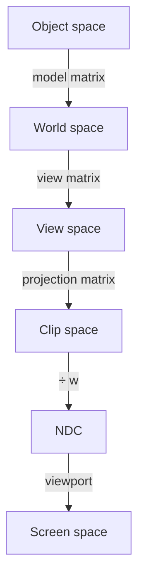

# Система координат WebGPU

**Что уже должно быть понятно:**

- векторы и матрицы ([Векторы и матрицы](/guide/math/vectors-matrices/))
- clip space: координаты от -1 до 1

**Что появится в этой главе:**

- какие системы координат проходит вершина на пути к экрану
- почему clip space от -1 до 1
- перспективное деление
- правосторонняя система координат в WebGPU

---

Каждая вершина проходит через несколько систем координат, прежде чем попасть на экран. Понимание этого пути объяснит,
зачем нужны матрицы проекции и что делает GPU под капотом.

## Путь вершины

### Object space

Координаты относительно центра объекта. Вершины куба от -0.5 до 0.5 — это object space. Куб «не знает», где он
находится в мире.

### World space

Координаты в общей системе сцены. Model-матрица переводит object space → world space: сдвигает, поворачивает и
масштабирует объект на нужное место.

### View space (eye space)

Координаты относительно камеры. View-матрица перестраивает мир так, что камера оказывается в начале координат и
смотрит вдоль оси -Z (в правосторонней системе).

### Clip space

Результат умножения на projection-матрицу. Координаты всё ещё однородные $(x, y, z, w)$. GPU проверяет, что
$-w \leq x \leq w$, $-w \leq y \leq w$, $0 \leq z \leq w$ — если вершина не попадает в этот объём, она отсекается.

Область видимости камеры называется **frustum** — усечённая пирамида. Near и far задают диапазон глубины,
FOV — угол обзора. Объекты за пределами frustum не рисуются.

### NDC (Normalized Device Coordinates)

После перспективного деления $(x/w,\ y/w,\ z/w)$ координаты становятся в диапазоне:

- $x$: $[-1, 1]$ (слева направо)
- $y$: $[-1, 1]$ (снизу вверх)
- $z$: $[0, 1]$ (от ближней плоскости к дальней) — это отличие от OpenGL, где $z \in [-1, 1]$

### Screen space

NDC преобразуются в пиксели экрана через viewport:

$$
\text{pixel}_x = \frac{\text{ndc}_x + 1}{2} \cdot \text{width}
$$

$$
\text{pixel}_y = \frac{1 - \text{ndc}_y}{2} \cdot \text{height}
$$

Ось $y$ инвертируется: в NDC она направлена вверх, а на экране пиксели считаются сверху вниз.

## Правосторонняя система координат

WebGPU использует правостороннюю систему:

- +X — вправо
- +Y — вверх
- +Z — на наблюдателя (из экрана)

Проверка «правило правой руки»: если указательный палец — X, средний — Y, то большой палец указывает направление Z.

По соглашению камера смотрит вдоль -Z. Это значит, что объекты перед камерой имеют отрицательные координаты Z
в view space — projection-матрица переворачивает ось Z так, чтобы ближние объекты имели меньшее значение глубины.

## Перспективное деление

В clip space координаты — однородные $(x, y, z, w)$. Projection-матрица подготавливает $w$ так, что он равен глубине
точки относительно камеры. GPU автоматически делит:

$$
\text{ndc}_x = \frac{\text{clip}_x}{\text{clip}_w}, \quad
\text{ndc}_y = \frac{\text{clip}_y}{\text{clip}_w}, \quad
\text{ndc}_z = \frac{\text{clip}_z}{\text{clip}_w}
$$

Это создаёт эффект перспективы — далёкие объекты (большой $w$) сжимаются к центру экрана (малые $\text{ndc}_x$,
$\text{ndc}_y$). Ближние объекты (малый $w$) растягиваются.

## Числовой пример: вершина через все пространства

Пусть вершина куба находится в позиции $(1, 1, -5)$ в object space. Куб сдвинут на $(3, 0, 0)$
в world space. Камера в точке $(0, 0, 5)$ смотрит вдоль $-Z$.

**1. Object → World** (model = сдвиг на $(3, 0, 0)$):

$$
\vec{p}_{world} = (1+3,\ 1+0,\ -5+0) = (4,\ 1,\ -5)
$$

**2. World → View** (view matrix: камера в $(0,0,5)$, смотрит вдоль $-Z$ — все Z смещаются на $-5$):

$$
\vec{p}_{view} = (4,\ 1,\ -5-5) = (4,\ 1,\ -10)
$$

**3. View → Clip** (perspective_rh с fov=45°, aspect=1, near=0.1, far=100):

Projection-матрица преобразует Z в диапазон $[0, 1]$, а $w$ становится равным $|z_{view}|$:

$$
\vec{p}_{clip} \approx (9.66,\ 2.41,\ 9.9,\ 10.0)
$$

**4. Clip → NDC** (перспективное деление):

$$
\text{ndc}_x = \frac{9.66}{10} = 0.966, \quad
\text{ndc}_y = \frac{2.41}{10} = 0.241, \quad
\text{ndc}_z = \frac{9.9}{10} = 0.99
$$

Z = 0.99 — почти на дальней плоскости (1.0 = far). X и Y в пределах $[-1, 1]$ — вершина видима.

**5. NDC → Screen** (окно 800×600):

$$
\text{pixel}_x = \frac{0.966 + 1}{2} \cdot 800 = 786, \quad
\text{pixel}_y = \frac{1 - 0.241}{2} \cdot 600 = 228
$$

Вершина отобразится в пиксель $(786, 228)$ — правая часть окна, ближе к верху.

---

С этими знаниями мы готовы к следующей главе, где применим model, view и projection матрицы на практике.
