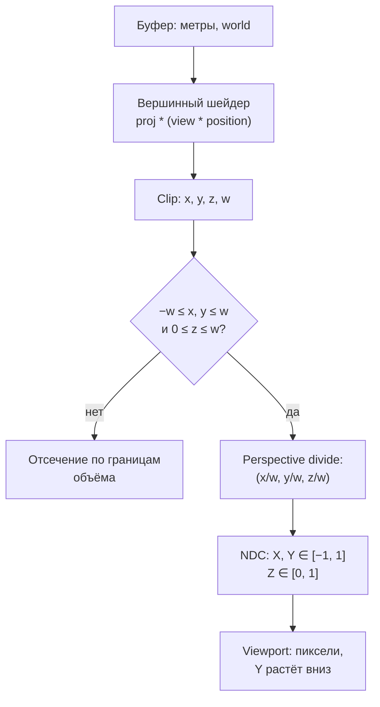

# Clip, экран и интерполяция

::: info Только native
Снимок [«Проекция и путь на экран»](../ortho-perspective/): та же камера, пол, оси и UV. Единственное изменение — ближняя табличка наклонена на 30° вокруг X; новая клавиша — `I`.
:::

Вершинный шейдер выдал четыре числа — и дальше вершина проходит конвейер, в котором происходит больше, чем кажется.
Наклон таблички делает эти шаги видимыми: её `w` теперь меняется от края к краю.

## Полный путь вершины



Стадии:

- **clip** — четыре координаты после шейдера, до любых делений. Допустимость проверяется в них: `−w ≤ x, y ≤ w` и `0 ≤ z ≤ w`. Треугольник, залезший за границу, **режется по ней**: на пересечении появляются новые вершины, остальное уходит.
- **perspective divide** — деление на `w`. Для ортографии `w = 1`: деление ничего не меняет. Для перспективы `w = d` — метры превращаются в доли кадра.
- **NDC** — нормализованные координаты: `X, Y ∈ [−1, 1]`, у wgpu/WebGPU `Z ∈ [0, 1]`. Правая система сама по себе диапазон глубины не задаёт: `[0, 1]` — это конвенция проекции (glam различает варианты `directx`/`opengl` именно по этому признаку).
- **viewport** — арифметика пикселей: `px = (X + 1)/2 · W`, `py = (1 − Y)/2 · H`. Обратите внимание на знак: экранный **Y растёт вниз**, математический — вверх, переворот происходит здесь, в последний момент.

## Нелинейная глубина

На `w` делится и `z`: результат — глубина, с которой будет работать depth-тест следующей главы. Для точки на расстоянии `d` от глаза (ближняя `near`, дальняя `far` плоскости) она равна:

```text
depth(d) = far · (d − near) / (d · (far − near))
```

При `near = 1`, `far = 9`:

| d | 1 | 2 | 9 |
| --- | --- | --- | --- |
| depth | 0 | 9/16 = 0.5625 | 1 |

Деление на `d` сгибает прямую: точка `d = 2` — уже за серединой диапазона, а на дальнюю половину метров (`d` от 2 до 9) остаётся меньше половины глубины.
Ближние поверхности различаются хорошо, дальние — плохо; к чему это приводит, увидим в [главе «Ориентация и видимость»](../depth-culling/).

## Интерполяция: почему a/w

Атрибуты — UV, цвет — известны в вершинах, а нужны в каждом фрагменте. Обычное среднее по экрану брать **нельзя**: экранное пространство получилось после деления на `w`, и линейность в нём потеряна.

Выведем правильное взвешивание на одном отрезке. Что вообще значит «интерполировать честно»? Атрибут — свойство **точки поверхности**, а не пикселя. Значит, сначала надо понять, какая точка отрезка проецируется в этот пиксель, и взять атрибут именно этой точки.

Экранная точка на параметре `t` — линейная смесь экранных координат вершин: `screen(t) = (1−t)·(A_xy/w_A) + t·(B_xy/w_B)`. Точка мира на параметре `s` — `P(s) = (1−s)A + sB`; её проекция:

```text
proj(s) = ((1−s)·A_xy + s·B_xy) / ((1−s)·w_A + s·w_B)
```

числитель и знаменатель — смеси по `s`. Приравняем `proj(s) = screen(t)` и приравняем вклады `A_xy` и `B_xy` по отдельности (равенство должно держаться при любых координатах вершин):

```text
(1−t)/w_A = (1−s)/D          t/w_B = s/D          где D = (1−s)w_A + s·w_B
```

Сложив оба равенства (`(1−t)/w_A + t/w_B = 1/D`), получаем два факта:

```text
1/w_P = (1−t)/w_A + t/w_B            — обратная глубина линейна по экрану
a_P   = ((1−t)·a_A/w_A + t·a_B/w_B) / ((1−t)/w_A + t/w_B)
```

Именно это и делает растеризатор: по экрану он линейно интерполирует пары `a/w` и `1/w` (что мы только что доказали — это следствие проекции отрезка, а не отдельное предположение), а деление даёт атрибут настоящей точки поверхности. Для точки внутри треугольника роль `(1−t), t` играют экранные барицентрические веса `λᵢ`:

```text
a = Σ(λᵢ · aᵢ/wᵢ) / Σ(λᵢ/wᵢ)
```

Контрольный пример: два веса по `0.5`, `w = (1, 2)`, `a = (0, 1)`:

- перспективно: `(0·1 + 1·0.5)/(1 + 0.5) = 0.5/1.5 = 1/3`;
- экранно-линейно: `0.5·0 + 0.5·1 = 1/2`.

Разница `1/3` против `1/2` — это и есть искажение, которое видно глазом. В WGSL интерполяция — атрибут вершинной переменной, и у наших табличек теперь два pipeline, чьи шейдеры различаются лишь декорацией одной интерполируемой переменной:

```wgsl
struct PerspectiveOutput {
    @builtin(position) position: vec4<f32>,
    @location(0) @interpolate(perspective) uv: vec2<f32>,
};

struct LinearOutput {
    @builtin(position) position: vec4<f32>,
    @location(0) @interpolate(linear) uv: vec2<f32>,
};
```

`perspective` — умолчание: varying делится на `w` при интерполяции. `linear` на позицию (`@builtin(position)`) не влияет: деление выполняет растеризатор, а отменяется только взвешивание `1/w` для самой переменной.

## Снимок

Табличка наклонена вокруг X через свой центр `(0, 0.6, 3)`: поворот на 30° переводит локальное `y_l` в `y = 0.6 + y_l·cos(30°)`, `z = 3 + y_l·sin(30°)`:

```rust
    // The v = 0 edge ends up 2.2 m from the eye, the v = 1 edge 1.8 m:
    // w now varies across the quad, which is what the I key exposes.
    Vertex {
        position: [-0.4, 0.2535898, 2.8, 1.0],
        color: [0.0; 4],
        uv: [0.0, 0.0],
    },
    Vertex {
        position: [0.4, 0.2535898, 2.8, 1.0],
        color: [0.0; 4],
        uv: [1.0, 0.0],
    },
    Vertex {
        position: [0.4, 0.9464102, 3.2, 1.0],
        color: [0.0; 4],
        uv: [1.0, 1.0],
    },
    Vertex {
        position: [-0.4, 0.9464102, 3.2, 1.0],
        color: [0.0; 4],
        uv: [0.0, 1.0],
    },
```

Край с `v = 0` — в 2.2 м от глаза, край с `v = 1` — в 1.8 м: `w` меняется по вертикали таблички. Клавиша `I` переключает pipeline для обеих табличек:

```rust
        let quad_pipeline = match self.interpolation {
            Interpolation::Perspective => &self.perspective_pipeline,
            Interpolation::Linear => &self.linear_pipeline,
        };
```

Численный след: горизонтальный шов текстуры `v = 0.5` при perspective-интерполяции проходит по проекции настоящей середины таблички — NDC `y ≈ 0.520`; линейная ставит его ровно посередине проекции, `y ≈ 0.555`. Полоса между этими линиями на наклонной табличке перекрашивается — верхняя половина «съезжает» вверх. Дальняя табличка не наклонена: у неё `w = 4` во всех вершинах, обе интерполяции совпадают.


Положение шва `v = 0.5` на наклонной табличке: слева perspective-интерполяция ведёт его по проекции настоящей середины таблички, справа экранно-линейная — по середине экранной. Полоса между этими линиями и есть то, что перекрашивает клавиша `I`; дальняя табличка не наклонена — на ней режимы совпадают.

Проверка повторяет оба контракта на CPU — взвешенное `a/w` и экранно-линейное — и сверяет цвета квадрантов в пяти точках кадра для каждого pipeline, включая точку между швами, где режимы обязаны разойтись.

```sh
cargo run -p clip-viewport
cargo test -p clip-viewport
```

## Проверьте модель

1. Глубина точки на расстояниях 1, 2 и 9 м при `near = 1`, `far = 9`?
2. Веса `0.5/0.5`, `w = (1, 2)`, `a = (0, 1)`: значение при perspective-интерполяции и при экранно-линейной?
3. Где пройдёт шов `v = 0.5` наклонной таблички, если включить `@interpolate(linear)`?
4. Почему `I` не меняет дальнюю (не наклонённую) табличку?

::: details Решения и контрольные выводы

1. `0`; `9·(2−1)/(2·8) = 0.5625`; `1`. Кривая глубины гиперболическая: середина диапазона метров не попадает в середину глубины.
2. `1/3` (сумма `a/w`, делённая на сумму `1/w`) и `1/2` (простое среднее). Разница — видимая ошибка экранно-линейной интерполяции.
3. Ровно посередине между краями проекции таблички (NDC `y ≈ 0.555`): линейная интерполяция не знает про `w` и делит отрезок пополам. Правильный шов — ниже (`≈ 0.520`), потому что нижняя половина дальше и на экране сжата.
4. Её `w` одинаков во всех вершинах (плоскость перпендикулярна взгляду, все точки в 4 м): веса `1/w` равны, и отношение сумм сводится к обычному среднему — режимы совпадают.

:::

Порядок draw всё ещё решает, кто поверх кого — «художник» из главы о проекции пока незаменим.
[Следующая глава](../depth-culling/) отбирает эту работу у порядка: winding, culling и depth-буфер.
