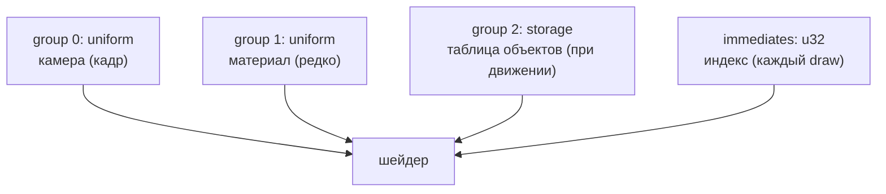

# Геометрия, материал, объект

::: info Только native, Features::IMMEDIATES
Свет — [главы «Материал и блик»](../blinn-phong/), камера — упрощённый вариант [главы «Управляемая камера»](../camera-fly/): фикс, не интерактивная. Прозрачность здесь не нужна: у главы две opaque-плоскости.
:::

Два одинаковых прямоугольника в кадре — и сразу вопрос архитектуры: что из них «общее», а что у каждого своё?
Кадр рисует одну плоскость дважды: слева — с identity-моделью, справа — с переносом; материалы разные.
Данные расходятся по **ролям**, и роль определяется частотой изменения, а не только shader visibility.

**Эксперимент:** плоскость XY, половины `0.8 × 0.6`, скомпонованная вокруг `(−0.9, 0, 0)` — левый объект живёт в собственных координатах, его model — identity.
Правый — та же геометрия с `model = перенос (1.8, 0, 0)`.
Камера фикс: `(0, 0.6, 3)`, взгляд в начало координат, fov 60°.
Один направленный свет `L = +Z`, Lambert + блик Blinn-Phong из [главы «Материал и блик»](../blinn-phong/).
Материалы: левый тёплый `(0.70, 0.25, 0.20)`, правый холодный `(0.20, 0.35, 0.70)`.
Клавиша `M` перепривязывает group 1 обеих draw к одному материалу, `X` двигает правый объект перезаливкой записи в storage.

## Три роли данных

Каждая роль ложится на свой механизм wgpu:



| Роль | Данные | Частота | Место |
|------|--------|---------|-------|
| кадр | `view_proj`, `eye` | раз в кадр | group 0, uniform |
| материал | `albedo`, `specular` | при смене материала | group 1, uniform |
| объект | `model`, `normal_matrix` | при движении объекта | group 2, storage |
| draw | индекс объекта | каждый draw | immediates |

Частота важнее видимости: камера пишется каждый кадр, материалы не меняются вовсе (меняется только привязка), таблица объектов перезаливается точечно — не весь буфер, а одна запись.
Индекс объекта не заслуживает даже буфера: он едет в командном состоянии, как [тинт в главе «Immediates»](../../foundations/draw-immediates/).

## Схема читателей

```wgsl
// Role: per frame. The camera chain plus the eye for the specular term.
struct Camera {
    view_proj: mat4x4<f32>,
    eye: vec4<f32>,
};

// Role: per material. Two vec4 = 32 bytes, no padding.
struct Material {
    albedo: vec4<f32>,
    specular: vec4<f32>,
};

// Role: per object. Two mat4x4 = a 128-byte stride.
struct ObjectRecord {
    model: mat4x4<f32>,
    normal_matrix: mat4x4<f32>,
};

@group(0) @binding(0) var<uniform> camera: Camera;
@group(1) @binding(0) var<uniform> material: Material;
@group(2) @binding(0) var<storage, read> objects: array<ObjectRecord>;

// Role: per draw. The index of this draw's record, written by
// set_immediates before the draw and read like any module-scope variable.
struct ObjectIndex {
    index: u32,
};

var<immediate> object: ObjectIndex;
```

Вершинный шейдер собирает цепочку справа налево — `P·V·M`, модель действует первой:

```wgsl
@vertex
fn vs_main(input: VertexInput) -> VertexOutput {
    let record = objects[object.index];
    // P * V * M, right to left: the model acts on the vertex first, the
    // camera chain second.
    let world = record.model * input.position;
    var output: VertexOutput;
    output.position = camera.view_proj * world;
    output.world_position = world.xyz;
    // Normals ride the inverse transpose (chapter 24); w = 0 keeps the
    // translation out of the product.
    output.world_normal = (record.normal_matrix * input.normal).xyz;
    return output;
}
```

`normal_matrix` честно выводится на CPU — `(M⁻¹)ᵀ` из [главы «Преобразование нормалей»](../normal-matrix/) — и для чистого переноса равна identity: перенос не поворачивает поверхности.

## Два draw одной геометрии

Меши разделяются буквально: **один** вершинный буфер, **один** индексный, ноль копий геометрии.

```rust
        pass.set_pipeline(&self.pipeline);
        pass.set_bind_group(0, &self.camera_bind_group, &[]);
        pass.set_bind_group(2, &self.objects_bind_group, &[]);
        pass.set_vertex_buffer(0, self.vertex_buffer.slice(..));
        pass.set_index_buffer(self.index_buffer.slice(..), wgpu::IndexFormat::Uint16);
        for object in 0..OBJECT_COUNT as u32 {
            // Role per material: separate mode keeps the warm/cool pair
            // (object 0 warm, object 1 cool); shared mode binds warm for
            // both draws.
            let material = usize::from(!self.shared_material && object == 1);
            pass.set_bind_group(1, &self.material_bind_groups[material], &[]);
            // Role per draw: the object index travels in the command
            // state - no buffer was written for it between the draws.
            pass.set_immediates(0, bytemuck::bytes_of(&object));
            pass.draw_indexed(0..INDICES.len() as u32, 0, 0..1);
        }
```

Между двумя `draw_indexed` не происходит ни одной записи в буферы: смена объекта — это `set_immediates`, смена материала — перепривязка группы.
Таблица объектов — read-only storage со stride 128 (две `mat4x4`), длина массива следует из размера привязки: `256 / 128 = 2`.


Один вершинный и один индексный буфер на оба объекта: слева запись с identity-моделью, справа — с переносом, центры в `(±0.9, 0, 0)`. Материалы в раздельном режиме — тёплый и холодный; клавиша `M` перепривязывает оба draw к одному.

## Материал и объект меняются раздельно

`M` переключает режим материалов.
В раздельном режиме каждый draw привязывает свою группу; в общем — обе привязывают одну, и **изменение затрагивает оба объекта**: материал — свойство пары «шейдер × привязка», позиции и камера ни при чём.

`X` переписывает запись правого объекта — `objects[1] = object_record(RIGHT_MOVED)` — и она перезаливается в storage в начале следующего `draw`: отдельного шага обновления у сэмпла нет.
Двигается только второй draw: таблица адресуется по записям, не по буферу целиком.

```rust
/// Builds a record for a translated object, deriving the normal matrix
/// the honest way instead of assuming the identity.
pub fn object_record(translation: Vec3) -> ObjectRecord {
    let model = Mat4::from_translation(translation);
    ObjectRecord {
        model,
        // Linear 3x3 part only (chapter 24): translation never applies to
        // a direction, so the normal matrix of a pure translation is the
        // identity.
        normal_matrix: Mat4::from_mat3(glam::Mat3::from_mat4(model).inverse().transpose()),
    }
}
```

## Проверка возможностей

Immediates — механизм стандарта WebGPU/WGSL, но его поддержка зависит от адаптера (в браузерах часто недоступен); поэтому бюджет проверяется до первого pipeline, с понятной ошибкой, а не паникой в недрах драйвера:

```rust
        if !gpu
            .device
            .features()
            .contains(wgpu::Features::IMMEDIATES)
        {
            return Err("This example requires Features::IMMEDIATES (native only): the object index travels in the command state".into());
        }
        if gpu.device.limits().max_immediate_size < 4 {
            return Err("This example requires max_immediate_size >= 4: one u32 object index per draw".into());
        }
```

Запрос идёт через `Settings::device_descriptor`, как в [главе «Immediates»](../../foundations/draw-immediates/): `required_features: Features::IMMEDIATES`, `max_immediate_size: 4` — ровно один `u32`.

## Снимок

Проверка сверяет центры объектов с CPU-моделью света.
Центры `(±0.9, 0, 0)` — зеркальные точки для камеры на оси `x = 0`: они проецируются в зеркальные пиксели одной строки кадра, а `dot(N, H)` для `L = +Z` от зеркальных точек одинаков.
Поэтому в общем режиме оба зонда равны не «примерно», а побайтово; в раздельном зонды соответствуют каждый своей CPU-тени, а после `X` старый центр правого объекта показывает фон — запись перезалита, левый не тронут.

```sh
cargo run -p scene-objects
cargo test -p scene-objects
cargo test -p scene-objects
```

## Проверьте модель

1. Сколько вершинных и индексных буферов создаст по этой схеме сцена из четырёх объектов на двух материалах?
2. Что нужно изменить, чтобы правый объект вращался? Какая часть записи изменится и что произойдёт с `normal_matrix`?
3. Почему камера в group 0, а материал в group 1 — что практического меняет этот порядок между двумя draw?
4. Оба draw читают одну и ту же таблицу объектов. Зачем тогда индекс, если записей две?

::: details Решения и контрольные выводы

1. Один вершинный и один индексный: геометрия общая, объекты различаются записями storage и immediate-индексом. Материалов два — по одному uniform-буферу на материал.
2. `model` станет `translation * rotation`; `normal_matrix = (M⁻¹)ᵀ` перестанет быть identity — поворот меняет ориентацию поверхностей, и нормали обязаны ехать своей матрицей ([глава о преобразовании нормалей](../normal-matrix/)).
3. Порядок групп задаёт точки переключения внутри кадра: group 0 достаточно привязать один раз до цикла, group 1 перепривязывается перед каждым draw. Чем реже роль меняется, тем дальше от цикла её место — и тем дешевле кадр.
4. Индекс выбирает запись: первый draw читает запись 0 (identity, левый объект), второй — запись 1 (перенос, правый). Таблица одна, «кто есть кто» решает draw.

:::

Геометрия, материал и объект разошлись по ролям — каркас сцены собран.
Раздел «Поверхность и свет» на этом закрыт: дальше эти роли встретятся снова — уже в составе больших сцен.
