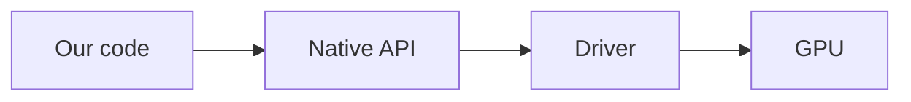
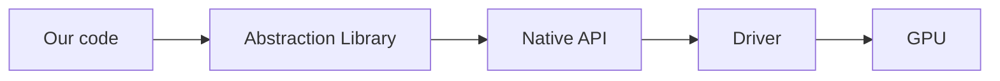
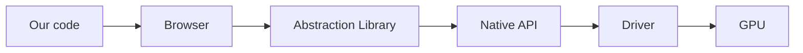
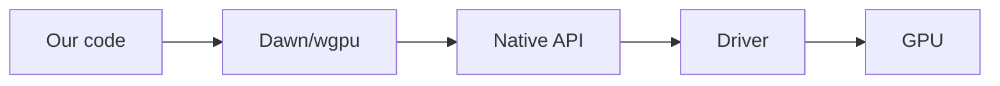

# О руководстве

## Краткое описание

_Кроссплатформенная нативная графика нового поколения на Rust_

Здесь вы сможете изучить работу с графическими API, начиная с нуля и заканчивая продвинутыми концепциями вроде
вычислений на видеокарте и физически корректной отрисовки сцен.

Руководство сосредотачивается на применении нового стандарта [WebGPU](https://www.w3.org/TR/webgpu) за пределами
браузеров, с помощью реализующей его библиотеки [wgpu](https://wgpu.rs/) и языка программирования Rust.

## Что такое графическое API

Графическое API - это интерфейс, позволяющий управлять видеокартой из кода программ для отрисовки 2D или
3D графики. Графические API нового поколения поддерживают также и произвольные вычисления на видеокартах.

Все графические API можно разделить на следующие виды:

- Нативные - реализованные напрямую в драйвере видеокарты. К таким относятся OpenGL, Vulkan, DirectX и Metal, а также
  проприетарные API игровых консолей, такие как GNM на PlayStation.

- Абстракции и обертки - различные библиотеки, предоставляющие своё графическое API поверх нативных. Такие, как
  [Skia](https://skia.org/), [IGL](https://github.com/facebook/igl),
  [ANGLE](https://chromium.googlesource.com/angle/angle) и другие.

- Отдельно можно выделить API в браузерах, например WebGL. Код фронтенда может работать с ними напрямую, но внутри
  самого браузера все равно используется библиотека-абстракция, совершающая вызовы нативного API текущей платформы.
  Таким образом, браузерные API можно тоже считать абстракциями над нативными.

## Почему WebGPU

На данный момент можно выделить следующие нативные графические API:

- OpenGL - официально признан устаревшим, не развивается, значительно отстает по кроссплатформенным возможностям и
  склонен к ошибкам и непредвиденному поведению.

- Vulkan - пришел на смену OpenGL, потенциально более производительный, более богатый по возможностям. Однако требует
  написания в разы больших объемов кода (примерно 1000 строк для самой примитивной программы уровня Hello World), очень
  легко допустить ошибку, большая часть работы по управлению видеокартой переложена на разработчика.
  Кроме этого, не доступен нативно на устройствах компании Apple, а слой совместимости MoltenVK (призванный решить эту
  проблему) отличается катастрофической нестабильностью и слабо подходит для серьезной разработки. Отсутствуют
  официальные инструменты отладки, необходимо полагаться на решения от сообщества. Есть множество жалоб на нестабильность даже на поддерживаемых системах вроде Windows. Последние годы стремительно теряет популярность, однако от полного вымирания также очень далек.

- DirectX 12 - разительно отличается от прошлых версий DirectX, первым внедряет новые возможности в мире графики, но по
  сложности и многословности схож с Vulkan. Вдобавок нативно работает только на Windows 10+ и Xbox, через слой
  совместимости Proton возможен запуск на Linux. Есть официальные инструменты отладки от Microsoft. В последние годы
  становится все более популярным.

- Metal - самое простое и удобное из трёх API нового поколения, с самыми продвинутыми инструментами отладки. По объему
  кода сравним с OpenGL, по простоте даже превосходит его. В разы проще и лаконичнее и Vulkan, и DirectX 12, при
  сохранении их возможностей. Однако поддерживается только платформами компании Apple, что означает полное отсутствие
  переносимости решений на нём. Но все это было справедливо лишь для Metal до 4 версии. В Metal 4 его авторы нацелились на максимальное сходство с DirectX 12 ради облегчения портирования игр с Windows на macOS, что неизбежно привело к его кардинальному усложнению.

Вдобавок, в браузерной среде до недавнего времени был доступен только WebGL, который является еще более урезанной
версией катастрофически устаревшего OpenGL.

В 2021 году Google, Apple, Mozilla и Khronos в составе рабочей группы W3C опубликовали черновик стандарта нового
графического API для браузеров, названного [WebGPU](https://www.w3.org/TR/webgpu). Оно призвано принести возможности
современных нативных графических API (Vulkan, DirectX 12, Metal) в браузерную среду, обеспечив полную
кроссплатформенность и предоставив доступ к современному решению вместо устаревшей модели WebGL/OpenGL.

Довольно скоро появилось две значимые реализации данного стандарта:

- [Dawn](https://dawn.googlesource.com/dawn) - написан на C/C++, используется в Chromium. Содержит компилятор Tint для
  преобразования шейдеров.
- [wgpu](https://wgpu.rs/) - написан на Rust, опционально имеет вариант сборки в библиотеку C для привязки к другим языкам программирования, используется в Firefox. Содержит компилятор Naga для преобразования шейдеров.

Данные реализации находятся в свободном доступе и позволяют использовать WebGPU не как API в браузере, а в качестве
нового кроссплатформенного решения для нативных платформ. Это дает возможность разрабатывать игры и другие графические
приложения с современными фичами, но без необходимости писать несколько реализаций под разные API и платформы, а также
делать это так же просто, как на OpenGL или Metal 3, значительно проще Vulkan и DirectX 12.

И Dawn, и wgpu относятся к библиотекам-абстракциям над нативными графическими API. "Под капотом" они превращают свои
вызовы в обращения к платформенному API, то есть Vulkan, DirectX 12 или Metal. Совместимость с OpenGL как нативным API
поддерживается, но с ограниченными возможностями, в качестве резервного варианта.

WebGPU выгодно отличается от других API-абстракций тем, что в первую очередь является новым стандартом в браузерах, а
значит поддерживается крупными корпорациями и будет использоваться разработчиками. Как следствие, Dawn и wgpu будут
продолжать развиваться под их нужды, и можно рассчитывать на своевременное исправление багов.

Примечание

За месяц до написания первой версии данной страницы вышла wgpu 24.0.0, в которой добавили поддержку
Apple Vision Pro, что может служить еще одной иллюстрацией поддержки множества платформ.

Дополнительная информация

Vulkan, DirectX 12, Metal и WebGPU относятся к графическим API нового поколения, тогда как OpenGL и WebGL - к старому.

Дополнительная информация

И Dawn, и wgpu позволяют запускать код на Rust/C/C++ в браузере через сборку в WASM, что дает использовать их в том
числе и для 3D графики на фронтенде. Но данный вопрос выходит за рамки руководства.

Таким образом, WebGPU является единственным графическим API, обладающим всеми перечисленными ниже свойствами:

- Адекватный уровень абстракции, позволяющий реализовывать необходимые для разработки игр и графических приложений
  алгоритмы, но не требующий чрезмерного количества действий для простых задач.

- Хорошая производительность.

- Полная кроссплатформенность.

- Доступ к современным возможностям, такие как вычисления на видеокарте.

- Стандартизация и широкая поддержка в индустрии.

Вдобавок, wgpu как реализация еще больше расширяет возможности WebGPU, предоставляя дополнительную функциональность при
работе вне браузера, на нативных платформах. Что, в совокупности с вышеперечисленным, делает его идеальным кандидатом
для использования в качестве основного графического API.

## Почему Rust

Но почему не использовать Dawn, или хотя бы wgpu в режиме совместимости с языком C? Ведь C/C++ - самые популярные языки
в сфере графической разработки и создания игр.

Тому есть несколько причин:

- Так как Dawn написан на C++, существует множество проблем при попытке привязаться к нему из других языков программирования. При этом wgpu официально предоставляет wgpu-native, сборку в библиотеку C, что значительно упрощает задачу привязки. Поэтому именно к ней привязываются такие языки, как [Odin (модуль стандартной библиотеки)](https://pkg.odin-lang.org/vendor/wgpu/) и [C# (официальный пакет Silk.NET)](https://github.com/dotnet/Silk.NET/blob/3c0313b2d69bbde12224c759a76bc2e7e064a893/build/nuke/Native/Wgpu.cs#L31). А это, в свою очередь, увеличивает количество пользователей, обнаруженных и исправленных багов, и в целом улучшает качество кода.

- wgpu написана на Rust, что позволяет использовать дополнительные гарантии безопасности при взаимодействии с ней из
  Rust кода. Например, стандартные проверки времени жизни ссылок гарантируют, что ресурсы видеокарты не будут очищены
  раньше дозволенного.

- wgpu сильнее отстает от изменений стандарта WebGPU, чем Dawn, однако поддерживает больше платформ.

- При использовании wgpu за пределами браузера, она предоставляет доступ к продвинутым возможностям современных нативных
  API за пределами стандарта WebGPU. Например, пуш константы, трассировка лучей, кеширование пайплайнов, рисование линий, привязки массивов объектов в шейдерах, и другие.

- wgpu в виде упакованной библиотеки весит примерно в 15 раз меньше Dawn (10мб против 150мб).

- Отсутствие проблем с кроссплатформенностью, подключением зависимостей и сборкой. Вместо 5 глав настройки проекта,
  типичных для C/C++ руководств, на это уйдет около 5 минут. Код запускается на любой операционной системе без изменений
  или платформ-специфичного кода, а стандартная система сборки автоматически подключает зависимости и собирает проект,
  как в остальных современных языках.

- Сам язык будет гарантировать отсутствие множества ошибок, типичных для программ на C/C++, в особенности касающихся
  управления памятью и многопоточности.

- Язык намного богаче и позволяет решать поставленную задачу с помощью готовых решений и алгоритмов, а не писать с нуля
  велосипеды, изобретенные 50 лет назад в других языках.

- Развитая экосистема языка позволит использовать готовые библиотеки на любой случай. На момент написания, глобальный
  репозиторий библиотек языка Rust, [crates.io](https://crates.io/), содержит в 39 раз больше пакетов, чем conan
  (репозиторий библиотек на C/C++ от сообщества) и vcpkg (аналогичное решение от Microsoft) вместе взятые.

- wgpu и Rust автоматически управляют памятью и не требуют от разработчика ручной очистки ресурсов видеокарты
  (никаких забытых `delete` и `free()`, без сборщика мусора как в языках вроде Java или Go).

- WebGPU использует язык WGSL для написания шейдеров, который более схож с Rust, чем с любым другим языком программирования.

Таким образом, Rust позволит нам писать меньше кода, делать это проще и удобнее, с большим количеством проверок и
гарантий корректной работы и безопасности, а также с поддержкой множества платформ, без потерь по производительности.

Кроме того, wgpu стала де-факто решением для графики в экосистеме Rust. Её используют такие проекты, как игровой
движок [Bevy](https://bevyengine.org/), движок рендера векторной графики [Vello](https://github.com/linebender/vello),
а также как бэкенд для рендера GUI библиотек [egui](https://github.com/emilk/egui) и [iced](https://iced.rs/).
Более зрелый игровой движок [Fyrox](https://fyrox.rs/) также планирует реализацию рендера на wgpu вместо устаревшего
OpenGL. Кроме того, можно привести пример MMORPG на wgpu, написанной с нуля без готового игрового движка -
[Veloren](https://www.veloren.net/). И даже новый браузерный движок от Mozilla, [Servo](https://github.com/servo/servo), отрисовывает
веб-страницы через wgpu.

## Целевая аудитория

Данное руководство написано в первую очередь для уверенных разработчиков, не имеющих опыта в работе с 2D и 3D.
Предполагается, что читатель умеет читать и писать код, но не имеет никаких познаний в компьютерной графике.
Если вы не знакомы с языком Rust, который используется в руководстве, то рекомендуется предварительно освоить его через
сторонние ресурсы, например [официальное руководство по языку](https://doc.rust-lang.org/book/title-page.html).

Компьютерная графика тесно связана с математикой, но это руководство не требует значительных познаний в линейной
алгебре или тригонометрии. Достаточно понимания, что такое векторы, матрицы, синусы и косинусы, то есть знаний уровня
школы, возможно 1 курса технического вуза.

## Структура руководства

Руководство разбито на секции, дополняющие друг друга. Мы начинаем от базовых вещей и наращиваем функциональность
в соответствии с различными решениями, принятыми в компьютерной графике. Руководство будет содержать как подробные
описания, так и блоки кода, диаграммы и математические формулы, чтобы объяснить графические концепции даже полным
новичкам в мире CG.

## Другие ресурсы

- [Официальные примеры wgpu](https://github.com/gfx-rs/wgpu/tree/trunk/examples) - набор примеров использования в
  репозитории wgpu, покрывающий много типовых задач, от освещения до сглаживания.

- [Документация wgpu](https://docs.rs/wgpu) - отличная официальная документация библиотеки wgpu, содержащая, кроме всего, рекомендации по использованию и описание потенциальных проблем и их решений.

- [WebGPU Fundamentals](https://webgpufundamentals.org/) - руководство по использованию WebGPU в браузере на языке
  JavaScript. Поскольку wgpu реализует стандарт WebGPU, информация оттуда является корректной и для него, а примеры кода
  часто переносятся на Rust с минимальными изменениями.

- [WebGPU C++ Guide](https://eliemichel.github.io/LearnWebGPU/index.html) - руководство по использованию WebGPU за
  пределами браузера, использующее язык C++. Немного освещает wgpu в режиме совместимости с C, но в целом сфокусировано
  больше на Dawn и самодельной обертке от автора руководства, что усложняет переносимость кода. Тем не менее можно
  подчерпнуть полезную информацию, даже если примеры кода переусложнены из-за недостатков используемого языка.

- [Learn Wgpu](https://sotrh.github.io/learn-wgpu) - руководство по использованию wgpu на языке Rust. Однако в нем используются неоптимальные зависимости, и само руководство больше
  ориентировано на разработчиков с опытом компьютерной графики, поскольку множество концепций упущены или объяснены
  очень бегло. Тем не менее отличается наличием совместимости с браузерной средой и интерактивными примерами прямо на
  сайте.

- [Learn OpenGL](https://learnopengl.com/) - классическое, очень популярное руководство. Несмотря на то, что сам OpenGL
  сильно устарел и не рекомендуется для новых разработок, данный ресурс остается самым подробным руководством для
  новичков в графике и объясняет на примерах типовые проблемы и решения. Стоит внимания для понимания общих концепций
  CG вне зависимости от используемого API. Послужило источником вдохновения для создания данного руководства.

- [Стандарт WebGPU](https://www.w3.org/TR/webgpu/) - Источник самой актуальной информации по API. Следует помнить, что
  реализации, такие как Dawn и wgpu, не всегда поддерживают всё, что имеется в стандарте.

- [Стандарт WGSL](https://www.w3.org/TR/WGSL/) - Источник самой актуальной информации по языку шейдеров WebGPU. Следует
  помнить, что компиляторы шейдеров, такие как Tint и Naga, не всегда поддерживают всё, что имеется в стандарте.

- [Tour of WGSL](https://google.github.io/tour-of-wgsl/) - Интерактивный курс по языку шейдеров WebGPU от Google.

- [WebGPU Unleashed](https://shi-yan.github.io/webgpuunleashed/) - практическое руководство по WebGPU в браузерной среде
  на JavaScript.

- [Learn WebGL](https://learnwebgl.brown37.net/index.html) - руководство по WebGL в браузерной среде на JavaScript.
