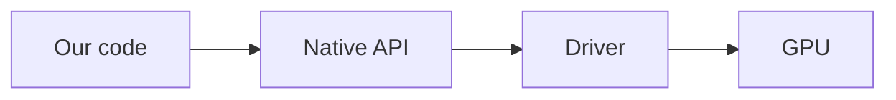
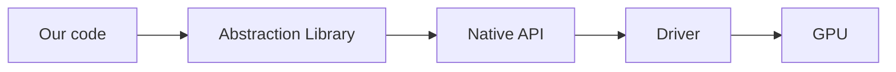
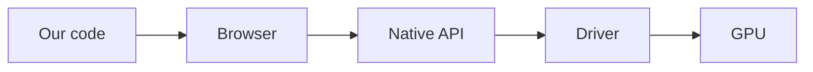
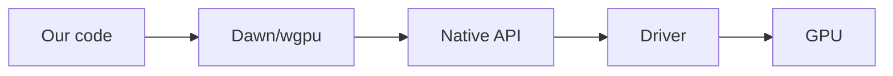

# О руководстве

## Краткое описание

*Кроссплатформерная нативная графика нового поколения на Rust*

Здесь вы сможете изучить работу с графическими API, начиная с нуля и заканчивая продвинутыми концепциями вроде
вычислений на видеокарте и физически корректной отрисовки сцен.

Руководство сосредотачивается на применении нового стандарта [WebGPU](https://www.w3.org/TR/webgpu) за пределами
браузеров, с помощью реализующей его библиотеки [wgpu](https://wgpu.rs/) и языка программирования Rust.

## Что такое графическое API

Графическое API - это программный интерфейс, как правило реализованный в драйвере видеокарты на конкретной операционной
системе, позволяющий управлять видеокартой из кода программ для отрисовки 2D или 3D графики. Графические API нового
поколения поддерживают также и произвольные вычисления на видеокартах.

Все графические API можно разделить на два вида:

* Нативные - реализованные напрямую в драйвере видеокарты. К таким относятся OpenGL, Vulkan, DirectX и Metal, а также
  проприетарные API игровых консолей, такие как GNM у PlayStation.

* Абстракции и обертки - различные библиотеки, предоставляющие своё графическое API поверх нативных. Такие как
  [Skia](https://skia.org/), [IGL](https://github.com/facebook/igl),
  [ANGLE](https://chromium.googlesource.com/angle/angle) и другие.

* Отдельно можно выделить API в браузерах, например WebGL. Код фронтенда может работать с ними напрямую, но внутри самого
браузера все равно происходят вызовы нативного API текущей платформы. Таким образом, браузерные API можно тоже считать
абстракциями над нативными.

## Почему WebGPU

На данный момент можно выделить следующие нативные графические API:

* OpenGL - официально признан устаревшим, не развивается, значительно отстает по кроссплатформерным возможностям и
  склонен к ошибкам и непредвиденному поведению.

* Vulkan - пришел на смену OpenGL, потенциально более производительный, более богатый по возможностям. Однако требует
  написания в разы больших объемов кода (примерно 1000 строк для самой примитивной программы уровня Hello World), очень
  легко допустить ошибку, большая часть работы по управлению видеокартой переложена на разработчика.
  Кроме этого, не доступен нативно на устройствах компании Apple, а слой совместимости MoltenVK (призванный решить эту
  проблему) отличается катастрофической нестабильностью и слабо подходит для серьезной разработки. Отстутствуют
  официальные инструменты отладки, необходимо полагаться на решения от сообщества.

* DirectX 12 - разительно отличается от прошлых версий DirectX, первым внедряет новые возможности в мире графики, но по
  сложности и многословности схож с Vulkan. Вдобавок нативно работает только на Windows 10+ и Xbox, через слой
  совместимости Proton возможен запуск на Linux. Есть официальные инструменты отладки от Microsoft.

* Metal - самое простое и удобное из трёх API нового поколения, с самыми продвинутыми инструментами отладки. По объему
  кода сравним с OpenGL, по простоте даже превосходит его. В разы проще и лаконичнее и Vulkan, и DirectX 12, при
  сохранении их возможностей. Однако поддерживается только платформами компании Apple, что означает полное отсутствие
  переносимости решений на нём.

Вдобавок, в браузерной среде до недавнего времени был доступен только WebGL, который является еще более урезанной
версией катастрофически устаревшего OpenGL.

В 2021 году Google, Apple, Mozilla и Khronos в составе рабочей группы W3C опубликовали черновик стандарта нового
графического API для браузеров, названного [WebGPU](https://www.w3.org/TR/webgpu).
Данное API призвано принести возможности современных нативных графических API (Vulkan, DirectX 12, Metal) в браузерную
среду, обеспечив полную кроссплатформерность и предоставив доступ к современному решению вместо устравшей модели
WebGL/OpenGL.

Довольно скоро появилось две значимые реализации данного стандарта:

* [Dawn](https://dawn.googlesource.com/dawn) - написан на C/C++ для встраивания в Chromium.
* [wgpu](https://wgpu.rs/) - написан на Rust с опциональной совместимостью с C для встраивания в Firefox.

Данные реализации находятся в свободном доступе и позволяют использовать WebGPU не как API в браузере, а в качестве
нового кроссплатформерного решения для нативных платформ.
Это позволяет разрабатывать игры и другие графические приложения с современными возможностями, но без необходимости
писать несколько реализаций под разные API и платформы, а также делать это так же просто, как на OpenGL или Metal,
значительно проще Vulkan и DirectX 12.

Обе реализации WebGPU внутри себя превращают нативные вызовы в обращения к нативным API, включая и Vulkan, и Direct X
12,
И Metal. Что позволяет использовать их продвинутые возможности в WebGPU, которое является "общим знаменателем" между
тремя
современными графическими API.

И Dawn, и wgpu относятся к библиотекам-абстракциям над нативными графическими API. "Под капотом" они превращают свои
вызовы в обращения к платформерному API, то есть Vulkan, DirectX 12 или Metal. Совместимость с OpenGL как нативным API
поддерживается, но с ограниченными возможностями, в качесте резервного варианта.

Примечание

За месяц до написания данной страницы вышла версия 24.0.0 wgpu, в которой добавили поддержку Apple Vision Pro, 
что может служить еще одной иллюстрацией поддержки множества платформ.

Дополнительная информация

Vulkan, DirectX 12, Metal и WebGPU относятся к графическим API нового поколения, тогда как OpenGL и WebGL - к старому.

## Почему Rust

Но почему не использовать Dawn, или хотя бы wgpu в режиме совместимости с языком C? Ведь C/C++ - самые популярные языки
в сфере графической разработки и создания игр.

Тому есть несколько причин:

* wgpu написан на Rust, что позволяет использовать дополнительные гарантии безопасности при взаимодействии с ней из
  Rust кода. Например, стандартные проверки времени жизни ссылок гарантируют, что ресурсы видеокарты не будет очищены
  раньше дозволенного.

* wgpu сильнее отстает от изменений стандарта WebGPU, чем Dawn, однако поддерживает больше платформ.

* При использовании wgpu за пределами браузера, он предоставляет доступ к продвинутым возможностям современных нативных
  API за пределами стандарта WebGPU. Например пуш константы, трассировка лучей, кеширование пайплайнов, рисование линии
  и другие.

* wgpu в виде упакованной библиотеки весит примерно в 15 раз меньше Dawn (10мб против 150мб).

* Отсутствие проблем с кроссплатформерностью, подключением зависимостей и сборкой. Вместо 5 глав настройки проекта,
  типичных для C/C++, на это уйдет около 5 минут. Код запускается на любой операционной системе без изменений и
  платформ-специфичного кода, а стандартная система сборки сама подключает зависимости и собирает проект, как в
  остальных
  современных языках.

* Сам язык будет гарантировать отсутствие множества ошибок, типичных для программ на C/C++, в особенности касающихся
  управления памятью и многопоточности.

* Язык намного богаче и позволяет решать поставленную задачу с помощью готовых решений и алгоритмов, а не переизобретать
  велосипеды, изобретенные 50 лет назад в других языках.

* wgpu и Rust автоматически управляют памятью и не требуют от разработчика ручной очистки ресурсов видеокарты 
(никаких забытых `destroy()` и `free()`, без сборщика мусора как в языках вроде Java или Go).

* множество корпораций уже переписали проекты с C/C++ и Go на Rust, а также правительство США рекомендует его в качестве
  безопасного и надежного языка для будущих разработок. Язык пятый год подряд становится рекордсменом по количеству
  новых
  разработчиков, а также занимает второе место по перспективности
  [по данным Jetbrains](https://www.jetbrains.com/lp/devecosystem-2024/).

Таким образом, Rust позволит нам писать меньше кода, делать это проще и удобнее, с большим количеством проверок и
гарантий корректной работы и безопасности, а также с поддержкой множества платформ, без потерь по производительности.

Кроме того, wgpu стало де-факто решением для графики в экосистеме Rust. Её используют такие проекты, как игровой
движок [Bevy](https://bevyengine.org/), движок рендера векторной графики [Vello](https://github.com/linebender/vello),
инструмент для запуска нейронных сетей на видеокарте на любой платформе [wonnx](https://github.com/webonnx/wonnx),
а также как бэкенд для рендера GUI библиотек [egui](https://github.com/emilk/egui) и [iced](https://iced.rs/).
Более зрелый движок [Fyrox](https://fyrox.rs/) также планирует реализацию рендера на wgpu вместо устаревшего OpenGL.
Кроме того, можно привести пример MMORPG на wgpu, написанной с нуля без готового игрового движка - 
[Veloren](https://www.veloren.net/).

## Целевая аудитория

Данное руководство написано в первую очередь для уверенных разработчиков, не имеющих опыта в работе с 2D и 3D.
Предполагается, что читатель умеет читать и писать код, но не имеет никаких знаний о компьютерной графике.
Если вы не знакомы с языком Rust, который используется в руководстве, то рекомендуется предварительно освоить его через
сторонние ресурсы, например [официальное руководство по языку](https://doc.rust-lang.org/book/title-page.html).

Компьютерная графика тесно связана с математикой, но это руководство не требует значительных познаний в линейной
алгебре или тригонометрии.
Достаточно понимания, что такое векторы, матрицы, синусы и косинусы, то есть знаний уровня школы, возможно 1 курса
технического вуза.

## Структура руководства

Руководство разбито на секции, дополняющие друг друга. Мы начинаем от базовых вещей и наращиваем функциональность
в соответствии с различными решениями, принятыми в компьютерной графике. Руководство будет содержать как подробные
описания, так и блоки кода, диаграммы и математические формулы, чтобы объяснить графические концепции даже полным 
новичкам в мире CG.
